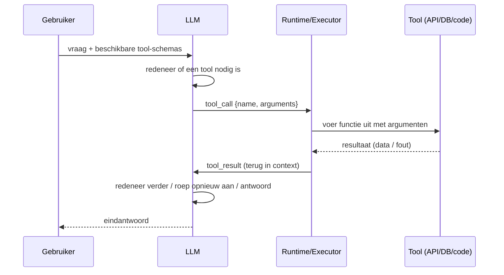
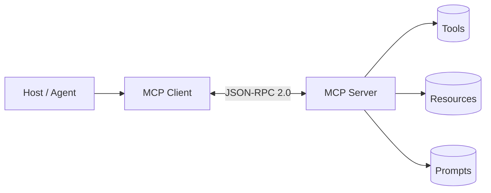
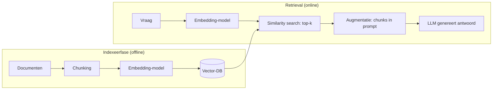
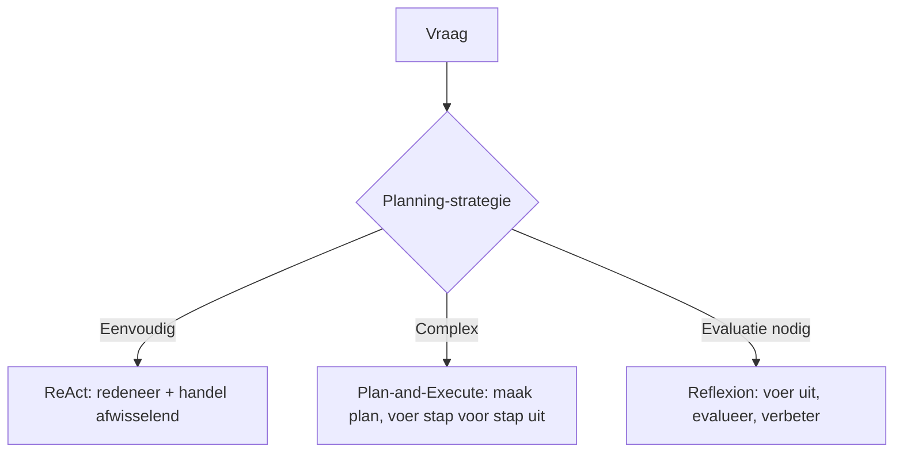
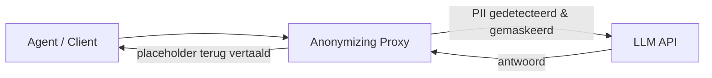

# AGENTS.md — Agentic AI: Hoe het werkt (en hoe je het bouwt)

Dit document beschrijft het doel, de opzet en de technische fundamenten van dit
project. Het dient zowel als projectbeschrijving als als startpunt voor de
uitgebreide documentatie over hoe je een Agentic AI-tool bouwt.

---

## 1. Doel van het project

Het doel is om een **complete, begrijpelijke samenvatting** te maken van de
technieken die nodig zijn om een *Agentic AI-tool* te bouwen, waarbij we **elk
detail concreet aantonen**. Dit project is dus eerst en vooral een
kennis-/documentatieproject (met later mogelijk kleine voorbeeldcode of
diagrammen per onderwerp).

De tweesporen-aanpak:

1. **Fundament** — begrijpen wat een taalmodel *in het algemeen* is (tokenisatie,
   architectuur, types, generatie), en daarna wat er gebeurt in *chatmodus* en
   in de *agentic laag*.
2. **Agentic laag** — begrijpen hoe je een model uitbreidt met tools, geheugen,
   retrieval en een besturingslus (de *agentic loop*).

> **Belangrijk onderscheid:** de werking en types van een Language Model zijn
> *algemeen* en gelden ongeacht of het model in een chat, een agent of een
> batch-proces draait. Daarom krijgen die een eigen hoofdstuk (§3). Pas daarna
> volgen de *chat-specifieke* pipeline (§4) en de *agentic-specifieke* loop (§5).

---

## 2. Projectstructuur (voorgesteld)

Het document wordt opgedeeld in logische hoofdstukken zodat elk onderdeel
afzonderlijk kan worden uitgediept en gedemonstreerd:

```
/
├── AGENTS.md              # dit bestand (projectbeschrijving + fundament)
├── CHEAT_SHEET.md         # samenvattend overzichtsdocument (eindproduct, §17 stap 7)
├── project_state.md       # statusdashboard van alle elementen uit dit document
├── docs/
│   ├── 01-language-model.md     # ALGEMEEN: tokenisatie, architectuur, types (§3)
│   ├── 02-llm-chatmode.md       # chat-specifiek: server, prompt, generatie (§4)
│   ├── 03-agentic-loop.md       # agentic-specifiek: de loop (§5)
│   ├── 04-tools.md              # function calling / tool use (§6)
│   ├── 05-mcp.md                # Model Context Protocol (§7)
│   ├── 06-rag.md                # retrieval augmented generation (§8)
│   ├── 07-compression.md        # context- en KV-cache compressie (§9)
│   ├── 08-memory.md             # kort- vs langetermijngeheugen (§10)
│   ├── 09-planning.md           # ReAct, plan-and-execute, reflexion (§11)
│   ├── 10-skills.md             # packages agent-capaciteiten (§12)
│   ├── 11-self-hosting.md       # eigen model draaien (llama.cpp e.a.) (§13)
│   ├── 12-data-privacy.md       # anonymizing proxy / PII (§14)
│   ├── 13-token-economics.md    # kosten van tokens (§15)
│   ├── 14-evaluation.md         # guardrails, testing, observability (§16)
│   ├── 15-project-file-index.md # projectbestandsindex / resource index (§19)
│   ├── 16-agentic-model-types.md # generieke vs coding agent + codex-modellen + signaling (§20)
│   └── 17-lite-classification.md # lite-classificatie & routing zonder LLM (§21)
└── examples/                # kleine demonstraties per onderwerp
```

> Deze structuur is een voorstel; hoofdstukken worden aangemaakt naarmate het
> project vordert. Het onderscheid *algemeen LM* vs *chat* vs *agentic* wordt
> consequent doorgevoerd.

---

## 3. Language Model: algemene werking en types

Dit hoofdstuk beschrijft wat een taalmodel *in algemene zin* is en doet. Het is
niet specifiek voor chat of voor een agent: elke LM-inferface (chat, completion,
agent) doorloopt deze stappen. Pas in §4 wordt dit toegepast op chatmodus.

### 3.1 Tokenisatie — tekst → getallen

Het model kan niet rechtstreeks met tekst rekenen. De ruwe string wordt
omgezet in **tokens** via een subwoord-algoritme:

- **BPE** (Byte-Pair Encoding, bv. GPT-2/3/4),
- **WordPiece** (BERT-familie),
- **SentencePiece / Unigram** (LLaMA, Gemini, T5).

Een token is een stukje tekst (een lettergreep, woorddeel of teken) met een
vast ID in een vocabulaire van typisch 32k–256k tokens. De tokenizer is
**bidirectioneel** met het trainingsproces: decodeer je later tokens terug naar
tekst, dan moet dat exact kloppen.

**Initialisatie & merge-stappen (BPE).** BPE start met een vocabulaire van
losse tekens (*init*) en telt in elke trainingsronde de meest voorkomende
*neighbour-pair*; die wordt samengevoegd tot één nieuw token (*merge*). Na N
merges groeit het vocabulaire van tekens naar subwoorden. Het decodeerproces
keert dit om: een token-ID → de bijbehorende subtekst. Een volledige
walkthrough met initialisatie en het mergen van de koppels staat in
[docs/01-language-model.md](docs/01-language-model.md) (§3.1, Python-voorbeeld).

### 3.2 Embeddings + positionele informatie

Elk token-ID wordt opgezocht in een **embedding matrix** (een soort
lookup-tabel) en omgezet in een dense vector van bijv. 4096 dimensies.

Omdat een Transformer geen inherent besef van volgorde heeft, wordt
**positionele encoding** toegevoegd:

- *Absolute* posities (sinus/cosinus bij oudere modellen),
- **RoPE** (Rotary Position Embedding — de huidige standaard bij LLaMA, Mistral,
  Gemma): de positie wordt als een rotatie in de vectoren verwerkt, wat
  extrapolatie naar langere contexten makkelijker maakt,
- **ALiBi** (bias op attention-scores i.p.v. op embeddings).

### 3.3 Het model zelf — opbouw van een decoder-only Transformer

De moderne LLM is vrijwel altijd een **decoder-only Transformer**: een stapel
van N identieke lagen (bv. 32–128). Elke laag doet:

1. **Multi-Head Self-Attention** — elk token "kijkt" naar eerdere tokens (causal
   mask voorkomt kijken naar de toekomst). Dit vangt relaties/context.
2. **Feed-Forward Network (FFN / MLP)** — een per-token transformatie, de
   "kennis"-opslag.
3. **LayerNorm + Residual connections** — stabilisatie en informatiestroom.

### 3.4 Architectuur-typen (niet chat-specifiek)

Ongeacht de interface verschillen modellen in *hoe* de lagen hun rekenwerk
verdelen:

| Type | Werking | Voorbeeld |
|------|---------|-----------|
| **Dense** | Alle parameters actief per token | GPT-3, LLaMA (basis) |
| **MoE** (Mixture of Experts) | FFN is opgesplitst in vele "experts"; een *router/gating network* kiest per token de top-k experts. Enkel die experts (+ router) zijn actief = **actieve parameters** < totale parameters | Mixtral, Grok, DeepSeek |
| **SSM / Mamba** | State-Space Model: recurrente verwerking i.p.v. attention; lineaire complexiteit in lengte | Mamba, Jamba (hybrid) |
| **Hybrid** | Mengeling van attention- en SSM-lagen | Jamba, Zamba |

**Active tokens / active parameters (MoE):** bij MoE is het totale aantal
parameters groot (voor capaciteit), maar per token wordt slechts een klein
deel ("active parameters") gebruikt. Dit houdt inference goedkoop terwijl de
"kennis-capaciteit" hoog blijft. De *router* bepaalt welke experts ("active
tokens" in de zin van: welke expert-activaties) voor een gegeven token
aangesproken worden.

---

## 4. Hoe werkt een LLM in chatmodus (chat-specifiek)

Waar §3 de *algemene* LM-werking behandelt, beschrijft dit hoofdstuk de
*chat-specifieke* pijplijn: wat de inference-server doet vanaf het moment dat
een plaintext-bericht binnenkomt, tot het antwoord streaming terugkomt.

### 4.1 De server ontvangt plaintext

De client stuurt een plaintext-bericht (en vaak wat metadata: gespreks-ID,
rollen van eerdere berichten) naar de inference-server. De server doet
server-side taken zoals:

- **Inputvalidatie** (lengte, veiligheid, rate-limiting).
- **Prompt-assemblage**: het samenvoegen van
  - een *system prompt* (instructies/persoonlijkheid),
  - de *conversation history* (eerder turns, met rollen `user`/`assistant`),
  - het nieuwe `user`-bericht,
  - eventueel *tool definitions* (beschikbare functies).
- Het toepassen van een **chat template** (bijv. ChatML, Llama-2, Mistral):
  speciale tokens zoals `<|im_start|>`, `<|im_end|>` structureren wie wat zegt,
  zodat het model het onderscheid tussen rollen leert.

### 4.2 Van input tot logits (forward pass)

De geassembleerde tekst wordt nu volgens §3.1 getokeniseerd en volgens §3.2
voorzien van embeddings + positionele encoding. Die vectors worden laag voor
laag door het model (§3.3, type volgens §3.4) gevoerd. Een *forward pass* geeft
voor de laatste positie een **logits**-vector: een score per woord in het
volledige vocabulaire.

### 4.3 Het antwoord definiëren — van logits naar tokens

Uit de logits wordt het volgende token gekozen via een sampling-strategie:

- **Greedy / argmax** — altijd het hoogstscorende token (deterministisch, maar
  repetitief).
- **Temperature** — verdeelt de logits; lager = scherper/voorspelbaarder, hoger
  = creatiever.
- **Top-k** — enkel de k beste tokens mogen gekozen worden.
- **Top-p (nucleus)** — kies uit de kleinste set tokens die samen p
  waarschijnlijkheid dekt (dynamischer dan top-k).
- **Beam search** — houdt meerdere hypothesen (minder gebruikt bij chat).

Dit is **autoregressief**: het gekozen token wordt teruggevoed als input, en
het proces herhaalt zich totdat een *stop-token* (zoals `<|end_of_text|>`) of
een lengtelimiet bereikt is. Een **KV-cache** slaat de reeds berekende
key/value-vectoren van eerdere tokens op, zodat niet alles telkens opnieuw
doorrekend wordt (cruciaal voor snelheid).

### 4.4 Token → tekst (decoding)

De gegenereerde token-IDs worden teruggedecodeerd naar tekst via de tokenizer
(detokenisatie). Speciale tokens worden verwijderd of verwerkt, en bij
**streaming** wordt elke nieuwe token direct naar de client gestuurd zodat de
gebruiker het antwoord woord-voor-woord ziet verschijnen.

---

## 5. Hoe werkt een Agentic loop (agentic-specifiek)

Een "gewoon" LLM is stateless en alleen tekst. Een **agent** voegt een
**besturingslus** toe waardoor het model *acties* kan ondernemen en
*tussenresultaten* kan verwerken. Het klassieke patroon:

```
 ┌─────────────────────────────────────────────┐
 │ 1. Perceive  : verzamel input + context      │
 │ 2. Reason     : LLM beslist volgende stap     │
 │ 3. Act        : roep tool aan / doe actie     │
 │ 4. Observe    : krijg resultaat terug         │
 │ 5. Repeat     : terug naar 2 tot taak klaar   │
 │ 6. Respond    : eindantwoord naar gebruiker   │
 └─────────────────────────────────────────────┘
```

### 5.1 Wanneer welk component ingezet wordt

De agentic loop roept per iteratie één of meerdere "gereedschappen" aan. De
kerncomponenten en hun trigger-moment:

| Component | Wat het doet | Wanneer ingezet | Uitdieping |
|-----------|--------------|-----------------|------------|
| **Tools / Function calling** | Het model produceert een gestructureerde aanroep (naam + argumenten); de runtime voert de functie uit (API, rekenmachine, code, DB). | Zodra de taak een *actie in de wereld* vereist (data ophalen, iets uitvoeren, iets berekenen) die het model niet uit zichzelf kan. | [§6](#6-tools--function-calling) |
| **MCP — Model Context Protocol** | Gestandaardiseerd protocol dat *tools, resources (gegevens)* en *prompts* ontsluit richting het model via herbruikbare servers. | Bij het koppelen van veel externe systemen/bronnen op een gestandaardiseerde manier (i.p.v. ad-hoc tool-integraties). | [§7](#7-mcp--model-context-protocol) |
| **RAG (Retrieval Augmented Generation)** | Documenten worden gechunkt, geëmbed en in een vector-DB opgeslagen; relevante stukken worden opgehaald en in de prompt geïnjecteerd. | Wanneer antwoorden *actuele, privé of gespecialiseerde* kennis vereisen die niet in de gewichten zit. | [§8](#8-rag-retrieval-augmented-generation) |
| **Compression** | Samenvatting van gesprekshistorie, prompt-compressie, of KV-cache-/context-window-beheer. | Zodra de context te groot/bereik/duur wordt; voorkomt "context verlies" en kosten. | [§9](#9-compression) |
| **Memory** | Kortetermijn (de huidige context) vs. langetermijn (externe store: vector-DB, SQL, file). | Voor continuïteit over sessies en het onthouden van feiten/voorkeuren. | [§10](#10-memory) |
| **Planning** | ReAct (reason+act interleaved), plan-and-execute (eerst plan, dan stappen), reflexion (evaluatie/verbetering). | Bij complexe, multi-stap taken; stuurt *wanneer* tools/retrieval aangeroepen worden. | [§11](#11-planning) |
| **Skills** | Verpakte, herbruikbare capaciteiten/instructies die de agent uitbreiden met domeinkennis of gestandaardiseerde workflows. | Bij terugkerende, goed omschreven taken en standaardprocedures (SOPs) waarvoor je de agent vooraf "leert" werken. | [§12](#12-skills) |

### 5.2 Hoe de onderdelen samenwerken (concreet voorbeeld)

1. Gebruiker: *"Wat zegt ons Q2-rapport over omzet in België?"*
2. **Planner/LLM** herkent: ik heb documentkennis nodig → **RAG** haalt het
   Q2-rapport op uit de vector-DB.
3. Het rapport is te lang → **Compression** vat de relevante passages samen.
4. LLM ziet samenvatting en beslist: er moet een getal uitgerekend worden →
   **Tool** (rekenmachine/SQL) wordt aangeroepen.
5. Resultaat komt terug (**Observe**), LLM formuleert antwoord en stopt de loop
   (**Respond**).
6. De interactie wordt in **Memory** bewaard voor toekomstige vragen.

De **agentic loop** is dus de "dirigent": hij beslist per iteratie welk
component (tool, RAG, compressie, geheugen) nodig is en voegt de uitkomst terug
in de context voor de volgende redeneer-stap.

---

## 6. Tools / Function calling

Tools (ook *function calling* genoemd) geven het model "handen en voeten": het
kan niet alleen tekst produceren, maar ook een **gestructureerde opdracht**
uitvoeren via een externe functie. Het model *kiest zelf* wanneer een tool
nodig is en vult de argumenten in; de uitvoering gebeurt buiten het model.

### 6.1 De tool-call cyclus



Stappen in woorden:

1. **Definitie** — de ontwikkelaar beschrijft elke tool in een schema (naam,
   beschrijving, parameters).
2. **Keuze** — het model krijgt de schemas mee en beslist of (en welke) tool
   aangeroepen wordt.
3. **Uitvoering** — de *runtime* (de agent-code, niet het model zelf) voert de
   functie uit en vangt het resultaat of een fout.
4. **Terugkoppeling** — het resultaat wordt als `tool`-bericht terug in de
   context geplaatst.
5. **Vervolg** — het model redeneert verder: het kan nog een tool aanroepen,
   of het eindantwoord formuleren.

### 6.2 Tool-schema (definitie)

Een tool wordt typisch beschreven met een JSON-Schema-achtige structuur:

```json
{
  "name": "get_weather",
  "description": "Haal de huidige weersvoorspelling op voor een locatie.",
  "parameters": {
    "type": "object",
    "properties": {
      "location": {
        "type": "string",
        "description": "Stad en land, bv. 'Brussel, België'"
      },
      "unit": { "type": "string", "enum": ["celsius", "fahrenheit"] }
    },
    "required": ["location"]
  }
}
```

**Best practices voor schema's:**
- Schrijf een heldere, specifieke `description` — het model kiest op basis
  hiervan of de tool relevant is.
- Specificeer types strikt en gebruik `enum` waar mogelijk.
- Markeer alleen wat écht nodig is als `required`.
- Verdeel complexe taken in meerdere kleine, heldere tools in plaats van één
  "zwitsers zakmes".

### 6.3 Native function calling vs. ReAct-prompting

- **Native function calling** — de model-API ondersteunt `tool_calls` expliciet
  (OpenAI, Anthropic, Gemini). Het model geeft gestructureerde JSON terug die
  door de SDK wordt geparsed. Robuust en gestandaardiseerd.
- **ReAct-prompting** — het model schrijft in *tekst* iets als
  `Thought: … Action: get_weather("Brussel") Observation: …`. De runtime
  parsed deze tekst. Werkt ook op modellen zonder native tool-ondersteuning,
  maar is fragieler (pars-fouten).

### 6.4 Geavanceerde patronen

- **Parallelle tool-calls** — het model kan meerdere onafhankelijke calls in één
  turn uitvoeren (bv. tegelijk weersinformatie voor drie steden ophalen),
  waardoor latency daalt.
- **Tool-chaining** — de output van de ene tool wordt argument voor de volgende.
- **Sub-agent met eigen tools** — complexe agents delegeren deel-taken aan
  gespecialiseerde sub-agenten (zie ook §11 Planning).

### 6.5 Veiligheid & betrouwbaarheid

Omdat een tool *echte effecten* kan hebben, is dit het meest risicovolle deel
van de agent:

- **Validatie van argumenten** — controleer types, bereiken en toegestane
  waarden *voor* executie; het model kan foute of kwaadaardige input geven.
- **Permissions / allow-list** — niet elke tool mag altijd; sommige acties
  (versturen van e-mail, delete) vereisen expliciete gebruikers-Go.
- **Sandboxing / isolatie** — code-execution-tools draaien bij voorkeur in een
  geïsoleerde, tijdelijke omgeving zonder toegang tot gevoelige systemen.
- **Foutafhandeling** — als een tool faalt, geef de fout terug aan het model;
  het kan corrigeren of een andere aanpak kiezen.
- **Idempotentie & side-effects** — wees voorzichtig met niet-idempotente
  acties (betalen, verzenden) en dubbele uitvoering.
- **Nooit blind vertrouwen** — de tool-output is de waarheid voor de volgende
  stap, maar controleer of het model er geen verkeerde conclusies uit trekt.

---

## 7. MCP — Model Context Protocol

Waar §6 de *concepten* van tool-use behandelt, is **MCP** (Model Context
Protocol, geïntroduceerd door Anthropic in 2024) de **standaard** waarmee je die
tools — én data, én prompts — op een herbruikbare manier aan elke
MCP-compatibele host aanbiedt. Het vervangt de wildgroei aan ad-hoc
integraties door één protocol.

### 7.1 Architectuur



- **Host** — de AI-toepassing/agent (bv. een IDE-extensie, Claude Desktop,
  je eigen agent-loop uit §5).
- **Client** — een component *binnen* de host dat de verbinding onderhoudt
  (meestal één client per server).
- **Server** — een aparte proces/service die capaciteiten ontsluit en praat
  over **stdio** (lokaal) of **HTTP + SSE** (remote). Berichtenverkeer
  verloopt volgens **JSON-RPC 2.0**.

### 7.2 De drie primitieven

MCP onderscheidt drie soorten capaciteiten:

| Primitief | Wie stuurt aan | Wat het is | Voorbeeld |
|-----------|----------------|------------|-----------|
| **Tools** | Model (model-controlled) | Uitvoerbare functies, net als §6 function calling | "zoek in Jira", "run SQL" |
| **Resources** | Applicatie/context (app-controlled) | Leesbare data die de app in de context kan laden | bestandsinhoud, DB-rij, log |
| **Prompts** | Gebruiker (user-controlled) | Herbruikbare prompt-templates | "vat dit dossier samen" |

Het model "ziet" tools zoals in §6; het grote verschil is dat de *server* de
implementatie levert en de host die via het protocol aanspreekt — niet de
agent-code zelf.

### 7.3 Waarom het ertoe doet

- **Interoperabiliteit** — één server (bv. een Postgres-MCP-server) werkt met
  elke MCP-host; je schrijft de integratie één keer.
- **Scheiding van zorgen** — de agent (host) blijft generiek; databronnen en
  acties zitten in servers.
- **Standaard tool/context-transport** — sluit naadloos aan op de agentic loop
  (§5) en op RAG (§8, via *resources*).

### 7.4 Wanneer te gebruiken

Gebruik MCP wanneer je agent met *veel* externe systemen moet praten en je die
integraties **herbruikbaar** en **onderhoudbaar** wil houden, in plaats van per
agent steeds opnieuw tool-schemas + executiecode te schrijven. Let op
beveiliging: een MCP-server kan acties uitvoeren, dus enkel vertrouwde servers
koppelen en permissies (§6.5) blijven van kracht.

---

## 8. RAG (Retrieval Augmented Generation)

RAG voorziet het model van **externe kennis** die niet in de gewichten zit:
actuele feiten, bedrijfsdocumenten, privé-data. In plaats van het antwoord uit
het geheugen te halen, *haalt* de agent relevante stukken tekst op en stopt die
in de prompt.

### 8.1 Waarom RAG?

- Kennis die **verouderd** is in de trainingsdata (nieuws, interne wijzigingen).
- **Privé / gespecialiseerde** kennis (klantendossiers, wetgeving, handboeken).
- **Hallucinatie-reductie** — het model kan verwijzen naar opgehaalde bronnen.
- **Controleerbaarheid** — je kunt citeren *welke* documenten het antwoord
  onderbouwen.

### 8.2 De volledige RAG-pijplijn



**Indexeerfase (offline):**
1. **Load** — documenten inladen (PDF, HTML, DB, wiki).
2. **Chunking** — opdelen in stukken die passen in de context en semantisch
   samenhangen.
3. **Embedding** — elke chunk omzetten naar een vector met een embedding-model.
4. **Store** — vectors opslaan in een vector-DB, gekoppeld aan de originele tekst.

**Retrieval (online):**
5. **Query embedding** — de vraag wordt met *hetzelfde* model geëmbed.
6. **Similarity search** — zoek de k dichtste chunks (cosine/ddot-product).
7. **Augmentatie** — de chunks worden in de prompt geïnjecteerd als context.
8. **Generatie** — het model antwoordt, idealiter met bronvermelding.

### 8.3 Chunking-strategieën

Er bestaan verschillende *implementatietypes*, elk met eigen voor- en nadelen
en risico's:

| Type | Werking | Voordeel | Nadeel / risico |
|------|---------|----------|-----------------|
| **Vaste grootte** | verdeel tekst in N-token blokken | simpel, voorspelbaar | snijdt zinnen/paragrafen doormidden → contextverlies aan randen |
| **Recursieve / structurele** | splits op paragrafen, dan zinnen; behoudt structuur | respecteert documentstructuur | afhankelijk van schone opmaak; vieze HTML bemoeilijkt |
| **Semantisch** | groepeer zinnen met gelijkaardige betekenis (embeddings) | coherentere chunks | duurder (embeddings nodig); arbitraire grenzen |
| **Overlappend** | voeg overlap toe tussen opeenvolgende chunks | behoudt context over grenzen heen | meer chunks → hogere kosten/latency |

Overweging: te grote chunks = meer tokens/kosten; te kleine = context
versnipperd. Een goede chunkgrootte ligt vaak rond 256–1024 tokens. Zie
[docs/06-rag.md](docs/06-rag.md) (§8.3) voor een Python-implementatie per type
met hun afwegingen.

### 8.4 Embedding-modellen

- Meestal een *separaat*, specifiek getraind model (sentence-transformers,
  OpenAI `text-embedding-*`, Cohere, BGE, …).
- Output is een dense vector (typisch 384–3072 dimensies).
- **Normaliseer** vectors zodat cosine-similarity equivalent is aan dot-product.
- Dezelfde embedder moet gebruikt worden voor indexeren én querying.

### 8.5 Vector-DB & similariteit

- **Metrieken:** cosine-similarity (meest gebruikt), dot-product, Euclidean.
- **Vector-DB's:** FAISS (lokaal), Chroma, Weaviate, Qdrant, Pinecone,
  pgvector (Postgres). Keuze afhankelijk van schaal, hosting, filters.
- **Metadata-filtering** — filter op datum, bron, permissies vóór of na de
  similarity search.

### 8.6 Re-ranking & hybrid search

- **Re-ranker (cross-encoder)** — nadat de top-k (bv. 20) is opgehaald, een
  nauwkeuriger model ordent ze op relevantie t.o.v. de vraag → neem top-3 à 5.
  Verhoogt precisie sterk.
- **Hybrid search** — combineer *dense* (embeddings) met *lexical* (BM25 /
  keyword). Goed voor exacte termen (codes, namen) én betekenis.

### 8.7 Evaluatie van RAG

- **Context relevance** — de opgehaalde chunks zijn relevant voor de vraag.
- **Faithfulness** — het antwoord steunt enkel op de opgehaalde context.
- **Answer relevance** — het antwoord beantwoordt de vraag.
- Frameworks: RAGAS, TruLens, DeepEval.

### 8.8 Wanneer (niet) te gebruiken

RAG is ideaal voor kennis-intensieve, brongebonden vragen. Voor puur
redeneerwerk of algemene kennis uit de trainingsdata is het vaak overbodig en
voegt het latency/kosten toe.

> **Resource Index vs. RAG:** voor de *gestructureerde* tegenhanger (bestands-
en symbolen-navigatie i.p.v. inhoud) zie [§19](#19-projectbestandsindex-resource-index).

### 8.9 RAG-varianten & recordstructuur

Niet elke RAG is gelijk. Populaire varianten om *to-the-point* vectoren te
krijgen **zonder** de context te verliezen:

- **Standaard / "naive" RAG** — chunk → embed → top-k. Simpel, maar brokkelige
  chunks verliezen context.
- **Contextual / "window" RAG** — sla naast de chunk ook de omliggende
  context (parent) op; embed de chunk, geef de parent terug. Voorkomt
  contextverlies aan chunkranden.
- **Parent-child chunks** — een kleine "child" voor nauwkeurige embedding, een
  grotere "parent" als retour-context.
- **Summary-based RAG** — embed een *samenvatting* van de chunk i.p.v. de
  ruwe tekst (vermindert ruis, snellere retrieval); de volledige tekst volgt
  bij de hit.
- **Hybrid (dense + lexical)** — combineer embeddings met BM25 (zie §8.6) voor
  exacte termen én betekenis.

**Hoe een record in de vector-DB eruitziet.** Een retrieval-record koppelt de
chunk-tekst aan een vector plus metadata; een typisch schema:

```json
{
  "id": "doc-123#chunk-4",
  "doc_id": "doc-123",
  "text": "De maandrapportage toont een omzetstijging van 8% in Belgie…",
  "embedding": [0.012, -0.34, "/* … 768 floats … */"],
  "metadata": {
    "source": "q2_rapport.pdf",
    "page": 12,
    "section": "Omzet per regio",
    "parent_text": "…volledige paragraaf incl. context…",
    "tokens": 318,
    "created_at": "2026-08-26"
  }
}
```

De `embedding` is de zoekvector; `metadata` laat toe te filteren vóór of na
de similarity search (§8.5). Voorbeelden van zo'n record-structuur en het
aanmaken ervan staan in [docs/06-rag.md](docs/06-rag.md) (§8.9, Python).

---

## 9. Compression

Naarmate een agent langer met een taak bezig is, groeit de context (geschiedenis
+ tool-resultaten + RAG-chunks). **Compression** houdt die beheersbaar in
lengte, kosten en latency.

### 9.1 Waarom comprimeren?

- **Context-windowlimiet** — elk model heeft een maximum aantal tokens.
- **Kosten** — je betaalt per token voor input én (indirect) voor het
  opbouwen van de KV-cache.
- **Latency** — langere context = tragere forward pass per token.
- **KV-cache geheugen** — groeit lineair (of meer) met contextlengte; bij
  langdurige sessies een knelpunt.

### 9.2 Vormen van compressie

| Vorm | Wat gebeurt er | Wanneer |
|------|----------------|---------|
| **Geschiedenis-samenvatting** | Oudere conversation turns worden samengevat tot een korte summary die in de context blijft. | Langdurige gesprekken / veel tussenstappen. |
| **Prompt-compressie** | Compressiemodel (bv. LLMLingua, Selective-Context) verwijdert overbodige woorden/tokens uit de input vóór inference. | Zeer lange instructies of documenten als context. |
| **KV-cache compressie** | KV-vectoren quantiseren (INT8/INT4), evicten (StreamingLLM: belangrijkste + recentste behouden) of pooling. | Wanneer de KV-cache te groot wordt voor het geheugen. |
| **Context-window management** | Sliding window (enkel recente N tokens) of selectief de meest relevante stukken bewaren (via retrieval). | Wanneer bruikbare info verspreid zit over een lange sessie. |

### 9.3 Trade-offs

Compressie verlaagt altijd *iets* aan informatie. Het juiste evenwicht:
- Samenvatten verliest nuances maar houdt de hoofdlijn.
- Te agressieve compressie → het model "vergeet" belangrijke constraints →
  fouten.
- Meet de impact via de evaluatiemetrics uit §8.7 / §10 en §16 (observability).

### 9.4 Wanneer toepassen

Pas compressie toe zodra de context het maximaal nuttige bereik nadert, of
zodra kosten/latency een probleem worden — niet eerder, om informatieverlies te
vermijden.

---

## 10. Memory

Memory onderscheidt een eenmalige agent-run van een **lerende, persisterende**
agent. Het gaat over *wat* de agent onthoudt en *waar* dat bewaard wordt.

### 10.1 Kortetermijngeheugen (working memory)

- De **actieve context** (de huidige prompt-inhoud): geschiedenis + tussen-
  resultaten + instructies.
- Bestaat enkel *binnen één run/sessie* en verdwijnt daarna (tenzij
  gepersisteerd wordt).
- Wordt beheerd zoals beschreven in §9 (compressie).

### 10.2 Langetermijngeheugen (external memory)

Buiten de context, in een externe store:

| Store | Geschikt voor | Voorbeeld |
|-------|---------------|-----------|
| **Vector-DB** | Semantisch ophalen van gerelateerde herinneringen (vaak via RAG, zie §8). | "Wat wisten we over klant X?" |
| **SQL / structured store** | Feiten, gebruikersvoorkeuren, gestructureerde records. | `user_profile`, `orders`. |
| **File / episodic log** | Volledige gesprekslogs, gebeurtenissen (audit trail). | `conversations/*.jsonl`. |

### 10.3 Geheugentypen (psychologisch model)

- **Episodisch** — specifieke gebeurtenissen ("gesprek van gisteren").
- **Semantisch** — algemene feiten ("gebruiker spreekt Nederlands").
- **Procedureseel** — *hoe* je iets doet ("routine voor facturatie").

### 10.4 Write- & read-patronen

- **Wanneer schrijven?** Na belangrijke gebruikersfeiten, beslissingen of
  geleerde voorkeuren. Vaak expliciet aangestuurd door de agent (tool `save_memory`).
- **Hoe ophalen?** Bij een nieuwe vraag: embed de vraag en doorzoek de
  langetermijnstore (analoog aan RAG, §8), zodat enkel relevante herinneringen
  de context binnenkomen.
- Let op privacy/compliance: niet alles permanent bewaren; gevoelige data
  vraagt om toestemming en verwijdering.

### 10.5 Consolidatie & vergeten

- **Consolidatie** — vat verspreide episodes samen tot semantische feiten
  (gebruikmakend van §9 compressie).
- **Vergeten / TTL** — oude of irrelevante entries verwijderen of laten
  vervallen om de store schoon en goedkoop te houden.

---

## 11. Planning

Planning stuurt *wanneer* en *in welke volgorde* de andere componenten
(tools, RAG, compressie, memory) worden ingezet. Het maakt een agent geschikt
voor complexe, multi-stap taken.

### 11.1 Waarom plannen?

Een taak als *"onderzoek de concurrenten, schrijf een rapport en mail het"*
vereist meerdere stappen, afhankelijkheden en tussentijdse beslissingen. Zonder
planning wordt de agent reactief en foutgevoelig.

### 11.2 Strategieën



- **ReAct** (Reason + Act) — redeneren en handelen *afwisselend*: voor elke
  stap denkt het model na (`Thought`), kiest een actie (`Act`), observeert
  (`Observation`) en herhaalt. Simpel, transparant, maar mist globaal overzicht
  bij lange taken.
- **Plan-and-Execute** — het model maakt *eerst* een volledig plan (lijst van
  stappen), daarna wordt elke stap uitgevoerd (optioneel door sub-agenten).
  Betere decompositie voor complexe taken; de planner hoeft niet elke detail
  zelf uit te voeren.
- **Reflexion / Reflection** — na uitvoering *evalueert* de agent het resultaat
  (zelf of via een critic), leert van fouten en probeert verbeterd. Cruciaal
  voor trajecten waarin de eerste poging kan mislukken.
- **Tree-of-Thought / Self-consistency** — verken meerdere redeneerpaden en kies
  het beste; bij reasoning-zware, niet-deterministische taken.
- **Goal decomposition** — breek een hoofddoel recursief op in sub-doelen tot
  elk sub-doel uitvoerbaar is.

### 11.3 Planner vs. Executor

Vaak scheid je de **planner** (kijkt naar het grote geheel, bepaalt de volgende
mijlpaal) van de **executor** (voert één concrete stap uit, met tools). Dit
verlaagt de cognitieve last per model-call en maakt parallelle uitvoering
(sub-agenten) mogelijk.

### 11.4 Evaluatie & error recovery

- Controleer na elke stap of het sub-doel bereikt is.
- Bij een fout: opnieuw proberen, plan aanpassen, of escaleren naar de
  gebruiker.
- Houd de geschiedenis van beslissingen bij (observability, zie §16) zodat de
  agent en de ontwikkelaar kunnen nagaan *waarom* een pad gekozen werd.

### 11.5 Wanneer welke strategie

- Korte, directe taken → ReAct volstaat.
- Lange, decomponeerbare taken → Plan-and-Execute (+ sub-agenten).
- Taken waar fouten duur zijn → Reflexion (evalueer en verbeter).

---

## 12. Skills

Naast tools (§6) en MCP-servers (§7) is er een lichtere manier om een agent
**blijvend slimmer** te maken: **skills**. Een skill is een *verpakte,
herbruikbare capaciteit* — instructies plus eventueel randmateriaal — die de
agent kan "inladen" wanneer een taak erom vraagt.

### 12.1 Wat is een skill?

- Een skill bevat typisch een `SKILL.md` met een **beschrijving** (waarop de
  agent matcht of de skill relevant is) en **instructies** (hoe de taak
  aangepakt wordt).
- Optioneel: meegeleverde scripts, sjablonen, of verwijzingen naar tools/RAG.
- In tegenstelling tot een *tool* (een functie die het model aanroept) is een
  skill vooral **kennis + werkwijze**: het *vormt* hoe de agent redeneert, en
  kan op zijn beurt tools (§6), RAG (§8), planning (§11) of memory (§10)
  aansturen.

### 12.2 Skills vs. Tools vs. MCP

| | Bevat | Wie "roept aan" | Voorbeeld |
|---|-------|-----------------|-----------|
| **Tool** | Uitvoerbare functie | Model (function calling) | `send_email()` |
| **MCP-server** | Tools + resources + prompts (gestandaardiseerd) | Host via protocol | Postgres-MCP |
| **Skill** | Instructies + kennis (meta) | Agent laadt bij matching | "hoe schrijf ik een GDPR-conforme closings paragraph" |

### 12.3 Lifecycle

1. **Discovery** — de agent vergelijkt de gebruikersvraag met de
   beschrijvingen van beschikbare skills.
2. **Loading** — bij een match wordt de skill-inhoud in de context geïnjecteerd
   (net als een stuk system-context).
3. **Execution** — de agent volgt de instructies; de skill mag tools/RAG
   aanroepen.

### 12.4 Wanneer skills gebruiken

- Terugkerende, goed omschreven taken en **standaardprocedures (SOPs)**.
- Domeinexpertise die je niet in de gewichten zit (bedrijfsprocessen, house
  style, compliance-regels).
- Als "bibliotheek" van werkwijzen die de agent met weinig tokens activeert.

**Best practices:** één skill per smal onderwerp, een scherpe `description`
(gebruikt voor matching), self-contained, en met concrete voorbeelden.

---

## 13. Zelf model hosten met llama.cpp of alternatief

Tot nu toe gingen we ervan uit dat een (cloud-)API het model levert. Je kunt het
model **zelf draaien** — lokaal of op eigen servers. Dat raakt direct de
privacy (§14) en de kosten (§15).

### 13.1 Waarom zelf hosten?

- **Data blijft binnen** — niets verlaat je infra (zie ook §14).
- **Geen per-token kosten** van cloud-API's (wel eigen hardware).
- **Volledige controle** — eigen modellen, fine-tunes, permissies, offline
  gebruik, geen rate-limits van derden.

### 13.2 Inference-engines / runtimes

| Runtime | Kenmerken | Use-case |
|---------|-----------|----------|
| **llama.cpp** | GGUF-formaat, CPU+GPU, quantisatie, zeer breed model-ondersteuning | Lokaal, weinig VRAM |
| **Ollama** | Laagdrempelig, bouwt op llama.cpp, OpenAI-compatibele server | Snelle lokale dev |
| **vLLM** | Hoge throughput, continuous batching, paged-attention | GPU-server / productie |
| **TGI** (Text Generation Inference) | Geoptimaliseerd serveren, quantisatie | Productie (HuggingFace) |
| **LM Studio** | GUI + local server, OpenAI-compatibel | Lokaal experimenteren |
| **ExLlama / TensorRT-LLM** | GPU-specifiek, maximale snelheid | Datacenter-GPU's |

### 13.3 Serving & compatibiliteit

De meeste runtimes hebben een **OpenAI-compatibele API** (`/v1/chat/completions`).
Daardoor kan de agent-loop (§5) en de client-code (§4) ongewijzigd blijven: je
vervangt enkel het `base_url`- en `api_key`-veld. De chat-pipeline uit §4 is nu
*jouw* server in plaats van die van een cloud-aanbieder.

### 13.4 Quantisatie (kwaliteit vs. middelen)

Om modellen op bescheiden hardware te laten draaien, worden gewichten
gequantiseerd:

- **GGUF q4/q5/q8** (llama.cpp), **GPTQ**, **AWQ** — lagere precisie
  (INT4/INT8) → minder VRAM en sneller, met vaak beperkte kwaliteitsdaling.
- Afweging: agressievere quantisatie bespaart geheugen maar kan precisie
  aantasten bij redeneer-/wiskundetaken.

### 13.5 Keuze: cloud vs. self-host

- **Self-host** bij: strenge privacy (§14), hoog/gelijkmatig volume (kosten,
  §15), offline eisen, of specifieke/fine-tuned modellen.
- **Cloud** bij: snelle start, weinig volume, behoefte aan grootste modellen
  zonder GPU-investering.

**Aandachtspunten:** je beheert zelf uptime, updates, schaling en GPU-kosten
(capex). Een goede tussenweg is een **anonymizing proxy** (§14) vóór een
cloud-API wanneer self-host niet haalbaar is.

---

## 14. Anonymizing proxy (data-privacy / PII)

Wanneer je tóch een externe (cloud-)LLM gebruikt, verlaat gevoelige data je
organisatie. Een **anonymizing proxy** is een laag die persoonsgegevens (PII)
en geheimen maskeert vóór het verzoek de aanbieder bereikt.

### 14.1 Het probleem

Prompts kunnen ongewild bevatten: namen, e-mailadressen, ID-nummers,
adressen, broncode, API-keys of medische/financiële data. Alles wat je naar de
API stuurt, kan (tot in logs) bij de aanbieder belanden — een GDPR- en
bedrijfsrisico.

### 14.2 Werkwijze van de proxy



1. **Detectie** — de proxy analyseert de tekst op PII via NER-modellen,
   regex-patronen of een bibliotheek zoals *Microsoft Presidio*
   (namen, e-mails, IBAN, SSN, adressen, credentials).
2. **Maskering** — vervang PII door een **consISTENTE placeholder** (token),
   bv. `<<PERSOON_1>>`. Het model ziet een leesbare, stabiele vervanger.
3. **Un-mask** — in het antwoord wordt de placeholder terugvertaald naar de
   echte waarde, zodat de eindgebruiker de oorspronkelijke data ziet.

### 14.3 Afwegingen

- **Reversibel vs. definitief** — bij reversibele tokens moet de mapping
  beveiligd bewaard worden (net zo gevoelig als de brondata zelf).
- **Kwaliteitsverlies** — anonimiseren kan context weghalen die het model nodig
  heeft; afweging tussen privacy en bruikbaarheid.
- **Logging** — ook jouw eigen logs mogen geen ruwe PII bevatten (zie §16).
- **Compliance** — data-minimalisatie en GDPR: verstuur enkel wat nodig is.

### 14.4 Plaats in de architectuur

De proxy zit idealiter *tussen* de agent (§5) en de API (§4 "server ontvangt
plaintext"), of als gateway in je eigen infra. Het is het natuurlijke
**alternatief voor self-hosting (§13)** wanneer je geen eigen model kunt
draaien maar wél privacy-eisen hebt.

---

## 15. Token economics

LLM-gebruik wordt verrekend **per token**. Token economics gaat over het
begrijpen en beheersen van die kosten — relevant zodra je agents (§5) met veel
context, RAG (§8) en tool-iteraties (§6) laat draaien.

### 15.1 Waaruit bestaan de kosten?

- **Input-tokens** — system prompt + geschiedenis + RAG-chunks + tool-schemas
  + eerder gegenereerde tussenstappen. Dit groeit snel bij een agent.
- **Output-tokens** — het gegenereerde antwoord.
- **Prijsmodel** — vaak verschillend tarief voor input vs. output; *cached
  input* (prompt-caching / prefix-cache) is goedkoper (zie ook §4.3, §9.2).
- **KV-cache / context** — indirecte kosten van langdurige context (zie §9.1).

### 15.2 Waarom het bij agents explodeert

Een agent-loop (§5) stuurt de *volledige context* bij elke stap opnieuw naar
het model: geschiedenis + RAG-resultaten + tool-resultaten stapelen zich op.
Meerdere iteraties × grote context = veel tokens per taak.

### 15.3 Heftactieken (cost levers)

| Hefboom | Werking | Gerelateerd hoofdstuk |
|---------|---------|-----------------------|
| **Compressie** | kortere geschiedenis / prompt-compressie | §9 |
| **Caching** | gemeenschappelijke prefix (system prompt) herbruiken via prompt-cache | §4.3, §9.2 |
| **Kleinere modellen** | goedkoper model voor routing/extractie/sub-agenten | §11 (sub-agenten) |
| **Self-hosting** | per-token-kosten → vaste infra-kosten (voordelig bij volume) | §13 |
| **Tool-result-limiet** | truncateer/vaat samen tool-output | §6, §9 |
| **Token-budget** | `max_tokens` en context-plafond afdwingen | §4, §9 |

### 15.4 Cloud vs. self-host (break-even)

- **Cloud** = variabele kosten per token, geen investering, direct
  beschikbaar — maar prijzig bij hoog volume.
- **Self-host** (§13) = capex (GPU's) + onderhoud, maar marginale kosten per
  token laag → break-even bij voldoende volume.
- **Kostenobservability** — track tokens per stap (zie §16 observability) om
  dure patronen vroeg te spotten.

---

## 16. Wat nog belangrijk is (aanvullingen)

- **Evaluatie & guardrails**: hoe weet je dat de agent juist en veilig handelt
  (testing, hallucinatie-controle, permissions op tools — zie §6.5)?
- **Kosten & latency**: tokens kosten geld/tijd; compressie (§9) en MoE (§3.4)
  helpen, maar tool-calls (§6) en RAG (§8) voegen round-trips toe.
- **Observability**: logging van elke loop-iteratie (welke tool (§6), welke
  retrieval (§8), welke planning (§11)) is essentieel om agents te debuggen.
- **Determinisme vs creativiteit**: keuze van sampling-strategie (§4.3)
  beïnvloedt of een agent reproduceerbaar is.
- **Privacy & compliance**: weeg self-hosting (§13) en/of anonymizing proxy
  (§14) af; token economics (§15) bepaalt de haalbaarheid op schaal.

---

## 17. Werkwijze / volgende stappen

1. ✅ `AGENTS.md` aanmaken met duidelijk onderscheid algemeen LM / chat / agentic.
2. ✅ Algemene LM-werking (§3) en chat-specifieke pipeline (§4) uitwerken.
3. ✅ Agentic loop (§5) + verdieping per component: Tools (§6), MCP (§7),
   RAG (§8), Compression (§9), Memory (§10), Planning (§11), Skills (§12).
4. ✅ Deployment & governance: self-hosting (§13), data-privacy / anonymizing
   proxy (§14), token economics (§15).
5. Per hoofdstuk een verdiepend `docs/`-document schrijven met diagrammen en
   kleine code-voorbeelden (start bij `01-language-model.md`).
6. Waar nuttig: een `examples/`-demo per techniek (tokenizer, RAG, tool-call,
   MCP-server).
7. Een samenvattend overzichtsdocument ("cheat sheet") als eindproduct.

---

## 18. Conventies voor dit project

- Documentatie in het **Nederlands** tenzij anders aangegeven.
- Gebruik duidelijke koppen en tabellen/diagrammen (mermaid) om details
  "aan te tonen" zoals het projectdoel vereist.
- Hou technische claims accuraat en vermeld bij benaderingen dat het een
  vereenvoudiging is.
- **Scheid consequent** wat algemeen LM-gedrag is van wat chat- of
  agentic-specifiek is.

---

## 19. Projectbestandsindex (Resource Index)

Naast de *semantische* ontsluiting via RAG (§8) is er een lichtere, *gestructureerde*
manier om een project navigeerbaar te maken voor een agent: een **Resource Index**
(ook *projectbestandsindex* of *codebase index* genoemd). Waar RAG de **inhoud**
van documenten vectoriseert om er vragen over te beantwoorden, houdt een Resource
Index enkel **metagegevens** per bestand bij: wat bestaat er, van welk type is het,
en hoe heet de oppervlakkige structuur (symbolen, hoofdstukken)?

De Resource Index is daarmee de *catalogus* van beschikbare bestanden — verwant aan
de **Resources**-primitief van MCP (§7.2): de index vertelt de agent *welke* resources
er zijn, MCP hoe je ze uitleast. Hij wordt typisch geraadpleegd in de *discovery*-stap
van de agentic loop (§5) om te bepalen welk bestand of deel gelezen moet worden,
vóór (of in plaats van) een dure RAG-retrieval.

### 19.1 Metagegevens-schema per bestand

Elke entry in de index bevat minstens: `path` (bestandsnaam), `type` (soort bestand)
en `inhoud`-metadata. De metadata hangen af van het type:

| `type` | Voorbeeld-extensies | `inhoud`-metadata | Extractiemethode |
|--------|---------------------|-------------------|------------------|
| **code** | `.py`, `.ts`, `.rs`, `.go`, `.java` | functie-/methodenamen, klassenamen, **globale variabelen/constanten**, imports, signatures | **tree-sitter** (incrementele parser → AST) |
| **text** | `.md`, `.txt`, `.rst` | **hoofdstuk-/sectiekoppen** (H1–H3); *tenzij* het document deel uitmaakt van de RAG-knowledge base (zie §19.4) | Markdown-parser / `mdast`, of regex op `#` |
| **data/config** | `.json`, `.yaml`, `.toml` | top-level sleutels / schema | JSON/YAML-parser |
| **overig** | `.csv`, `.sql`, … | kolomnamen / tabel- of query-namen | specifieke parser |

> **Tree-sitter** is een grammar-gebaseerde parser die uit vrijwel elke taal een
> Abstract Syntax Tree (AST) haalt. Daarmee kan de index deterministisch
> symbolen (methoden, globals) opnoemen *zonder* het hele bestand in de context
> te laden en *zonder* embeddings te berekenen.

### 19.2 Voorbeeld van een index-manifest

```json
{
  "files": [
    {
      "path": "src/agent.py",
      "type": "code",
      "language": "python",
      "symbols": {
        "functions": ["run_agent", "plan_step"],
        "classes": ["AgentLoop"],
        "globals": ["MAX_TOKENS", "DEFAULT_MODEL"]
      }
    },
    {
      "path": "docs/01-language-model.md",
      "type": "text",
      "headings": [
        "3. Language Model: algemene werking en types",
        "3.1 Tokenisatie — tekst → getallen",
        "3.2 Embeddings + positionele informatie"
      ],
      "rag_indexed": false
    },
    {
      "path": "knowledge/handbook.md",
      "type": "text",
      "rag_indexed": true,
      "note": "onderdeel van RAG-knowledge base; hoofdstukken NIET in resource index"
    }
  ]
}
```

### 19.3 Hoe de index wordt opgebouwd

1. **Indexeren** — doorloop de repo; voor code gebruikt tree-sitter de juiste
   grammar om symbolen te extracten, voor tekst een heading-extractie.
2. **Opslaan** — één JSON-/JSONL-manifest met één entry per bestand (zie §19.2).
3. **Onderhouden** — herbouw bij wijziging (file-watcher of bij elke task start)
   zodat de index niet veroudert.

### 19.4 Wanneer RAG, wanneer een Resource Index?

Dit is de kernkeuze. Samengevat:

| Vraag van de agent | Geschikte aanpak | Waarom |
|--------------------|------------------|--------|
| "Welk bestand / welke functie / welke sectie **bestaat**?" | **Resource Index** | Lexicale, exacte structuur → goedkoop, deterministisch, geen embeddings |
| "Wat **staat erin** over onderwerp X?" / "Vind relevante tekst over Z" | **RAG** (§8) | Semantische gelijkenis, werkt ook als de term niet letterlijk voorkomt |
| Één klein bestand lezen | Direct lezen | Geen index nodig als het toch in context past |
| Groot corpus, privé/actuele kennis | **RAG** | Inhoud past niet in context, retrieval selecteert relevantie |

**Regel voor tekstdocumenten:** een document krijgt zijn **hoofdstuknamen** in de
Resource Index, *tenzij* het deel uitmaakt van de **RAG-knowledge base**. Is het
`rag_indexed: true`, dan vertrouw je voor de inhoud op RAG en laat je de
hoofdstukken uit de resource index weg (de index vermeldt enkel dat het via RAG
beschikbaar is). Zo vermijd je dubbele ontsluiting en verwarring.

**Complementair, niet exclusief:** in een agent-loop (§5) wordt de Resource Index
vaak *eerst* geraadpleegd om te bepalen *welk* bestand/deel relevant is, en pas
*daarna* RAG (of direct lezen) om de werkelijke inhoud op te halen. De Resource
Index = "waar ligt wat / hoe heet het" (structuur); RAG = "wat is erin relevant"
(inhoud).

### 19.5 Relatie met MCP Resources (§7) en Memory (§10)

- **MCP Resources (§7.2)** — de Resource Index is de *catalogus* van die resources:
  hij maakt ze ontdekbaar; MCP is het transport om ze uit te lezen.
- **Memory (§10)** — een langetermijn-vectorstore lijkt op RAG; de Resource Index is
  daarentegen een *file manifest* (gestructureerd, niet geëmbed) en dient vooral
  navigatie, niet het onthouden van feiten.

### 19.6 Trade-offs

- **Resource Index** — goedkoop, snel, deterministisch, altijd-accuraat over
  *structuur*; weet niets over *inhoud* en kan verouderd raken (herbouw nodig).
- **RAG (§8)** — rijk aan inhoud en semantisch; kost embeddings + vector-DB +
  retrieval-latency, en is minder geschikt voor zuiver structurele "bestaat dit?"
  vragen.

---

## 20. Agentic & model types (generiek vs coding)

Waar §5 de *loop* beschrijft, gaat dit hoofdstuk over *welk soort agent* en
*welk soort model* eronder zit — en vooral hoe een model zijn bedoeling
("instruction") naar de loop seint.

### 20.1 Generieke Agentic vs. Coding Agentic

| Aspect | Generieke agentic | Coding agentic |
|--------|-------------------|----------------|
| Doel | Algemene assistentie, vragen beantwoorden, taken orchestreren | Code lezen/schrijven/uitvoeren, repo's begrijpen, tests draaien |
| Omgeving | Tools: search, API's, RAG, rekenmachine | + filesystem, shell, interpreter, linter, git, test-runner |
| Context | Chat-geschiedenis + documenten | Hele codebase (bestanden, symbolen, build, foutlogs) |
| Failure-mode | Verkeerd antwoord | Compileer-/runtime-fout → agent moet iteratief herstellen |
| Evaluatie | Faithfulness, antwoordkwaliteit | Tests groen, diff klein, geen regressie |

Een *coding agentic* is dus een **generieke agentic + een code-omgeving en
code-specifieke tools**, plus een lus die fouten (build/test) terugvoedt.

### 20.2 Model types: wat verwachten van een "codex-type" model?

Een codex-type model (bv. Codex, de code-afgestemde varianten van GPT/LLaMA)
verschilt van een algemeen model door:

- **Meer code in de trainingsdata** → betere syntaxis, idiomatische code, kennis
  van libraries/frameworks.
- **Tooling-affiniteit** — beter in het produceren van *gestructureerde* acties
  (tool_calls, diffs, commando's).
- **Langdurende context** — vaak grotere contextvensters om bestanden te
  behappen.
- **Self-correction bias** — getraind om tests/fouten te verwerken.

Verwacht van een codex-type model: scherpere code, maar het blijft een
*taalmodel* — het "begrijpt" geen code semantisch, het *genereert* waarschijnlijke
vervolgen. De omgeving (compiler, tests) levert de echte waarheid.

### 20.3 Hoe seint het model instructies naar de loop?

Het model genereert **geen magie**: het schrijft een *gestructureerde boodschap*
die de loop parsed. Bij native function calling is dat een `tool_calls`-blok
(naam + JSON-argumenten); de runtime voert het uit en stopt het resultaat terug
in de context (zie §6.1). Bij een coding agent stuurt het model bv.:

```json
{
  "tool": "run_shell",
  "arguments": {"command": "pytest tests/test_agent.py"}
}
```

De agentic loop (§5) leest dat, voert `pytest` uit, en stopt de uitvoer (groen/
rood) terug als `tool_result`. Zo wordt een *taal* model een *actie* model: de
"instructie" is gewoon tekst die de loop interpreteert. Een uitgewerkt voorbeeld
staat in [docs/16-agentic-model-types.md](docs/16-agentic-model-types.md).

---

## 21. Optimalisaties: lite-classificatie & routing

Sommige beslissingen (naar welke tool sturen? RAG ja/nee? welke agent?) vereisen
geen zwaar *geheugenmodel* (LLM). Er bestaan lightweight shortcuts om de
*categorie* van een vraag of tekst te bepalen.

### 21.1 Probleem

Een LLM aanroepen om "wat voor soort vraag is dit?" te classifyen is traag en
duur, zeker in een agentic loop die vaak routeert. Je wil goedkoop en direct
categoriseren.

### 21.2 Shortcuts & lokale "modellen"

| Techniek | Hoe | Wanneer |
|----------|-----|---------|
| **Keyword / regex** | match op domein-termen ("factuur", "ERROR") | simpele, voorspelbare routing |
| **TF-IDF + kleine classifier** | `TfidfVectorizer` + `LogisticRegression` (lokaal, geen GPU) | veel gelabelde voorbeelden, stabiel schema |
| **Lokale embedder + cosine** | kleine embedder (sentence-transformers mini) vergelijkt vraag met voorbeeldzinnen per categorie | semantische routing zonder LLM |
| **Zero-shot (lokale transformer)** | bv. een kleine NLI/zeroshot-classifier op CPU | nieuwe categorieën zonder retraining |
| **fastText / bag-of-words** | supersnelle tekstclassificatie, getraind in seconden | hoge doorvoer, weinig resources |

Deze "modellen" zijn geen LLM's: ze classificeren op statistiek/embeddings en
lopen lokaal in milliseconden.

### 21.3 Voorbeeld (TF-IDF routing, lokaal)

```python
# Vereenvoudiging: lokaal, geen LLM. pip install scikit-learn
from sklearn.feature_extraction.text import TfidfVectorizer
from sklearn.linear_model import LogisticRegression

train = [
    ("Wat is de omzet in Q2?", "financieel"),
    ("Toon het factuur van klant X", "financieel"),
    ("Hoe reset ik mijn wachtwoord?", "support"),
    ("De app crasht bij login", "support"),
]
X = [t for t, _ in train]; y = [c for _, c in train]
vec = TfidfVectorizer().fit(X)
clf = LogisticRegression().fit(vec.transform(X), y)

def route(question: str) -> str:
    return clf.predict(vec.transform([question]))[0]

print(route("factuur voor Belgie ontbreekt"))   # -> financieel
```

### 21.4 Trade-offs

Lite-classificatie is **snel, goedkoop, deterministisch**, maar minder taal-
begrip dan een LLM en gevoelig voor onbekende formuleringen. Gebruik het voor
*routering* en *gate-keeping*; laat de LLM de echte redenering doen. Zie
[docs/17-lite-classification.md](docs/17-lite-classification.md) voor een
uitgebreider voorbeeld (embeddings + zero-shot).
