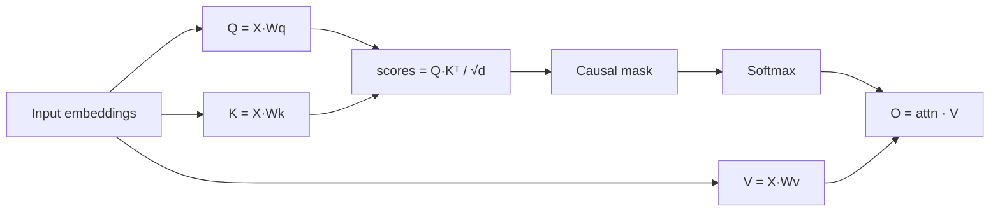
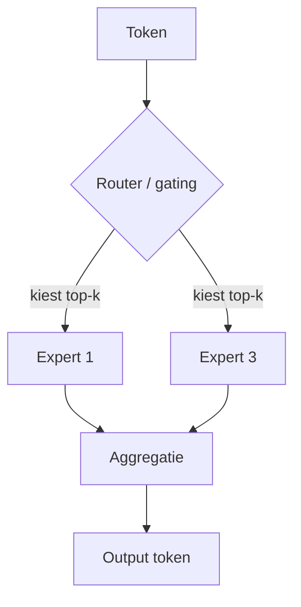

# 3. Language Model: algemene werking en types (verdieping)

> Dit document verdiept [§3 van `AGENTS.md`](../AGENTS.md). Het beschrijft wat een
> taalmodel **in algemene zin** is en doet — ongeacht of het in een chat, een
> agent of een batch-proces draait. Pas daarna (in `02-llm-chatmode.md` en
> `03-agentic-loop.md`) passen we dit toe op chat- en agentic-modi.

Het doel van dit hoofdstuk is **elk detail concreet aan te tonen** met
minimalistische, leesbare Python-voorbeelden (voornamelijk `numpy`). De code is
pedagogisch: ze toont het *principe* correct, maar is geen productie-implementatie.

---

## Functioneel: wat is een taalmodel en waarom snappen we dit eerst?

Een **Language Model (LM)** is een wiskundig model dat de *waarschijnlijkheid van
tekst* leert. Concreet: gegeven een reeks voorafgaande woorden (of tekens),
voorspelt het model *welk token* (stukje tekst) het meest waarschijnlijk volgt.
Alles wat een LLM "kan" — tekst schrijven, vertalen, redeneren, ja zelfs
"denken" in een agent — komt neer op die ene operatie: **telkens het volgende
token voorspellen**.

Waarom dit hoofdstuk *vóór* chat en agentic?

- De werking en types van een LM zijn **universeel**. Tokenisatie, embeddings,
  de Transformer-laag en MoE bestaan ongeacht de interface.
- Chat (§4) en Agentic (§5) zijn *lagen erbovenop*: ze bepalen hoe de input
  wordt voorbereid en wat er met de output gebeurt, maar het model zelf blijft
  hetzelfde.
- Wie de basis snapt, begrijpt ook *waarom* bepaalde limitaties bestaan
  (context-window, KV-cache, kosten) die later in compression (§9) en token
  economics (§15) terugkomen.

### De vier stappen op hoog niveau

```mermaid
flowchart TD
    A[Plaintext] --> B[1. Tokenisatie]
    B --> C[2. Embeddings + positionele encoding]
    C --> D[3. Transformer-lagen (N x)]
    D --> E[4. Logits → volgende token]
    E --> F[Sampling / argmax]
    F -->|autoregressief| B
```

Elke stap wordt hieronder zowel functioneel als technisch uitgediept.

---

## Technisch

### 3.1 Tokenisatie — tekst → getallen

**Functioneel.** Een model rekent niet met letters maar met getallen. De tokenizer
zet een string om in een rij **tokens** (woorddelen, lettergrepen of tekens),
elk met een vast ID in een vocabulaire van typisch 32k–256k tokens. De tokenizer
is *bidirectioneel* met het trainingsproces: decodeer je later tokens terug naar
tekst, dan moet dat exact kloppen.

De drie veelgebruikte algoritmen:

| Algoritme | Principe | Voorbeeld-modellen |
|-----------|----------|--------------------|
| **BPE** (Byte-Pair Encoding) | merge steeds het frequentste karakterpaar | GPT-2/3/4, Claude |
| **WordPiece** | merge op basis van taalkundige waarde (likelihood) | BERT-familie |
| **SentencePiece / Unigram** | subwoord via probabilistische compressie | LLaMA, Gemini, T5 |

**Technisch (BPE vanaf nul).** Het volgende voorbeeld traint een mini-BPE op een
kleine corpus, zodat je het *merge*-proces letterlijk ziet gebeuren.

```python
# pedagogische BPE — geen productiecode
import re
from collections import Counter

def get_pairs(word):
    return set(zip(word[:-1], word[1:]))

def train_bpe(corpus, vocab_size=12):
    # start: woorden opgesplitst in karakters, met expliciet woord-eind-token
    words = re.findall(r"\w+", corpus.lower())
    tokens = [list(w) + ["</w>"] for w in words]
    merges = []
    while len(merges) < vocab_size:
        counts = Counter()
        for t in tokens:
            counts.update(get_pairs(t))
        if not counts:
            break
        best = max(counts, key=counts.get)
        merges.append(best)
        # pas alle tokens aan: smelt (best[0], best[1]) samen tot één symbool
        a, b = best
        new_tokens = []
        for t in tokens:
            nt, i = [], 0
            while i < len(t):
                if i < len(t) - 1 and t[i] == a and t[i + 1] == b:
                    nt.append(a + b); i += 2
                else:
                    nt.append(t[i]); i += 1
            new_tokens.append(nt)
        tokens = new_tokens
    return merges

merges = train_bpe("agents agentic agent wise agency", vocab_size=8)
print("Geleerde merges:", merges)
```

**Technisch (echte tokenizer).** In de praktijk gebruik je een bestaande
tokenizer. Met `tiktoken` (OpenAI) zie je concreet hoeveel tokens een zin kost:

```python
# pip install tiktoken
import tiktoken

enc = tiktoken.get_encoding("cl100k_base")   # GPT-3.5/4 vocab
text = "Agentic AI werkt met tokens."
ids = enc.encode(text)
print("token-IDs :", ids)
print("decode    :", [enc.decode([i]) for i in ids])
print(f"{len(ids)} tokens voor {len(text)} karakters "
      f"(~{len(text)/len(ids):.1f} kar/token)")
```

> **Inzicht:** "agentic" wordt vaak *niet* als één woord getokeniseerd maar als
> meerdere subwoorden — vandaar dat dezelfde term in verschillende modellen een
> ander aantal tokens kan opleveren. Dat heeft directe gevolgen voor de kosten
> (§15).

---

### 3.2 Embeddings + positionele informatie

**Functioneel.** Elk token-ID wordt opgezocht in een **embedding-matrix** (een
grote lookup-tabel) en omgezet in een dense vector van bijv. 4096 dimensies.
Die vector is de "betekenis" van het token in getalvorm.

Maar: een Transformer heeft **geen besef van volgorde**. Als je enkel embeddings
gebruikt, is "hond bijt man" gelijk aan "man bijt hond". Daarom wordt
**positionele encoding** toegevoegd zodat het model weet *waar* een token staat.

| Methode | Werking | Gebruikt door |
|---------|---------|---------------|
| Absolute (sin/cos) | vaste golven per positie | oudere Transformers |
| **RoPE** (Rotary) | positie = rotatie in de vector | LLaMA, Mistral, Gemma |
| **ALiBi** | bias op attention-scores i.p.v. embeddings | recente lange-context modellen |

**Technisch (embedding lookup + RoPE in numpy).**

```python
import numpy as np

rng = np.random.default_rng(0)
vocab_size, d_model = 20, 4
embedding = rng.standard_normal((vocab_size, d_model))   # lookup-tabel

def embed(token_ids):
    return embedding[np.asarray(token_ids)]               # (seq, d_model)

def rope(x, base=10000.0):
    """Rotary Position Embedding: roteer paren van dimensies per positie."""
    seq, d = x.shape
    half = d // 2
    inv_freq = 1.0 / (base ** (np.arange(0, d, 2) / d))   # (half,)
    pos = np.arange(seq)[:, None]                         # (seq,1)
    angles = pos * inv_freq[None, :]                      # (seq, half)
    cos, sin = np.cos(angles), np.sin(angles)
    x1, x2 = x[..., 0::2], x[..., 1::2]                   # even / oneven dims
    out = np.empty_like(x)
    out[..., 0::2] = x1 * cos - x2 * sin
    out[..., 1::2] = x1 * sin + x2 * cos
    return out

ids = [1, 3, 7]
x = embed(ids)
print("embeddings   :", x.shape)
print("na RoPE      :", rope(x).shape)
```

> **Waarom RoPE?** Omdat de positie een *rotatie* is, extrapoleert het model
> makkelijker naar langere sequenties dan bij absolute encodings — relevant voor
> het context-window in §9 en §4.

---

### 3.3 Het model zelf — een decoder-only Transformer

**Functioneel.** De moderne LLM is vrijwel altijd een **decoder-only
Transformer**: een stapel van N identieke lagen (32–128). Elke laag doet drie
dingen:

1. **Multi-Head Self-Attention** — elk token "kijkt" naar eerdere tokens; een
   *causal mask* verhindert kijken naar de toekomst.
2. **Feed-Forward Network (FFN / MLP)** — een per-token transformatie, de
   "kennis"-opslag.
3. **LayerNorm + Residual connections** — stabilisatie en informatiestroom.

**Technisch (één causal self-attention head in numpy).** Dit toont het hart van
elke laag: query's, keys en values, een score, een causal mask en softmax.

```python
def causal_self_attention(x, seed=0):
    seq, d = x.shape
    r = np.random.default_rng(seed)
    Wq, Wk, Wv = (r.standard_normal((d, d)) for _ in range(3))
    Q, K, V = x @ Wq, x @ Wk, x @ V

    scores = (Q @ K.T) / np.sqrt(d)              # (seq, seq)
    # causal mask: positie i mag ENKEL naar posities <= i kijken
    mask = np.triu(np.ones((seq, seq)), k=1).astype(bool)
    scores[mask] = -1e9

    e = np.exp(scores - scores.max(axis=-1, keepdims=True))
    attn = e / e.sum(axis=-1, keepdims=True)     # softmax per rij
    return attn @ V                              # gewogen som van Values

x = rope(embed([1, 3, 7]))
out = causal_self_attention(x)
print("attention-output:", out.shape)
```



> **Vereenvoudiging:** echte modellen gebruiken *multi-head* (meerdere
> aandachtspatronen parallel), **Rotary** op Q/K vóór de score, en een FFN na de
> attention. De FFN is typisch `Linear → activatie → Linear` per token.

---

### 3.4 Architectuur-typen (niet chat-specifiek)

**Functioneel.** Ongeacht de interface verschillen modellen in *hoe* de lagen
hun rekenwerk verdelen. Dat bepaalt de balans tussen capaciteit (kennis) en
snelheid/kosten.

| Type | Werking | Voorbeeld |
|------|---------|-----------|
| **Dense** | Alle parameters actief per token | GPT-3, LLaMA (basis) |
| **MoE** | FFN opgesplitst in "experts"; een router kiest per token top-k experts | Mixtral, DeepSeek |
| **SSM / Mamba** | recurrente verwerking i.p.v. attention; lineaire complexiteit | Mamba, Jamba |
| **Hybrid** | mix van attention- en SSM-lagen | Jamba, Zamba |

**MoE in detail — active parameters vs. totale parameters.** Bij MoE is het
*totale* aantal parameters groot (voor capaciteit), maar per token wordt slechts
een klein deel ("**active parameters**") gebruikt. Een *router* (gating network)
bepaalt welke experts ("active tokens" in de zin van: welke expert-activaties)
voor een gegeven token aangesproken worden. Dit houdt inference goedkoop terwijl
de "kennis-capaciteit" hoog blijft.

**Technisch (mini-MoE in numpy).**

```python
def moe(x, n_experts=4, k=2, seed=1):
    seq, d = x.shape
    r = np.random.default_rng(seed)
    experts = [r.standard_normal((d, d)) for _ in range(n_experts)]
    router = r.standard_normal((d, n_experts))

    logits = x @ router                         # (seq, n_experts)
    topk = np.argsort(logits, axis=-1)[:, -k:]  # per token: top-k experts

    out = np.zeros_like(x)
    for i in range(seq):
        for e in topk[i]:
            gate = logits[i, e]                 # router-gewicht
            out[i] += gate * (x[i] @ experts[e])
    return out, topk

out, topk = moe(rope(embed([1, 3, 7])), k=2)
print("actieve expert per token:\n", topk)
```



> **SSM / Mamba** laten we hier zonder code; het vervangt attention door een
> recursieve state-update met lineaire complexiteit in lengte — interessant voor
> heel lange contexten, maar buiten de scope van deze basis-verdieping.

---

## Samenvatting (key takeaways)

- Een LM doet één ding: **het volgende token voorspellen** uit voorafgaande tokens.
- De pijplijn is universeel: **tokeniseer → embed + positioneer → Transformer-lagen
  → logits → sample**.
- Tokenisatie bepaalt de *kosteenheid* (tokens ≠ karakters) → relevant voor §15.
- RoPE geeft volgorde zónder de vector te breken → makkelijker lange context.
- **MoE** ontkoppelt capaciteit (totale params) van kost (actieve params):
  meer kennis voor dezelfde rekentijd per token.

Deze basis geldt voor chat (§4) én agentic (§5). In het volgende document
(`02-llm-chatmode.md`) zien we wat de *server* met de input doet vóórdat dit
model aangeroepen wordt.
