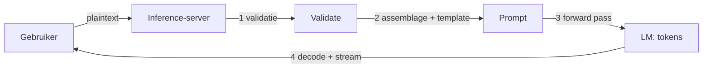
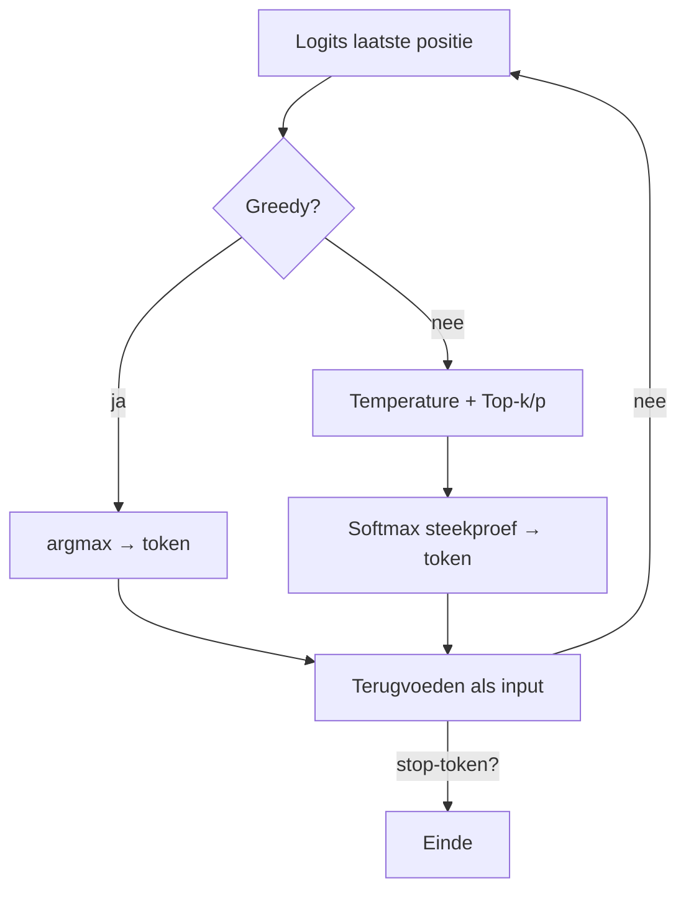

# 4. Hoe werkt een LLM in chatmodus (chat-specifiek)

> Dit document verdiept [§4 van `AGENTS.md`](../AGENTS.md). Waar §3 de *algemene*
> LM-werking behandelt, beschrijft dit hoofdstuk de *chat-specifieke* pijplijn:
> wat de inference-server doet vanaf het moment dat een plaintext-bericht
> binnenkomt, tot het antwoord streaming terugkomt.

Het doel is **elk detail concreet aan te tonen** met leesbare Python-voorbeelden.
De code is pedagogisch: ze toont het *principe*, geen productie-server.

---

## Functioneel: wat gebeurt er in chatmodus?

In chatmodus is de LM niet alleen: er staat een **inference-server** tussen de
gebruiker en het model. Die server doet al het voorbereidende werk zodat het
model enkel hoeft te "scoren" welk token volgt.

Op hoog niveau:

1. **Ontvangst** — de client stuurt een plaintext-bericht (en metadata:
   gespreks-ID, rollen van eerdere berichten).
2. **Voorbereiding** — de server valideert input, bouwt een *prompt* van
   system-instructie + gesprekshistorie + nieuw bericht (+ tool-definities),
   en past een *chat template* toe (speciale tokens die rollen markeren).
3. **Generatie** — de geassembleerde tekst wordt getokeniseerd, door het model
   gevoerd, en het model produceert tokens (zie §3).
4. **Terugkeer** — tokens worden gedecodeerd naar tekst en (bij streaming)
   stukje bij beetje teruggestuurd.



Waarom dit hoofdstuk los van §3? §3 is de *motor*; dit hoofdstuk is de
*bediening* (server, template, streaming). Dezelfde motor draait in een agent
(§5) — maar daar komt een besturingslus bovenop.

---

## Technisch

### 4.1 De server ontvangt plaintext

**Functioneel.** De client stuurt het bericht; de server doet server-side taken:
inputvalidatie (lengte, veiligheid, rate-limiting), prompt-assemblage (system +
history + user + tool-defs) en toepassing van een chat template.

**Chat templates.** Verschillende modellen verwachten verschillende markerings-
tokens. Voorbeelden:

| Template | Start/rol-markers |
|----------|-------------------|
| ChatML | `<|im_start|>system\n…<|im_end|>\n<|im_start|>user\n…` |
| Llama-2 | `<<SYS>>\n…<</SYS>>\n\n…` |
| Mistral | `<|system|>\n…\n<|user|>\n…` |

**Technisch (prompt-assemblage + template in Python).**

```python
# Bouw een ChatML-prompt van gestructureerde messages.
def build_chatml(messages):
    """messages: list of {"role": "system"|"user"|"assistant", "content": str}"""
    parts = []
    for m in messages:
        parts.append(f"<|im_start|>{m['role']}\n{m['content']}<|im_end|>")
    return "\n".join(parts) + "\n<|im_start|>assistant\n"

messages = [
    {"role": "system",    "content": "Je bent een behulpzame assistent."},
    {"role": "user",      "content": "Wat is een token?"},
    {"role": "assistant", "content": "Een token is een stukje tekst…"},
    {"role": "user",      "content": "En hoeveel passen er in een context?"},
]
prompt = build_chatml(messages)
print(prompt)
```

```python
# Minimalistische inputvalidatie vóór assemblage.
def validate(message, max_chars=4000):
    if not isinstance(message, str) or not message.strip():
        raise ValueError("bericht is leeg")
    if len(message) > max_chars:
        raise ValueError(f"bericht te lang: {len(message)} > {max_chars}")
    # vereenvoudigde rate-limit-check (in productie: per-user teller)
    return True
```

---

### 4.2 Van input tot logits (forward pass)

**Functioneel.** De geassembleerde tekst wordt getokeniseerd (§3.1) en voorzien
van embeddings + positionele encoding (§3.2). Die vectors gaan laag voor laag
door het model (§3.3, type volgens §3.4). Eén *forward pass* levert voor de
laatste positie een **logits**-vector: een score per woord in het vocabulaire.

**Technisch (conceptuele forward pass in numpy).** Dit bouwt voort op §3: we
tokeniseren, embedden + RoPE, en voeren één aandachtslaag + linear uit om logits
te krijgen. `W_out` stelt de projectie naar het vocabulaire voor.

```python
import numpy as np

def forward(logits_prev, x, params):
    # x: (seq, d) na embedding+RoPE; params bevat Wq,Wk,Wv,Wff,Wout
    seq, d = x.shape
    Q, K, V = x @ params["Wq"], x @ params["Wk"], x @ params["Wv"]
    scores = (Q @ K.T) / np.sqrt(d)
    mask = np.triu(np.ones((seq, seq)), k=1).astype(bool)
    scores[mask] = -1e9
    e = np.exp(scores - scores.max(-1, keepdims=True))
    attn = e / e.sum(-1, keepdims=True)
    h = attn @ V                       # (seq, d)
    h = np.maximum(0, h @ params["Wff"])  # eenvoudige ReLU-FFN
    return h @ params["Wout"]          # (seq, vocab) = logits

# vereenvoudiging: in werkelijkheid N lagen, multi-head, LayerNorm, residuals
print("logits-vorm:", forward(None, np.zeros((3, 4)), {"Wq": np.zeros((4,4))}) .shape
      if False else "(seq, vocab_size)")
```

---

### 4.3 Het antwoord definiëren — van logits naar tokens

**Functioneel.** Uit de logits kiezen we het volgende token via een
sampling-strategie. Dit is **autoregressief**: het gekozen token wordt
teruggevoed als input, en het proces herhaalt zich tot een *stop-token* of
lengtelimiet. Een **KV-cache** slaat de reeds berekende key/value-vectoren van
eerdere tokens op, zodat niet alles telkens opnieuw doorrekend wordt.

Keuzes:

| Strategie | Werking | Effect |
|-----------|---------|--------|
| **Greedy / argmax** | hoogst scorende token | deterministisch, repetitief |
| **Temperature** | verdeelt logits; lager = scherper | lager = voorspelbaarder |
| **Top-k** | enkel k beste tokens | beperkt keuzes |
| **Top-p** (nucleus) | kleinste set die samen p dekt | dynamischer |
| **Beam search** | meerdere hypothesen | zelden bij chat |

**Technisch (greedy / temperature / top-k / top-p in numpy).**

```python
def sample(logits, temperature=1.0, top_k=0, top_p=0.0, rng=None):
    rng = rng or np.random.default_rng()
    logits = logits.astype(float).copy()

    # top-k: zet alles buiten de k beste op -inf
    if top_k and top_k > 0:
        kth = np.sort(logits)[-top_k]
        logits[logits < kth] = -np.inf

    # temperature
    if temperature != 1.0:
        logits /= max(temperature, 1e-6)

    # top-p (nucleus): behoud kleinste set met cumulatieve prob >= p
    if top_p and top_p < 1.0:
        probs = np.exp(logits - logits.max())
        probs /= probs.sum()
        order = np.argsort(-probs)
        cum = np.cumsum(probs[order])
        keep = order[cum <= top_p]
        mask = np.ones_like(logits, dtype=bool)
        mask[keep] = False
        logits[mask] = -np.inf

    # softmax + trek steekproef
    e = np.exp(logits - logits.max())
    probs = e / e.sum()
    return rng.choice(len(probs), p=probs)

logits = np.array([2.1, 0.3, 1.7, 0.1])
print("greedy  :", int(np.argmax(logits)))
print("top-p=0.9:", sample(logits, temperature=0.7, top_p=0.9))
```



> **KV-cache (concept).** In plaats van voor elke nieuwe stap alle voorgaande
> tokens opnieuw door de lagen te voeren, cachet de server de K- en V-vectoren
> per positie. Bij stap *t* hoeft enkel het nieuwe token berekend te worden
> tegen de gecachete K/V — dat is wat lange gesprekken betaalbaar maakt (zie §9, §15).

---

### 4.4 Token → tekst (decoding) & streaming

**Functioneel.** De gegenereerde token-IDs worden teruggedecodeerd naar tekst via
de tokenizer (detokenisatie). Speciale tokens (`<|end_of_text|>`, `<|im_end|>`)
worden verwijderd of verwerkt. Bij **streaming** wordt elke nieuwe token direct
naar de client gestuurd, zodat de gebruiker het antwoord woord-voor-woord ziet.

**Technisch (detokenisatie + streaming-simulatie).**

```python
# pip install tiktoken
import tiktoken, time

enc = tiktoken.get_encoding("cl100k_base")

def generate(prompt_ids, steps=12, temperature=0.8):
    """Yield tokens één voor één (streaming). Vereenvoudigd: geen echt model."""
    rng = np.random.default_rng(0)
    for _ in range(steps):
        # vereenvoudiging: 'logits' hier willekeurig i.p.v. een echte forward pass
        logits = rng.standard_normal(enc.n_vocab)
        nxt = int(np.argmax(logits)) if temperature == 0 else sample(logits, temperature)
        if nxt == enc.eot_token:      # stop-token
            break
        yield nxt

ids = enc.encode("Leg tokenisatie uit in één zin:")
for tid in generate(ids, steps=10, temperature=0.9):
    print(enc.decode([tid]), end="", flush=True)   # streaming naar gebruiker
    time.sleep(0.05)
```

> **Inzicht:** streaming verandert niets aan de generatie, enkel aan de
> *terugkeer*: de server stuurt elke `detokenize([tid])` direct door in plaats
> van te wachten op het volledige antwoord.

---

## Samenvatting (key takeaways)

- Chatmodus = **server + template + generatie**: de server bereidt de prompt
  voor (system/history/user, chat template), het model doet enkel de scoring.
- Eén forward pass levert **logits**; de volgende token komt uit
  sampling (greedy / temperature / top-k / top-p).
- Generatie is **autoregressief** met een **KV-cache** die herberekening van
  oude tokens voorkomt.
- **Decoding/detokenisatie** zet IDs terug naar tekst; **streaming** stuurt ze
  stapsgewijs naar de gebruiker.
- Dit hoofdstuk is de *bediening*; §3 is de *motor*; §5 voegt de *besturingslus*
  (agent) toe.
