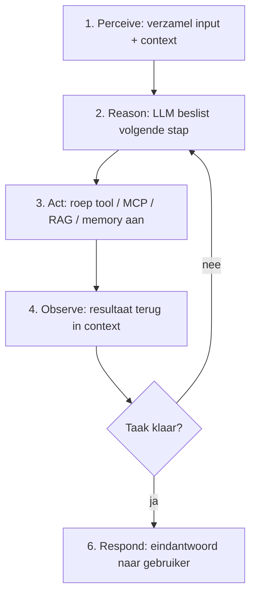
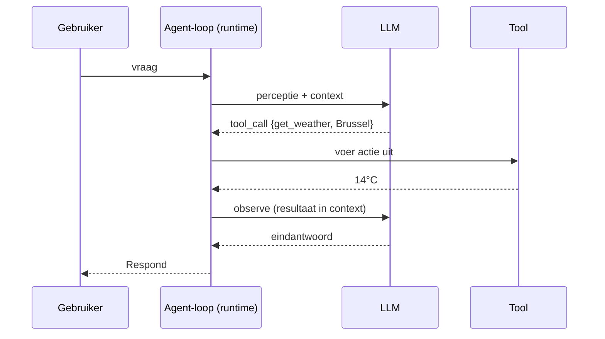
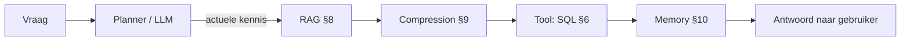

# 5. Hoe werkt een Agentic loop (verdieping)

> Dit document verdiept [§5 van `AGENTS.md`](../AGENTS.md#5-hoe-werkt-een-agentic-loop-agentic-specifiek).
> Een "gewoon" LLM is **stateless** en alleen tekst (zie §3 en de chat-pijplijn in
> §4). Een **agent** voegt een **besturingslus** toe waardoor het model *acties*
> kan ondernemen en *tussenresultaten* kan verwerken. Hier beschrijven we die
> loop en wanneer de omringende componenten (tools, MCP, RAG, compression, memory,
> planning, skills) ingezet worden.

Het doel van dit hoofdstuk is **elk detail concreet aan te tonen** met
minimalistische, leesbare Python-voorbeelden. De code is pedagogisch: ze toont
het *principe* correct, maar is geen productie-implementatie.

---

## Functioneel: wat is een agentic loop en waarom hebben we die?

Een LLM alleen kan tekst genereren, maar niet *handelen*: het kan geen data
ophalen, geen berekening maken, geen bestand lezen. Een **agentic loop** sluit
dat gat door het model te omringen met een runtime die:

1. **Perceive** — de input van de gebruiker én de opgebouwde context verzamelt.
2. **Reason** — het model laat beslissen wat de volgende stap is (antwoorden, of
   een actie ondernemen).
3. **Act** — een *tool*, *MCP-server*, *RAG-retrieval* of *geheugen*-operatie
   uitvoert buiten het model om.
4. **Observe** — het resultaat terug in de context plaatst.
5. **Repeat** — opnieuw naar *Reason* gaat zolang de taak niet klaar is.
6. **Respond** — het eindantwoord aan de gebruiker geeft en de loop stopt.

Het model blijft daarbij hetzelfde model uit §3: het produceert telkens het
volgende "token" of — bij function calling — een gestructureerde `tool_call`.
De *lus* is puur runtime-logica rond het model heen.



Waarom dit hoofdstuk *na* §3 en §4? Omdat de agentic loop **bovenop** het
model (§3) en de chat-pijplijn (§4) zit: het model levert de redenering, de chat
server levert de tokenizer/forward-pass (§4), en de agent-loop beslist *wanneer*
welke externe component aangeroepen wordt. De agent is dus de "dirigent".

---

## Technisch

### De agentic loop uitgewerkt (de 6 stappen)

**Functioneel.** De loop is een `while`-constructie: zolang er geen eindantwoord
is, blijft de runtime het model aanroepen. Elke aanroep krijgt de *volledige*
context (geschiedenis + reeds uitgevoerde acties + observaties). Het model kan
dan kiezen: óf een `tool_call` uitvoeren (→ Act + Observe), óf direct antwoorden
(→ Respond, loop stopt).

**Technisch (minimalistische loop in Python).** Onderstaand voorbeeld toont de
volledige cyclus met een *mock*-LLM. In productie vervang je `mock_llm` door de
API-aanroep (OpenAI/Anthropic/vLLM) die `tool_calls` teruggeeft (zie §6).

```python
# Agentic loop — minimalistisch, pedagogisch (geen productiecode)
from dataclasses import dataclass

@dataclass
class Msg:
    role: str      # "user" | "assistant" | "tool"
    content: str

def mock_llm(messages):
    """Vereenvoudiging: een 'model' dat één tool-call doet en dan stopt.
    Echt zou dit een API-call zijn die tool_calls of content teruggeeft."""
    n_obs = sum(1 for m in messages if m.role == "tool")
    if n_obs == 0:
        # 2. Reason -> beslis een actie (tool call)
        return {"tool_calls": [{"name": "get_weather",
                                "arguments": {"location": "Brussel"}}]}
    # 4. na observatie -> 6. Respond (eindantwoord, loop stopt)
    return {"content": "Het is 14°C in Brussel."}

def run_agent_loop(user_input, tools, max_steps=5):
    messages = [Msg("user", user_input)]          # 1. Perceive
    for _ in range(max_steps):                     # 5. Repeat
        decision = mock_llm(messages)
        if "tool_calls" in decision:
            for call in decision["tool_calls"]:    # 3. Act
                result = tools[call["name"]](**call["arguments"])
                messages.append(Msg("tool", str(result)))   # 4. Observe
        else:
            return decision["content"]             # 6. Respond
    return "[max steps bereikt]"

tools = {"get_weather": lambda location: f"14°C in {location}"}
print(run_agent_loop("Wat is het weer in Brussel?", tools))
# -> Het is 14°C in Brussel.
```



> **Inzicht:** bij elke `Repeat` wordt de *hele* context opnieuw naar het model
> gestuurd. Daarom groeien de token-kosten bij agents snel (§15) en is
> **compression** (§9) en **memory** (§10) onmisbaar bij lange taken.

---

### 5.1 Wanneer welk component ingezet wordt

**Functioneel.** De agentic loop roept per iteratie nul, één of meerdere
"gereedschappen" aan. Niet elk component is altijd nodig; de *planner* (het
model zelf, of een expliciete planner uit §11) bepaalt welk component op welk
moment zinvol is. De kerncomponenten en hun trigger-moment:

| Component | Wat het doet | Wanneer ingezet | Uitdieping |
|-----------|--------------|-----------------|------------|
| **Tools / Function calling** | Model produceert een gestructureerde aanroep (naam + argumenten); runtime voert de functie uit (API, rekenmachine, code, DB). | Zodra de taak een *actie in de wereld* vereist die het model niet uit zichzelf kan. | [§6](./04-tools.md) |
| **MCP — Model Context Protocol** | Gestandaardiseerd protocol dat *tools, resources (gegevens)* en *prompts* ontsluit via herbruikbare servers. | Bij het koppelen van veel externe systemen/bronnen op een gestandaardiseerde manier. | [§7](./05-mcp.md) |
| **RAG (Retrieval Augmented Generation)** | Documenten gechunkt, geëmbed en in een vector-DB; relevante stukken opgehaald en in de prompt geïnjecteerd. | Wanneer antwoorden *actuele, privé of gespecialiseerde* kennis vereisen die niet in de gewichten zit. | [§8](./06-rag.md) |
| **Compression** | Samenvatting van gesprekshistorie, prompt-compressie, of KV-cache-/context-window-beheer. | Zodra de context te groot/bereik/duur wordt; voorkomt "context verlies" en kosten. | [§9](./07-compression.md) |
| **Memory** | Kortetermijn (huidige context) vs. langetermijn (externe store: vector-DB, SQL, file). | Voor continuïteit over sessies en het onthouden van feiten/voorkeuren. | [§10](./08-memory.md) |
| **Planning** | ReAct (reason+act interleaved), plan-and-execute, reflexion. | Bij complexe, multi-stap taken; stuurt *wanneer* tools/retrieval aangeroepen worden. | [§11](./09-planning.md) |
| **Skills** | Verpakte, herbruikbare capaciteiten/instructies die de agent uitbreiden met domeinkennis of SOPs. | Bij terugkerende, goed omschreven taken en standaardprocedures. | [§12](./10-skills.md) |

**Technisch (een kleine router).** In plaats van dit in de LLM te verstoppen,
laten we hier zien hoe een *planner* zo'n beslissing als functie kan voorstellen.
Dit is de logica die achter de tabel staat — in productie neemt het model deze
beslissing op basis van de prompt.

```python
def choose_component(need: str) -> str:
    """Mapping van een vastgestelde 'behoefte' naar het juiste component."""
    return {
        "actie_in_de_wereld":   "tools",        # §6
        "veel_externe_systemen":"mcp",          # §7
        "actuele_kennis":       "rag",          # §8
        "context_te_groot":     "compression",  # §9
        "sessie_overstijgend":  "memory",       # §10
        "complexe_meerstap":    "planning",     # §11
        "terugkerende_sop":     "skills",       # §12
    }.get(need, "none")

print(choose_component("actuele_kennis"))   # -> rag
print(choose_component("actie_in_de_wereld"))  # -> tools
```

> **Opmerking:** dit is een *vereenvoudigde* router. Een écht agentisch systeem
> laat het LLM zelf beslissen (bijv. via function calling, §6.3) in plaats van een
> statische `if`/`dict`. De tabel hierboven is de *beslissingsgids*; de code toont
> enkel het mechanisme.

---

### 5.2 Hoe de onderdelen samenwerken (concreet voorbeeld)

**Functioneel.** Stel de vraag: *"Wat zegt ons Q2-rapport over omzet in België?"*
De loop doorloopt dan achtereenvolgens:

1. **Planner/LLM** herkent: ik heb documentkennis nodig → **RAG** (§8) haalt het
   Q2-rapport op uit de vector-DB.
2. Het rapport is te lang → **Compression** (§9) vat de relevante passages samen.
3. LLM ziet samenvatting en beslist: er moet een getal uitgerekend worden → een
   **Tool** (§6, rekenmachine/SQL) wordt aangeroepen.
4. Resultaat komt terug (**Observe**), LLM formuleert antwoord en stopt de loop
   (**Respond**).
5. De interactie wordt in **Memory** (§10) bewaard voor toekomstige vragen.

De agentic loop is dus de dirigent: hij beslist per iteratie welk component nodig
is en voegt de uitkomst terug in de context voor de volgende redeneer-stap.

**Technisch (orchestratie in Python).** Hieronder staat dezelfde keten, maar dan
als aanroepbare stappen met *mock*-implementaties van RAG, compression, tool en
memory. De `run_q2_agent` functie volgt exact de 5 stappen hierboven.

```python
# Concreet voorbeeld uit §5.2 — vereenvoudigd met mock-componenten.
def mock_rag(query):
    # §8: retrieval uit een vector-DB (hier: één lange tekst)
    return ("Q2-rapport (lang): omzet NL €1.2M, BE €0.8M, FR €0.5M, "
            "DE €0.9M; BE groei 12% t.o.v. Q1; ...")

def mock_compress(text):
    # §9: vat samen zodat het in de context past
    return "Q2: BE omzet €0.8M (12% groei t.o.v. Q1)."

def mock_sql(query):
    # §6: tool-aanroep (hier een domme lookup)
    return 0.8  # miljoen euro

def mock_memory_save(fact):
    # §10: langetermijngeheugen (hier een no-op)
    pass

def run_q2_agent(question):
    # 1. RAG haalt het relevante document op
    doc = mock_rag(question)
    # 2. Compression vat het rapport samen (te lang voor context)
    summary = mock_compress(doc)
    # 3. Tool (SQL/rekenmachine) berekent het gevraagde getal
    answer = mock_sql("omzet BE")
    # 4. Memory bewaart de interactie voor toekomstige vragen
    mock_memory_save(question)
    # 5. Respond
    return f"Omzet in België (Q2): €{answer}M."

print(run_q2_agent("Wat zegt ons Q2-rapport over omzet in België?"))
# -> Omzet in België (Q2): €0.8M.
```



> **Inzicht:** de volgorde is niet hardcoded in het model maar *beslist per
> iteratie*. Een andere vraag ("Stuur een mail naar de finance-afdeling") zou
> bijvoorbeeld direct naar een tool (§6) of MCP-server (§7) gaan zónder RAG. Dat
> is precies de kracht van de loop: de componenten zijn **optelbare bouwstenen**.

---

## Samenvatting (key takeaways)

- Een **agentic loop** zet een stateless LLM (§3) om in een *handelend* systeem:
  **Perceive → Reason → Act → Observe → Repeat → Respond**.
- De *lus* is runtime-logica rond het model heen; het model zelf verandert niet
  (het levert nog steeds het volgende token of een `tool_call`).
- Per iteratie wordt de **volledige context** opnieuw naar het model gestuurd →
  dat verklaart de kostenexplosie bij agents (§15) en het belang van compression
  (§9) en memory (§10).
- De componenten uit §5.1 (tools §6, MCP §7, RAG §8, compression §9, memory §10,
  planning §11, skills §12) zijn **optelbare bouwstenen**; de planner beslist
  wanneer welke aan bod komt.
- Het Q2-voorbeeld (§5.2) toont hoe RAG → compression → tool → memory in één loop
  samenwerken tot een antwoord.

In het volgende document (`04-tools.md`, §6) verdiepen we de eerste en
belangrijkste bouwsteen: **function calling / tools**.
