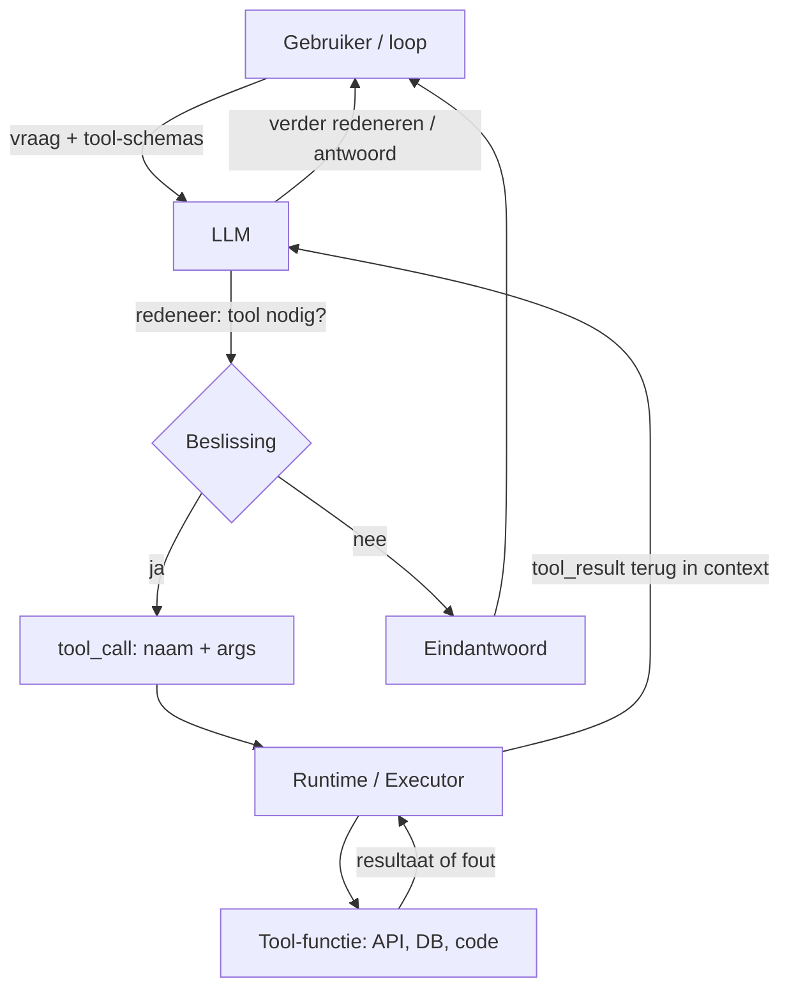
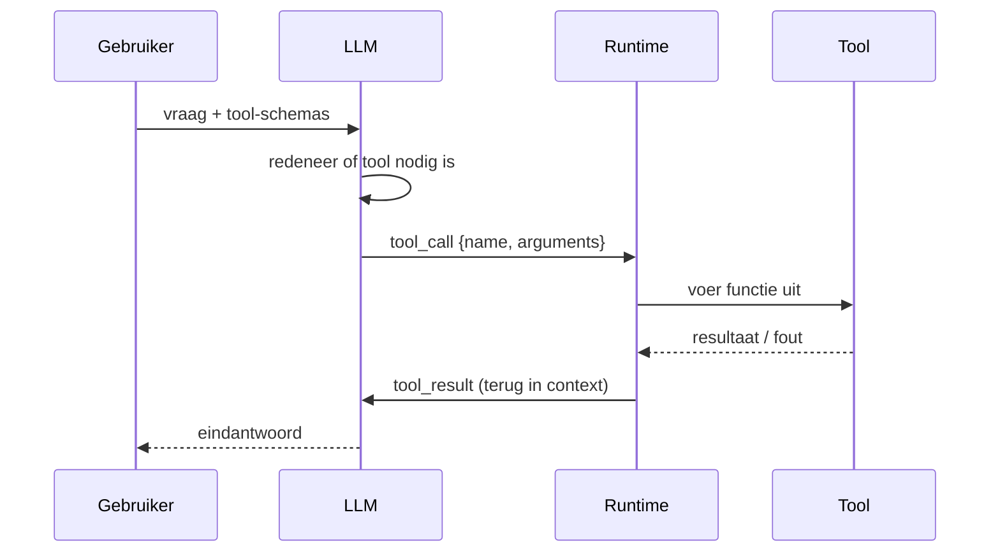

# 6. Tools / Function calling (verdieping)

> Dit document verdiept [§6 van `AGENTS.md`](../AGENTS.md). Tools (ook *function
> calling* genoemd) zijn het onderdeel waarmee een agent **handelt in de
> wereld**: het model produceert een gestructureerde opdracht en de *runtime*
> voert die uit. Tools zijn een **agentic-specifiek** concept (zie de agentic
> loop, §5) — het onderliggende taalmodel (§3) en de chat-server (§4) blijven
> ongewijzigd. De *standaard* om tools (én data, én prompts) aan te bieden,
> bespreken we later in §7 (MCP).

Het doel van dit hoofdstuk is **elk detail concreet aan te tonen** met
minimalistische, leesbare Python-voorbeelden. De code is pedagogisch: ze toont
het *principe* correct, maar is geen productie-implementatie.

---

## Functioneel: wat zijn tools en waarom bestaan ze?

Een "gewoon" LLM is **stateless en enkel tekst** (zie §3 en §4). Het kan geen
actuele feiten ophalen, geen berekening maken buiten zijn gewichten, en geen
systeem aansturen. **Tools** geven het model "handen en voeten": het model
kiest *zelf* of een tool nodig is, vult de argumenten in, en de uitvoering
gebeurt **buiten** het model (in jouw code). Het resultaat komt als een
`tool`-bericht terug in de context, waarna het model verder redeneert.

Wanneer wordt een tool ingezet? Dat bepaalt de **agentic loop** (§5.1): zodra de
taak een *actie in de wereld* vereist — data ophalen, iets uitrekenen, een
systeem aansturen — die het model niet uit zichzelf kan.

### De tool-call cyclus op hoog niveau



De cyclus is **iteratief**: het model mag na een tool-resultaat opnieuw een tool
aanroepen, of pas dan het eindantwoord formuleren. Dit sluit naadloos aan op de
agentic loop (§5): de loop is de "dirigent", tools zijn één van de instrumenten.

> **Tools vs. MCP (vooruitblik §7).** Tools zijn het *concept* (naam, schema,
> uitvoering). MCP is de **standaard** die tools — plus resources en prompts —
> op een herbruikbare, protocol-gebaseerde manier ontsluit. Je kunt tools hebben
> zonder MCP; MCP is de gestandaardiseerde *manier* om ze aan te bieden.

---

## Technisch

### 6.1 De tool-call cyclus

**Functioneel.** De cyclus heeft vijf stappen: (1) **definitie** van de tool,
(2) **keuze** door het model, (3) **uitvoering** door de runtime, (4)
**terugkoppeling** van het resultaat in de context, (5) **vervolg** — het model
redeneert verder of antwoordt. Hieronder een werkend, minimaal voorbeeld van de
volledige cyclus in één runtime.

**Technisch (de volledige cyclus in Python).**

```python
# 6.1 — De tool-call cyclus (pedagogisch, geen echte model-API)
from typing import Callable

# 1. Definitie: de runtime houdt een registry van beschikbare tools
def get_weather(location: str, unit: str = "celsius") -> str:
    """Voorbeeld-tool: haalt 'weer' op (hier gestubd)."""
    # In productie: echte HTTP-call naar een weerdienst
    return f"Weer in {location}: 18°{unit[0].upper()} (gestubd)"

TOOL_REGISTRY: dict[str, Callable] = {"get_weather": get_weather}

def execute_tool(name: str, arguments: dict) -> str:
    """3. Uitvoering: de runtime roept de echte functie aan."""
    if name not in TOOL_REGISTRY:
        raise ValueError(f"Onbekende tool: {name}")
    return TOOL_REGISTRY[name](**arguments)

# 2. Keuze: een (gesimuleerd) model beslist een tool aan te roepen.
#    Echte API's geven een gestructureerde tool_call terug, bv:
def mock_model_decides() -> dict:
    return {"name": "get_weather", "arguments": {"location": "Brussel, België"}}

# 4. + 5. Terugkoppeling en vervolg binnen de agentic loop
def agentic_step():
    call = mock_model_decides()                       # 2. keuze
    result = execute_tool(call["name"], call["arguments"])  # 3. uitvoering
    tool_result = f"tool_result[{call['name']}]: {result}"   # 4. terug in context
    # 5. het model krijgt `tool_result` in de prompt en formuleert het antwoord
    return f"{tool_result}\n→ Het is 18°C in Brussel, neem een jas mee."

print(agentic_step())
```



> **Vereenvoudiging:** in productie is `mock_model_decides()` de API-aanroep
> (zie 6.2) en loopt de cyclus in een `while`-lus totdat het model stopt met
> tool-calls (de agentic loop, §5).

---

### 6.2 Tool-schema (definitie)

**Functioneel.** Een tool wordt beschreven met een **JSON-Schema-achtige
structuur**: een `name`, een `description` (waarop het model beslist of de tool
relevant is) en `parameters` (types, `enum`, `required`). Heldere schema's zijn
cruciaal: het model kiest de tool en vult argumenten in *op basis van de
beschrijving*.

**Technisch (schema als Python-dict + aanbieden aan de API).**

```python
# 6.2 — Tool-schema (definitie)
weather_schema = {
    "type": "function",
    "function": {
        "name": "get_weather",
        "description": "Haal de huidige weersvoorspelling op voor een locatie.",
        "parameters": {
            "type": "object",
            "properties": {
                "location": {
                    "type": "string",
                    "description": "Stad en land, bv. 'Brussel, België'",
                },
                "unit": {"type": "string", "enum": ["celsius", "fahrenheit"]},
            },
            "required": ["location"],   # enkel wat écht nodig is
        },
    },
}

# De runtime biedt de schemas aan het model aan (OpenAI-compatibel voorbeeld)
def build_tools(schemas: list[dict]) -> list[dict]:
    return schemas

# Conceptuele client-aanroep (vereenvoudigd, geen echte call):
# from openai import OpenAI
# client = OpenAI()
# client.chat.completions.create(
#     model="gpt-4o",
#     messages=[{"role": "user", "content": "Wat is het weer in Brussel?"}],
#     tools=build_tools([weather_schema]),
# )
```

**Best practices (uit §6.2 van `AGENTS.md`):**
- Schrijf een heldere, specifieke `description`.
- Specificeer types strikt en gebruik `enum` waar mogelijk.
- Markeer alleen wat écht nodig is als `required`.
- Verdeel complexe taken in meerdere kleine tools i.p.v. één "zwitsers zakmes".

---

### 6.3 Native function calling vs. ReAct-prompting

**Functioneel.** Er zijn twee manieren waarop het model een tool aanroept:
- **Native function calling** — de model-API ondersteunt `tool_calls` expliciet.
  Het model geeft gestructureerde JSON terug die de SDK parseert. Robuust.
- **ReAct-prompting** — het model schrijft tekst in het patroon
  `Thought: … Action: … Observation: …`. De runtime parsed die tekst. Werkt ook
  op modellen zonder native tool-ondersteuning, maar is fragieler (pars-fouten).

**Technisch (beide benaderingen naast elkaar).**

```python
# 6.3 — Native function calling vs. ReAct-prompting

# (a) NATIVE: het model geeft gestructureerde JSON terug
native_tool_call = {
    "name": "get_weather",
    "arguments": {"location": "Brussel, België", "unit": "celsius"},
}
print("native:", native_tool_call["name"], native_tool_call["arguments"])

# (b) REACT: het model schrijft tekst die we moeten parsen
react_text = (
    "Thought: ik heb het weer in Brussel nodig\n"
    'Action: get_weather\nAction Input: {"location": "Brussel, België"}\n'
    "Observation: 18°C\nAnswer: Het is 18°C in Brussel."
)

import re, json
m = re.search(r"Action:\s*(\w+)\s*Action Input:\s*(\{.*?\})", react_text, re.S)
if m:
    name, args_json = m.group(1), m.group(2)
    args = json.loads(args_json)            # fragiel: parsing kan mislukken
    print("react parsed:", name, args)
```

> **Trade-off.** Native is de voorkeur bij moderne modellen (OpenAI, Anthropic,
> Gemini). ReAct blijft nuttig voor modellen zonder native support, maar
> vergt zorgvuldige prompt-engineering en fouttolerante parsing.

---

### 6.4 Geavanceerde patronen

**Functioneel.** Drie patronen die de performantie en structuur van een agent
verbeteren:
- **Parallelle tool-calls** — meerdere onafhankelijke calls in één turn (lagere
  latency).
- **Tool-chaining** — de output van de ene tool wordt argument voor de volgende.
- **Sub-agent met eigen tools** — complexe agents delegeren deel-taken aan
  gespecialiseerde sub-agenten (zie ook §11 Planning).

**Technisch (parallel & chaining in Python).**

```python
# 6.4 — Geavanceerde patronen

# (a) PARALLELLE tool-calls: onafhankelijke calls tegelijk uitvoeren
calls = [
    {"name": "get_weather", "arguments": {"location": "Brussel"}},
    {"name": "get_weather", "arguments": {"location": "Antwerpen"}},
    {"name": "get_weather", "arguments": {"location": "Gent"}},
]
# In productie via concurrency (asyncio / ThreadPoolExecutor); hier sequentieel:
results = [execute_tool(c["name"], c["arguments"]) for c in calls]
print("parallel:", results)

# (b) TOOL-CHAINING: output van tool A = input voor tool B
def geo_to_coords(city: str) -> dict:
    return {"lat": 50.85, "lon": 4.35}        # stub: geocoding

def get_weather_by_coords(coords: dict) -> str:
    return f"Weer @ {coords}"                  # stub

coords = geo_to_coords("Brussel")              # A
chained = get_weather_by_coords(coords)        # B (input = output A)
print("chained:", chained)

# (c) SUB-AGENT: delegeer een deel-taak aan een gespecialiseerde agent.
#     Zie §11 (Planning) voor de aansturing; hier enkel het concept:
#     sub_agent = Agent(tools=[search_tool, math_tool], goal="vergelijk concurrenten")
```

---

### 6.5 Veiligheid & betrouwbaarheid

**Functioneel.** Omdat een tool *echte effecten* kan hebben, is dit het meest
risicovolle deel van de agent. De runtime moet **valideren**, **toestemming
vragen** voor gevaarlijke acties, **isoleren** (sandbox), **fouten zacht
afhandelen** (en teruggeven aan het model), en **idempotentie** respecteren.

**Technisch (validatie + permissies + foutafhandeling).**

```python
# 6.5 — Veiligheid & betrouwbaarheid

# (a) VALIDATIE van argumenten vóór executie
def safe_execute(name: str, arguments: dict) -> str:
    schema = weather_schema["function"]["parameters"]
    missing = [r for r in schema["required"] if r not in arguments]
    if missing:
        raise ValueError(f"Ontbrekende verplichte argumenten: {missing}")
    enum = schema["properties"]["unit"].get("enum")
    if "unit" in arguments and enum and arguments["unit"] not in enum:
        raise ValueError(f"Ongeldige 'unit': {arguments['unit']!r}")
    return execute_tool(name, arguments)        # pas ná validatie uitvoeren

# (b) PERMISSIES / allow-list: sommige acties vereisen expliciete Go
DANGEROUS_TOOLS = {"send_email", "delete_record"}
def guard(name: str, user_consent: bool = False) -> None:
    if name in DANGEROUS_TOOLS and not user_consent:
        raise PermissionError(f"Tool '{name}' vereist expliciete gebruikers-Go")

# (c) FOUTAFHANDLING: faal zacht, geef de fout terug aan het model
try:
    guard("get_weather")                        # ok: niet gevaarlijk
    out = safe_execute("get_weather", {"location": "Brussel", "unit": "kelvin"})
except Exception as e:
    # de fout gaat als 'tool_result' (met error-flag) terug naar het model,
    # dat dan kan corrigeren of een andere aanpak kiezen
    print("tool_error terug naar model:", repr(e))
```

> **Nooit blind vertrouwen.** De tool-output is de "waarheid" voor de volgende
> stap, maar controleer of het model er geen verkeerde conclusies uit trekt.
> Combineer validatie met observability (§16) zodat elke tool-call traceerbaar is.

---

## Samenvatting (key takeaways)

- **Tools** geven een LLM "handen en voeten": het model *kiest* en *vult in*, de
  *runtime* *voert uit* — buiten het model om.
- De **cyclus** is definitie → keuze → uitvoering → terugkoppeling → vervolg, en
  is iteratief binnen de agentic loop (§5).
- Een **tool-schema** (JSON-Schema-achtig) bepaalt of en hoe het model de tool
  gebruikt; heldere `description` en strikte types zijn essentieel.
- **Native function calling** is robuuster dan **ReAct-prompting** (tekst-parsing).
- Geavanceerde patronen: **parallelle calls**, **chaining** en **sub-agenten**
  (§11) verhogen snelheid en structuur.
- **Veiligheid** is niet optioneel: valideer argumenten, vraag Go voor
  gevaarlijke acties, sandbox code-executie en handel fouten zacht af.
- Tools zijn het *concept*; **MCP (§7)** is de *standaard* om ze (en data/prompts)
  herbruikbaar aan te bieden.

Het volgende document (`05-mcp.md`) behandelt die standaard: hoe je tools,
resources en prompts ontsluit via één protocol in plaats van ad-hoc integraties.
