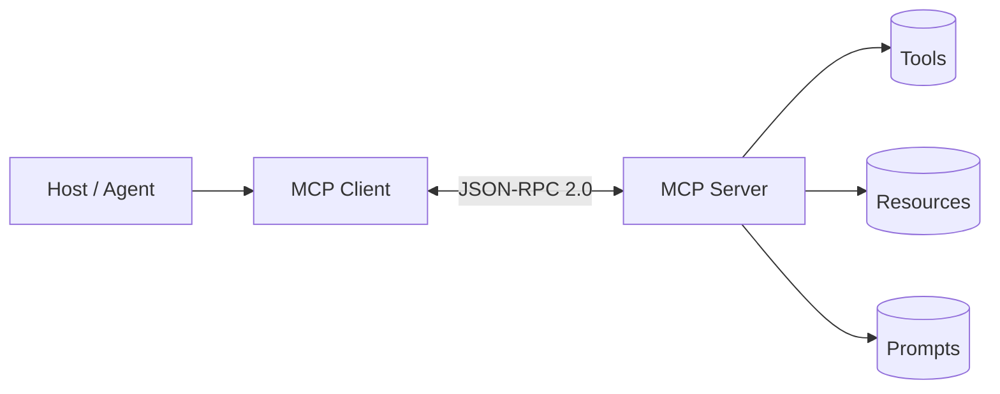
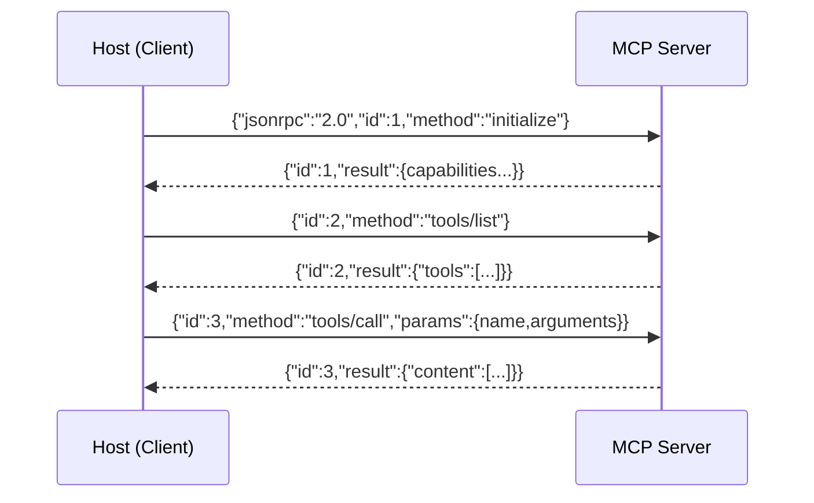

# 7. MCP — Model Context Protocol (verdieping)

> Dit document verdiept [§7 van `AGENTS.md`](../AGENTS.md). MCP (Model Context
> Protocol, door Anthropic geïntroduceerd in 2024) is de **standaard** waarmee je
> **tools, resources én prompts** op een herbruikbare manier aan elke
> MCP-compatibele host aanbiedt. Waar §6 de *concepten* van tool-use behandelt,
> is MCP de *gestandaardiseerde laag* die ad-hoc integraties vervangt door één
> protocol. MCP sluit rechtstreeks aan op de agentic loop (§5) en op RAG (§8, via
> *resources*).

Het doel van dit hoofdstuk is **elk detail concreet aan te tonen** met
minimalistische, leesbare Python-voorbeelden. De code is pedagogisch: ze toont
het *principe* (JSON-RPC 2.0 over stdio) correct, maar is geen productie-server.

---

## Functioneel: wat is MCP en waarom bestaat het?

Zonder MCP schrijft elke agent *per integratie* eigen tool-schemas én
executiecode. Met drie Jira-, Slack- en Postgres-integraties heb je al drie
losse, niet-herbruikbare koppelingen. **MCP lost dit op** met één protocol:

- Een **server** (apart proces) levert de capaciteiten en de implementatie.
- Een **client** (binnen de host) onderhoudt de verbinding.
- De **host** (de agent, §5) blijft generiek en "plugt" servers in via het
  protocol.

Het grote verschil met gewone tools (§6): de *server* levert de implementatie,
de host spreekt die aan via MCP — niet de agent-code zelf. MCP onderscheidt
drie **primitieven**:

| Primitief | Wie stuurt aan | Wat |
|-----------|----------------|-----|
| **Tools** | Model | Uitvoerbare functies (zoals §6) |
| **Resources** | App/context | Leesbare data (bestand, DB-rij, log) |
| **Prompts** | Gebruiker | Herbruikbare prompt-templates |



**Wanneer gebruik je het?** Bij *veel* externe systemen waarbij je integraties
**herbruikbaar** en **onderhoudbaar** wil houden. Let wel op veiligheid: een
MCP-server kan acties uitvoeren, dus enkel vertrouwde servers en permissies (§6.5)
blijven van kracht.

---

## Technisch

### 7.1 Architectuur

**Functioneel.** De architectuur kent drie rollen: **Host** (de agent/app),
**Client** (binnen de host, één per server) en **Server** (apart proces). Het
verkeer loopt over **stdio** (lokaal) of **HTTP + SSE** (remote), telkens volgens
**JSON-RPC 2.0** — een gestandaardiseerd berichtenformaat met `method`, `params`,
`id` en `result`/`error`.

**Technisch (minimale JSON-RPC 2.0 server over stdio).** Dit toont het hart van
MCP: de transportlaag. Een request komt binnen als één JSON-regel; de server
dispatcht op `method` en schrijft een JSON-RPC response terug.

```python
# 7.1 — Minimale MCP-server (JSON-RPC 2.0 over stdio, pedagogisch)
import json, sys

def handle(message: dict) -> dict | None:
    """Dispatch één JSON-RPC 2.0 request naar een handler."""
    method = message.get("method")
    msg_id = message.get("id")

    if method == "initialize":
        # handshake: server meldt zijn capabilities
        return {
            "jsonrpc": "2.0", "id": msg_id,
            "result": {
                "protocolVersion": "2024-11-05",
                "capabilities": {"tools": {}, "resources": {}, "prompts": {}},
                "serverInfo": {"name": "demo-server", "version": "0.1"},
            },
        }
    if method == "tools/list":
        return {"jsonrpc": "2.0", "id": msg_id, "result": {"tools": TOOLS}}
    if method == "tools/call":
        name = message["params"]["name"]
        args = message["params"].get("arguments", {})
        result = TOOL_IMPL[name](**args)   # zie 7.2
        return {"jsonrpc": "2.0", "id": msg_id,
                "result": {"content": [{"type": "text", "text": result}]}}
    # notifications (geen id) vereisen geen response
    return None

def serve_stdio():
    """Lees line-delimited JSON van stdin, schrijf responses naar stdout."""
    for line in sys.stdin:
        line = line.strip()
        if not line:
            continue
        request = json.loads(line)
        response = handle(request)
        if response is not None:
            sys.stdout.write(json.dumps(response) + "\n")
            sys.stdout.flush()

# (in productie: serve_stdio() — hier tonen we enkel het dispatch-principe)
```



> **Vereenvoudiging:** echte MCP voegt `resources/read`, `prompts/get`,
> incremental `notifications` en encoding-details toe. Het *principe* — één
> JSON-RPC methode per actie, gestandaardiseerd — is hier correct weergegeven.

---

### 7.2 De drie primitieven

**Functioneel.** MCP onderscheidt **Tools** (model-controlled, uitvoerbaar),
**Resources** (app-controlled, leesbare data) en **Prompts** (user-controlled,
templates). Het model "ziet" tools zoals in §6; het verschil is dat de *server*
de implementatie levert.

**Technisch (de payloads van de drie primitieven).**

```python
# 7.2 — De drie primitieven als MCP-payloads

# (a) TOOLS: zoals §6, maar ontsloten via de server
TOOLS = [{
    "name": "get_weather",
    "description": "Haal het weer op voor een locatie.",
    "inputSchema": {   # = het JSON-Schema uit §6.2
        "type": "object",
        "properties": {"location": {"type": "string"}},
        "required": ["location"],
    },
}]

def _impl_get_weather(location: str) -> str:
    return f"Weer in {location}: 18°C (gestubd)"

TOOL_IMPL = {"get_weather": _impl_get_weather}

# (b) RESOURCES: leesbare data die de app in de context laadt
RESOURCES = [{
    "uri": "file:///docs/handbook.md",
    "name": "Bedrijfshandboek",
    "mimeType": "text/markdown",
}]
def read_resource(uri: str) -> str:
    # in productie: echte lees van bestand / DB
    return f"Inhoud van {uri} (gestubd)"

# (c) PROMPTS: herbruikbare prompt-templates, gekozen door de gebruiker
PROMPTS = [{
    "name": "vat_samen",
    "description": "Vat een dossier samen.",
    "arguments": [{"name": "dossier", "description": "Pad naar het dossier"}],
}]
def render_prompt(name: str, arguments: dict) -> str:
    if name == "vat_samen":
        return f"Vat het volgende dossier samen: {arguments['dossier']}"
    raise ValueError("onbekende prompt")
```

> **Resources ↔ RAG (§8).** Een MCP-*resource* is de gestructureerde tegenhanger
> van RAG-*retrieval*: beide leveren context aan, maar resources zijn exact
> adresseerbaar (`file://…`) terwijl RAG semantisch zoekt. Zie ook §19 (Resource
> Index).

---

### 7.3 Waarom het ertoe doet

**Functioneel.** Drie voordelen:
- **Interoperabiliteit** — één server (bv. Postgres-MCP) werkt met elke host.
- **Scheiding van zorgen** — de host blijft generiek; bronnen zitten in servers.
- **Standaard transport** — sluit aan op de agentic loop (§5) en RAG (§8).

**Technisch (een host die twee servers aggregeert — de interoperabiliteit).**

```python
# 7.3 — Host aggregeert meerdere MCP-servers via één generieke interface
class Host:
    def __init__(self):
        self.servers = {}          # name -> client-stub

    def connect(self, name: str, client):
        self.servers[name] = client   # elke server spreekt hetzelfde protocol

    def list_all_tools(self) -> list[dict]:
        tools = []
        for name, client in self.servers.items():
            # identieke aanroep voor élke server → herbruikbaar
            tools += client.request("tools/list")["tools"]
        return tools

# Conceptueel:
# host = Host()
# host.connect("postgres", PostgresClient(...))   # server A
# host.connect("jira", JiraClient(...))           # server B
# host.list_all_tools()   # de host kent geen enkel serverspecifiek detail
```

> **Scheiding van zorgen:** de host-code hierboven weet niets over Postgres of
> Jira — enkel dat elke server `tools/list` begrijpt. Dat is precies de winst
> van de standaard.

---

### 7.4 Wanneer te gebruiken

**Functioneel.** Gebruik MCP bij *veel* externe systemen die je herbruikbaar en
onderhoudbaar wil houden. Wees voorzichtig: een MCP-server kan acties uitvoeren,
dus koppel enkel vertrouwde servers en houd permissies (§6.5) in ere.

**Technisch (een vertrouwens-/permissiegating vóór het koppelen van een server).**

```python
# 7.4 — Beslissing & beveiliging rond MCP-servers
TRUSTED_SERVERS = {"postgres-intern", "jira-intern"}   # allow-list
DANGEROUS_TOOL_PREFIXES = ("delete_", "send_", "write_")

def should_connect(server_name: str) -> bool:
    # enkel vertrouwde servers mogen gekoppeld worden
    return server_name in TRUSTED_SERVERS

def gate_tool_call(tool_name: str, user_consent: bool = False) -> None:
    # gevaarlijke tools vereisen expliciete Go (zie ook §6.5)
    if tool_name.startswith(DANGEROUS_TOOL_PREFIXES) and not user_consent:
        raise PermissionError(f"MCP-tool '{tool_name}' vereist gebruikers-Go")

# voorbeeld
assert should_connect("postgres-intern") is True
assert should_connect("onbekend-extern") is False   # geweigerd: niet vertrouwd
try:
    gate_tool_call("delete_record", user_consent=False)
except PermissionError as e:
    print("geblokkeerd:", e)
```

> **Nooit blind vertrouwen.** Omdat een MCP-server *echte effecten* kan hebben,
> is dezelfde veiligheidsdiscipline als bij tools (§6.5) hier verplicht:
> allow-list van servers, permissies op gevaarlijke calls, en observability (§16).

---

## Samenvatting (key takeaways)

- **MCP** is de *standaard* (JSON-RPC 2.0) om **tools, resources én prompts**
  herbruikbaar aan te bieden — in tegenstelling tot ad-hoc tool-integraties (§6).
- Drie rollen: **Host** (agent), **Client** (binnen host), **Server** (apart
  proces, via stdio of HTTP+SSE).
- Drie **primitieven**: **Tools** (model), **Resources** (app), **Prompts**
  (gebruiker). Resources zijn de exact-adresseerbare tegenhanger van RAG (§8).
- **Interoperabiliteit**: één server werkt met elke host; de host blijft generiek.
- Gebruik MCP bij *veel* externe systemen; houd **vertrouwens-allow-list** en
  **permissies** (§6.5) strikt — een server kan acties uitvoeren.

Het volgende document (`06-rag.md`) behandelt RAG: hoe je externe kennis
(semantisch) ophaalt en in de prompt injecteert — en waarom dat een *complement*
is van MCP-resources (zie ook §19).
