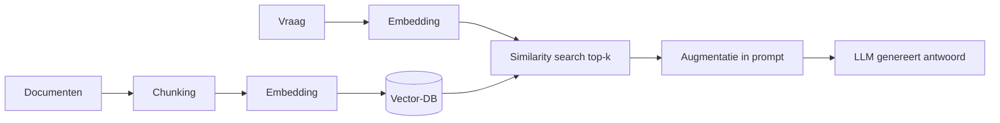
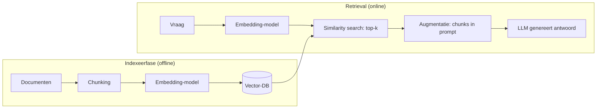

# 8. RAG — Retrieval Augmented Generation (verdieping)

> Dit document verdiept [§8 van `AGENTS.md`](../AGENTS.md). Het beschrijft hoe je
> een taalmodel **externe kennis** geeft die niet in de gewichten zit — actuele
> feiten, bedrijfsdocumenten, privé-data — door die kennis *op te halen* en in de
> prompt te injecteren. RAG sluit aan op de agentic loop (§5): retrieval is een
> stap die de *Observe*-fase voedt, en de opgehaalde context kan in langetermijn-
> geheugen (§10) worden bewaard.

Het doel van dit hoofdstuk is **elk detail concreet aan te tonen** met
minimalistische, leesbare Python-voorbeelden. De code is pedagogisch: ze toont
het *principe* correct, maar is geen productie-implementatie. Vereenvoudigingen
worden telkens expliciet gemarkeerd.

---

## Functioneel

Een gewoon taalmodel "weet" enkel wat in zijn trainingsdata zat. Vraag je het
naar iets dat daarna veranderde, of naar iets dat nooit openbaar was (jouw
klantendossier, je interne handleiding), dan gokt het — en dat leidt tot
hallucinaties. **RAG (Retrieval Augmented Generation)** draait dit om: in
plaats van het antwoord uit het geheugen te halen, *haalt* de agent relevante
stukken tekst op en stopt die als context in de prompt. Het model redeneert
vervolgens over die context.

**Waarom RAG?** (de vier drijfveren uit §8.1)

- **Verouderde kennis** — nieuws, interne wijzigingen en wetgeving die na de
  traindatum vielen, zitten niet in de gewichten.
- **Privé / gespecialiseerde kennis** — klantendossiers, handboeken,
  broncode: data die het model nooit gezien heeft.
- **Hallucinatie-reductie** — het model kan verwijzen naar de opgehaalde
  bronnen in plaats van te verzinnen.
- **Controleerbaarheid** — je kunt citeren *welke* documenten het antwoord
  onderbouwen, wat auditing en vertrouwen mogelijk maakt.

**Wanneer wel / niet?** (§8.8) RAG is ideaal voor kennis-intensieve,
brongebonden vragen. Voor puur redeneerwerk of algemene kennis uit de
trainingsdata is het vaak overbodig en voegt het alleen latency en kosten toe.
Let op de keuze tussen RAG en een **Resource Index** (§19): RAG ontsluit
*inhoud* semantisch, een Resource Index ontsluit *structuur* (welk bestand /
welke functie bestaat) deterministisch en goedkoop.

### De vier hoog-niveau stappen



Functionaliteit wordt hieronder technisch uitgediept, maar onthoud: RAG is een
**tweefasenproces** — een offline *indexeerfase* (bouw de zoekbare kennis op)
en een online *retrieval*-fase (haal per vraag de juiste stukken op).

---

## Technisch

### 8.1 Waarom RAG? (motivatie op systeemniveau)

**Functioneel.** Zoals hierboven: verouderde, privé en gespecialiseerde kennis
zit niet in de gewichten; RAG injecteert die externe kennis en maakt het
antwoord controleerbaar.

**Technisch (plaats in de agentic loop).** In de agentic loop (§5) is retrieval
een *Act*-stap gevolgd door *Observe*: de planner beslist dat kennis nodig is,
de retrieval-component levert chunks, en die keren terug in de context voor de
volgende redeneer-stap. Onderstaand fragment toont die integratie in het
klein — zonder de LLM-aanroep zelf.

```python
# pedagogische RAG-stap binnen een agentic loop (geen LLM-aanroep hier)
def agentic_rag_step(question, retriever, llm_answer):
    # 1. Act: haal relevante chunks op
    context_chunks = retriever.search(question, top_k=5)
    # 2. Observe: chunks worden context voor de volgende LLM-call
    prompt = build_prompt(question, context_chunks)
    # 3. Respond (hier enkel placeholder; in §5 roept de loop de LLM aan)
    return llm_answer(prompt, sources=context_chunks)

# Vereenvoudiging: in productie kiest de LLM zélf wanneer retrieval nodig is
# (zie §5 planner), en wordt het resultaat teruggekoppeld als tool_result.
```

> **Inzicht:** RAG vervangt het geheugen van het model niet, het *voedt* de
> context. Daarmee is het nauw verwant aan langetermijngeheugen (§10): een
> vectorstore als geheugen is technisch hetzelfde mechanisme als Rag retrieval.

---

### 8.2 De volledige RAG-pijplijn

**Functioneel.** De pijplijn heeft twee helften: indexeren (offline) en
retrieval (online).

- **Indexeerfase:** Load → Chunking → Embedding → Store in vector-DB.
- **Retrieval:** Query embedding (met *hetzelfde* model) → Similarity search
  top-k → Augmentatie in prompt → Generatie met bronvermelding.



**Technisch (end-to-end, gesimplificeerd).** Dit orkestreert de acht stappen
met de hulpfuncties die in de volgende subsecties concreet worden gemaakt.

```python
# pedagogische end-to-end RAG — vereenvoudigd, geen echte vector-DB
import numpy as np

def index_documents(docs, chunker, embedder):
    # stap 1-4: load gebeurt in 'docs', hier chunk + embed + "store"
    store = []  # vereenvoudiging: een list i.p.v. echte vector-DB (zie 8.5)
    for doc in docs:
        for chunk in chunker(doc):
            store.append({"text": chunk, "vec": embedder(chunk)})
    return store

def retrieve(store, question, embedder, top_k=3):
    q = embedder(question)
    scored = [(cosine(q, item["vec"]), item["text"]) for item in store]
    scored.sort(reverse=True)
    return [text for _, text in scored[:top_k]]  # stap 5-6

def augment(question, chunks):
    context = "\n---\n".join(chunks)
    return f"Context:\n{context}\n\nVraag: {question}"  # stap 7

# Vereenvoudiging: 'embedder' en 'cosine' komen in 8.4 / 8.5; generatie (8)
# is een gewone LLM-call (zie 02-llm-chatmode.md / §5).
```

> **Cruciaal:** indexeren en querien gebruiken **hetzelfde** embedding-model.
> Een andere embedder geeft niet-vergelijkbare vectoren en dus waardeloze
> retrieval.

---

### 8.3 Chunking-strategieën

**Functioneel.** Documenten worden opgedeeld in stukken die passen in de context
en semantisch samenhangen. Er bestaan verschillende *implementatietypes*, elk
met eigen voor- en nadelen en risico's:

| Type | Werking | Voordeel | Nadeel / risico |
|------|---------|----------|-----------------|
| **Vaste grootte** | verdeel tekst in N-token blokken | simpel, voorspelbaar | snijdt zinnen/paragrafen doormidden → contextverlies aan randen |
| **Recursieve / structurele** | splits op paragrafen, dan zinnen; behoudt structuur | respecteert documentstructuur | afhankelijk van schone opmaak; vieze HTML bemoeilijkt |
| **Semantisch** | groepeer zinnen met gelijkaardige betekenis (embeddings) | coherentere chunks | duurder (embeddings nodig); arbitraire grenzen |
| **Overlappend** | voeg overlap toe tussen opeenvolgende chunks | behoudt context over grenzen heen | meer chunks → hogere kosten/latency |

Afweging: te grote chunks = meer tokens/kosten; te kleine = context versnipperd.
Een goede chunkgrootte ligt vaak rond **256–1024 tokens**.

**Technisch — implementatie per type.** Hieronder drie concreet uitgewerkte
varianten, zodat je het verschil (en het risico) ziet.

```python
import re, numpy as np

# HULP: cosine-similariteit (nodig voor semantisch chunking hieronder)
def cosine(a, b):
    return float(np.dot(a, b) / (np.linalg.norm(a) * np.linalg.norm(b)))

# (a) VASTE GROOTTE — simpel, maar snijdt zinnen doormidden (RISICO: contextverlies)
def chunk_fixed(text, size=80):
    words = text.split()
    return [" ".join(words[i:i+size]) for i in range(0, len(words), size)]

# (b) RECURSIEVE / STRUCTURELE + OVERLAP — behoudt structuur
#     (RISICO: heeft last van rommelige / vieze opmaak zoals HTML)
def chunk_text(text, chunk_size=200, overlap=40):
    paragraphs = [p for p in text.split("\n\n") if p.strip()]
    pieces = []
    for p in paragraphs:
        pieces.extend(re.split(r"(?<=[.!?])\s+", p))  # zin-split
    chunks, current = [], ""
    for piece in pieces:
        if len(current) + len(piece) <= chunk_size:
            current += piece + " "
        else:
            chunks.append(current.strip())
            current = current[-overlap:] + piece + " "   # overlap aan rechtergrens
    if current:
        chunks.append(current.strip())
    return chunks

# (c) SEMANTISCH — groepeer op betekenis via embeddings
#     (RISICO: kost embeddings per zin; arbitraire grens via threshold)
def chunk_semantic(sentences, embed, threshold=0.8):
    groups, cur = [], [sentences[0]]
    for s in sentences[1:]:
        if cosine(embed(s), embed(cur[-1])) < threshold:
            groups.append(" ".join(cur)); cur = [s]
        else:
            cur.append(s)
    groups.append(" ".join(cur))
    return groups
```

> **Risico-overzicht:** *vaste grootte* verliest context aan randen;
> *recursief* heeft last van rommelige opmaak; *semantisch* is duurder en trekt
> arbitraire grenzen; *overlappend* verhoogt kosten/latency. Kies op basis van
> documentkwaliteit en budget. In productie meet je `chunk_size` in **tokens**
> (zie `01-language-model.md` §3.1) en gebruik je een echte tokenizer.

---

### 8.4 Embedding-modellen

**Functioneel.** Een *separaat*, specifiek getraind model zet elke chunk om in
een dense vector (typisch 384–3072 dimensies). Voorbeelden: sentence-transformers,
OpenAI `text-embedding-*`, Cohere, BGE. **Normaliseer** vectoren zodat
cosine-similarity equivalent wordt aan het dot-product. Dezelfde embedder voor
index én query.

**Technisch (embedder in numpy, pedagogisch).** Dit toont het principe van
normalisatie; in productie laad je een echt model.

```python
import numpy as np, hashlib

def embed(text, dim=64):
    # VEREENVOUDIGING: hash-based "embedder" — GEEN semantiek, enkel deterministisch!
    seed = int(hashlib.md5(text.encode()).hexdigest(), 16) % (2**32)
    rng = np.random.default_rng(seed)
    v = rng.standard_normal(dim)
    return v / np.linalg.norm(v)   # genormaliseerd → cosine == dot-product

# Productie:
#   from sentence_transformers import SentenceTransformer
#   model = SentenceTransformer("all-MiniLM-L6-v2")
#   vec = model.encode("omzet steeg in Q2")
```

> **Normaliseer** altijd zodat cosine ≈ dot-product; gebruik *hetzelfde* model
> voor index én query, anders zijn vectoren niet vergelijkbaar.

---

### 8.5 Vector-DB & similariteit

**Functioneel.** De chunks + vectoren worden opgeslagen in een vector-DB.
Er wordt gezocht op *similariteit*; metadata laat filtering toe (datum, bron,
permissies).

- **Metrieken:** cosine-similarity (meest gebruikt), dot-product, Euclidean.
- **Vector-DB's:** FAISS (lokaal), Chroma, Weaviate, Qdrant, Pinecone,
  pgvector (Postgres). Keuze afhankelijk van schaal, hosting, filters.

**Technisch (cosine + "DB" als dict).**

```python
import numpy as np, hashlib

def embed(text, dim=64):   # lokaal (zelfde als §8.4); productie: sentence-transformer
    seed = int(hashlib.md5(text.encode()).hexdigest(), 16) % (2**32)
    v = np.random.default_rng(seed).standard_normal(dim)
    return v / np.linalg.norm(v)

def cosine(a, b):
    return float(np.dot(a, b) / (np.linalg.norm(a) * np.linalg.norm(b)))

db = {  # id -> {"vec": ..., "text": ...}
    "c1": {"vec": embed("omzet steeg in Q2"),      "text": "omzet steeg in Q2"},
    "c2": {"vec": embed("server crash bij login"),  "text": "server crash bij login"},
}

def search(query, db, top_k=1):
    q = embed(query)
    hits = sorted(((cosine(q, r["vec"]), r["text"]) for r in db.values()), reverse=True)
    return hits[:top_k]

print(search("wat was de omzet?", db))   # -> [(score, "omzet steeg in Q2")]
```

> Echte vector-DB's (FAISS, Chroma, Qdrant, pgvector) doen dit geschaald én met
> **metadata-filtering** vóór of na de similarity search.

---

### 8.6 Re-ranking & hybrid search

**Functioneel.** Na de top-k (bv. 20) uit de vector-DB kun je de precisie
verhogen:

- **Re-ranker (cross-encoder)** — een nauwkeuriger model ordent de kandidaten
  op relevantie t.o.v. de vraag → neem top-3 à 5.
- **Hybrid search** — combineer *dense* (embeddings) met *lexical* (BM25 /
  keyword). Goed voor exacte termen (codes, namen) én betekenis.

**Technisch (lexicale BM25-stub + rerank-stub).**

```python
from collections import Counter

def bm25(query, doc):   # x1 vereenvoudiging van echte BM25
    q = set(query.lower().split()); tf = Counter(doc.lower().split())
    return sum(tf.get(t, 0) for t in q)

def rerank(query, hits, k=2):
    # "cross-encoder" stub: score = lexicale overlap; in prod een echt model
    return sorted(hits, key=lambda h: bm25(query, h[1]), reverse=True)[:k]

hits = search("omzet crash server", db, top_k=2)   # dense top-k
print(rerank("omzet crash server", hits))           # hybride/rerank → betere volgorde
```

> Hybrid = dense + lexical vangt zowel exacte termen als betekenis. Re-ranking
> verfijnt de top-k vóór de LLM ze als context krijgt.

---

### 8.7 Evaluatie van RAG

**Functioneel.** Drie kernmetrics:

- **Context relevance** — de opgehaalde chunks zijn relevant voor de vraag.
- **Faithfulness** — het antwoord steunt enkel op de opgehaalde context.
- **Answer relevance** — het antwoord beantwoordt de vraag.

Frameworks: RAGAS, TruLens, DeepEval.

**Technisch (faithfulness op lexicale overlap — stub).**

```python
def faithfulness(answer, context_chunks):
    ctx = " ".join(context_chunks).lower()
    words = answer.lower().split()
    covered = sum(1 for w in words if w in ctx) / max(1, len(words))
    return covered   # fractie van antwoordwoorden gesteund door context

print(faithfulness("de omzet steeg", ["omzet steeg in Q2"]))   # -> 1.0
```

> Een lage faithfulness betekent dat het model iets "verzon" buiten de context —
> een signaal om retrieval of prompt aan te scherpen.

---

### 8.8 Wanneer (niet) te gebruiken

**Functioneel.** RAG is ideaal voor kennis-intensieve, brongebonden vragen.
Voor puur redeneerwerk of algemene kennis uit de trainingsdata is het vaak
overbodig en voegt het enkel latency en kosten toe. Zie ook §19 voor de
Resource-Index-afweging (structuur vs. inhoud).

**Technisch (beslissings-hulp).**

```python
def use_rag(question, indexed_knowledge_available, needs_fresh_data):
    return bool(indexed_knowledge_available and needs_fresh_data)

print(use_rag("wat is de omzet in Q2?", indexed_knowledge_available=True,
             needs_fresh_data=True))   # -> True
```

---

### 8.9 RAG-varianten & recordstructuur

**Functioneel.** Niet elke RAG is gelijk. Populaire varianten om *to-the-point*
vectoren te krijgen **zonder** de context te verliezen:

| Variant | Werkwijze | Wanneer |
|---------|-----------|---------|
| **Standaard / "naive" RAG** | chunk → embed → top-k | simpel, maar brokkelige chunks verliezen context |
| **Contextual / "window" RAG** | sla naast de chunk ook de omliggende context (parent) op; embed de chunk, geef de parent terug | voorkomt contextverlies aan chunkranden |
| **Parent-child chunks** | kleine "child" voor nauwkeurige embedding, grotere "parent" als retour-context | scherpe retrieval + rijke context |
| **Summary-based RAG** | embed een *samenvatting* van de chunk i.p.v. ruwe tekst | minder ruis, snellere retrieval; volledige tekst volgt bij hit |
| **Hybrid (dense + lexical)** | combineer embeddings met BM25 (zie §8.6) | exacte termen én betekenis |

**Hoe een record in de vector-DB eruitziet.** Een retrieval-record koppelt de
chunk-tekst aan een vector plus metadata; een typisch schema:

```json
{
  "id": "doc-123#chunk-4",
  "doc_id": "doc-123",
  "text": "De maandrapportage toont een omzetstijging van 8% in Belgie…",
  "embedding": [0.012, -0.34, "/* … 768 floats … */"],
  "metadata": {
    "source": "q2_rapport.pdf",
    "page": 12,
    "section": "Omzet per regio",
    "parent_text": "…volledige paragraaf incl. context…",
    "tokens": 318,
    "created_at": "2026-08-26"
  }
}
```

**Technisch (record-structuur + DB-opslag in Python).** De `embedding` is de
zoekvector; `metadata` laat filtering toe vóór of na de similarity search.
Contextual RAG vult `parent_text`; bij parent-child is `text` de kleine "child"
en `parent_text` de grote "parent".

```python
from dataclasses import dataclass, asdict
import json, numpy as np, hashlib

def embed(text, dim=64):   # lokaal (zelfde als §8.4); productie: sentence-transformer
    seed = int(hashlib.md5(text.encode()).hexdigest(), 16) % (2**32)
    v = np.random.default_rng(seed).standard_normal(dim)
    return v / np.linalg.norm(v)

@dataclass
class RAGRecord:
    id: str
    doc_id: str
    text: str
    embedding: list
    metadata: dict

def make_records(doc_id, chunks, embed, parent_text=None):
    recs = []
    for i, ch in enumerate(chunks):
        recs.append(RAGRecord(
            id=f"{doc_id}#chunk-{i}",
            doc_id=doc_id,
            text=ch,
            embedding=embed(ch).round(4).tolist(),   # de zoekvector
            metadata={
                "source": f"{doc_id}.pdf",
                "page": 12,
                "section": "Omzet per regio",
                "parent_text": parent_text or ch,      # contextual / parent-child
                "tokens": len(ch.split()),
            },
        ))
    return recs

records = make_records(
    "doc-123",
    ["omzet steeg 8% in Belgie", "kosten daalden 3%"],
    embed,
    parent_text="volledige paragraaf incl. context",
)
db = {r.id: r for r in records}   # "vector-DB" (dict-vereenvoudiging)
print(json.dumps(asdict(db["doc-123#chunk-0"]), indent=2, ensure_ascii=False))
```

> De `embedding` is de zoekvector; `metadata` laat toe te filteren vóór of na
> de similarity search (§8.5). Summary-based RAG vervangt `text` door een
> samenvatting bij het embedden, en bewaart de volledige tekst in `parent_text`.

---

## Samenvatting (key takeaways)

- RAG geeft het model **externe kennis** die niet in de gewichten zit en maakt
  antwoorden controleerbaar (citeerbare bronnen).
- Het is een **tweefasenproces**: offline indexeren (chunk → embed → store),
  online retrieval (query-embed → top-k → augment → generate).
- **Chunking** bepaalt de kwaliteit: vaste grootte is simpel maar riskeert
  contextverlies; recursief/semantisch/overlappend hebben elk eigen voor- en
  nadelen (zie §8.3-tabel).
- Dezelfde **embedder** + genormaliseerde vectoren zijn verplicht; anders is
  retrieval waardeloos.
- **Re-ranking / hybrid search** verhogen de precisie; **evaluatie**
  (faithfulness!) vangt hallucinaties op.
- Er bestaan meerdere **RAG-varianten** (contextual, parent-child, summary,
  hybrid) om context te bewaren; een record koppelt chunk-tekst, vector én
  metadata in één zoekbaar object (§8.9).

RAG sluit aan op de agentic loop (§5) en op langetermijngeheugen (§10): een
vectorstore *is* technisch een vorm van geheugen.
