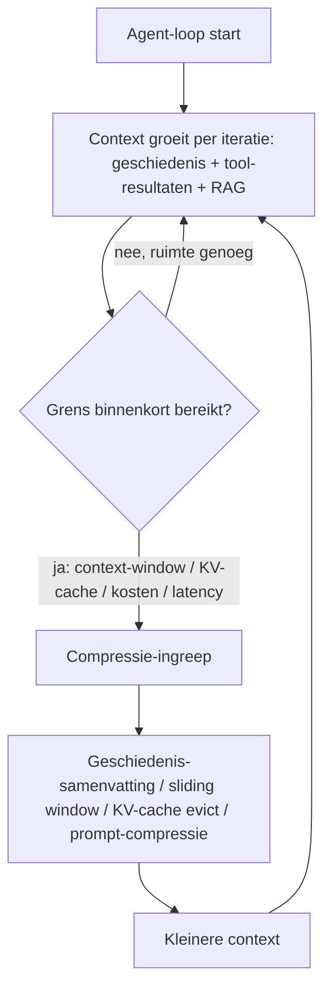

# 9. Compression: context beheersbaar houden (verdieping)

> Dit document verdiept [§9 van `AGENTS.md`](../AGENTS.md). Het beschrijft hoe
> **Compression** de context van een agent beheersbaar houdt in lengte, kosten en
> latency — een agentic-specifiek onderwerp dat pas relevant wordt zodra een
> agent (§5) langdurig met een taak bezig is en de context (geschiedenis +
> tool-resultaten + RAG-chunks) blijft groeien.

Het doel van dit hoofdstuk is **elk detail concreet aan te tonen** met
minimalistische, leesbare Python-voorbeelden. De code is pedagogisch: ze toont
het *principe* correct, maar is geen productie-implementatie. Echte compressie
gebruikt bijna altijd een taalmodel (LM) zelf — dat wordt per voorbeeld
expliciet vermeld.

---

## Functioneel: wat doet compressie in een agent en waarom?

Een "gewoon" LLM-gesprek is kort en past in één context-window. Maar een
**agent** (§5) doorloopt een *loop*: per iteratie roept hij tools (§6) aan,
haalt RAG-chunks op (§8) en schrijft tussenresultaten terug in de context.
Daardoor groeit de context bij elke stap. Zonder ingreep bereik je vroeg of laat
een van vier grenzen:

- **De context-windowlimiet** — elk model accepteert maar een maximaal aantal
  tokens (enkel de meest recente modellen gaan tot honderdduizenden tokens).
- **De kosten** — je betaalt per token voor de input én (indirect) voor het
  opbouwen van de KV-cache (zie §3.4 en §15).
- **De latency** — een langere context betekent een tragere forward pass per
  gegenereerd token.
- **Het KV-cache geheugen** — de opgeslagen key/value-vectoren van eerdere
  tokens groeien lineair (of sneller) met de contextlengte; bij langdurige
  sessies wordt dat een hard geheugenknooppunt.

**Compression** grijpt in vóórdat die grenzen bereikt zijn: het verkleint de
context (in tokens) zodat de agent verder kan werken binnen de limiet, tegen
lagere kosten en met lagere latency. Het is dus een *onderhoudstool* van de
agentic loop, geen onderdeel van het basismodel.

Wanneer compressie ingrijpt, hangt af van de strategie (zie §9.4): zodra de
context het "maximaal nuttige" bereik nadert, of zodra kosten/latency een
probleem worden — niet eerder, om informatieverlies te vermijden.



---

## Technisch

### 9.1 Waarom comprimeren?

**Functioneel.** De vier grenzen hierboven zijn geen theorie maar harde
beperkingen van de infrastructuur. Samengevat:

| Grens | Wat gebeurt er zonder compressie | Gerelateerd hoofdstuk |
|-------|----------------------------------|-----------------------|
| Context-windowlimiet | De aanroep faalt of wordt afgekapt; de agent "vergeet" vroege stappen. | §3 (tokenisatie), §4 |
| Kosten | Input-tokens stapelen per loop-iteratie → kosten exploderen. | §15 |
| Latency | Tragere forward pass per token bij lange context. | §3.3 (attention) |
| KV-cache geheugen | Geheugen groeit lineair/sneller met lengte; OOM bij lange sessies. | §3.4 |

**Technisch (token-teller / budget-check).** Voordat je kunt comprimeren, moet
je *meten* hoe groot de context is. Dit toont het principe van een token-teller
die een budget bewaakt tegen de context-windowlimiet.

```python
# pedagogische token-teller — geen productiecode
# echte telling gebeurt met de modelspecifieke tokenizer (zie §3.1)
def count_tokens(text, chars_per_token=4.0):
    """Benaderd aantal tokens: ~1 token per 4 karakters voor Engelstalige text.
    Vervang in productie door tiktoken / de juiste tokenizer."""
    return max(1, int(len(text) / chars_per_token))

def context_size(messages, token_budget):
    """Tel tokens van een context (lijst van {'role','content'}) en geef
    terug of we boven het budget zitten."""
    used = sum(count_tokens(m["content"]) for m in messages)
    return used, used >= token_budget

# voorbeeld
history = [
    {"role": "user",      "content": "Zoek het Q2-rapport en vat de omzet samen."},
    {"role": "assistant", "content": "Ik haal het rapport op via RAG."},
    {"role": "tool",      "content": "Q2-rapport: omzet BE 1.2M, NL 0.9M, FR 0.7M."},
]
used, over = context_size(history, token_budget=3000)
print(f"{used} tokens gebruikt, boven budget: {over}")
```

> **Vereenvoudiging:** de `chars_per_token`-schatting is ruw. Echte code telt
> met de *exacte* tokenizer van het model (§3.1), omdat het aantal tokens per
> karakter sterk varieert per taal en model. De teller hier dient enkel om het
> *beslismoment* (meten vóór comprimeren) te tonen.

---

### 9.2 Vormen van compressie

**Functioneel.** AGENTS.md onderscheidt vier vormen. Elk grijpt op een ander
niveau in: op de *tekst* van de geschiedenis, op de *input-prompt*, op de
*KV-cache* (de intern opgeslagen vectors), of op het *context-window* als
geheel.

| Vorm | Wat gebeurt er | Wanneer |
|------|----------------|---------|
| **Geschiedenis-samenvatting** | Oudere conversation turns worden samengevat tot een korte summary die in de context blijft. | Langdurige gesprekken / veel tussenstappen. |
| **Prompt-compressie** | Compressiemodel (bv. LLMLingua, Selective-Context) verwijdert overbodige woorden/tokens uit de input vóór inference. | Zeer lange instructies of documenten als context. |
| **KV-cache compressie** | KV-vectoren quantiseren (INT8/INT4), evicten (StreamingLLM: belangrijkste + recentste behouden) of pooling. | Wanneer de KV-cache te groot wordt voor het geheugen. |
| **Context-window management** | Sliding window (enkel recente N tokens) of selectief de meest relevante stukken bewaren (via retrieval). | Wanneer bruikbare info verspreid zit over een lange sessie. |

#### 9.2.1 Geschiedenis-samenvatting — `summarize_history()`

**Technisch (stub).** Oudere turns worden samengevat tot één korte summary die
de plaats inneemt van de volledige geschiedenis. In productie roep je hiervoor
een LM aan; hier een stub die het *aanspreekpunt* toont.

```python
# pedagogische stub — echte samenvatting gebruikt een LM (zie §9.3 trade-offs)
def summarize_history(messages, keep_recent=2):
    """Vat alles behalve de laatste `keep_recent` turns samen tot één summary.
    Retourneert een nieuwe, kortere context."""
    recent = messages[-keep_recent:]
    to_summarize = messages[:-keep_recent]
    if not to_summarize:
        return recent
    # STUB: een echt systeem concateneert to_summarize en laat een LM een
    # compacte summary genereren (verlies van nuance, zie §9.3).
    summary_text = f"[summary van {len(to_summarize)} eerdere turns]"
    summary_msg = {"role": "system", "content": summary_text}
    return [summary_msg] + recent

compact = summarize_history(history, keep_recent=1)
print("gecomprimeerde context:", compact)
```

> **Vereenvoudiging:** de stub produceert een letterlijke placeholder. Echte
> `summarize_history()` vraagt een LM om de essentie te behouden; daarbij
> verdwijnen nuances (zie §9.3).

#### 9.2.2 Prompt-compressie

**Technisch (lexicale stub).** Een compressiemodel (LLMLingua, Selective-Context)
verwijdert vóór inference overbodige woorden/tokens. Hier een lexicale benadering
die vuller-woorden schrapt — *niet* semantisch, enkel ter illustratie.

```python
# pedagogische lexicale stub — géén semantisch begrip!
STOPWORDS = {"even", "eveneens", "eigenlijk", "gewoon", "simpelweg", "toch", "even"}

def compress_prompt(text):
    """Verwijdert filler-woorden. Echte prompt-compressie is semantisch
    (behoudt betekenis, zie LLMLingua / Selective-Context)."""
    tokens = text.split()
    kept = [t for t in tokens if t.lower() not in STOPWORDS]
    return " ".join(kept)

prompt = "We moeten eigenlijk even de omzet simpelweg analyseren."
print(compress_prompt(prompt))   # -> "We moeten de omzet analyseren."
```

> **Vereenvoudiging:** een echte compressie leest *betekenis* en behoudt
> constraints; een lexicale filter kan per ongeluk een belangrijk woord
> verwijderen. Gebruik hiervoor een daarvoor getraind compressiemodel.

#### 9.2.3 KV-cache compressie — `kv_cache_evict()` (StreamingLLM-idee)

**Technisch.** In plaats van de tekst te korten, wordt de *intern opgeslagen*
KV-cache ingekort: behoud de **belangrijkste** (attention-sinks: de eerste
tokens die veel attention trekken) plus de **recentste** tokens, en verwijder
de rest (StreamingLLM). Hier een vereenvoudigde garde die op positie selecteert.

```python
# pedagogische evict — toont het StreamingLLM-idee (sinks + recent)
def kv_cache_evict(cache, sink_size=2, recent_size=4):
    """cache: lijst van KV-vectoren in volgorde van positie.
    Behoud de eerste `sink_size` (attention-sinks) + de laatste `recent_size`.
    Echte StreamingLLM kiest sinks op attention-score, niet op positie 0."""
    if len(cache) <= sink_size + recent_size:
        return cache
    sinks = cache[:sink_size]
    recent = cache[-recent_size:]
    return sinks + recent   # middelste posities worden geëvict

kv = [f"kv@{i}" for i in range(10)]   # 10 opgeslagen positities
print(kv_cache_evict(kv, sink_size=2, recent_size=4))
# -> ['kv@0', 'kv@1', 'kv@6', 'kv@7', 'kv@8', 'kv@9']
```

> **Vereenvoudiging:** StreamingLLM bepaalt *sinks* op basis van attention-score
> (de tokens die het model het vaakst "bekijkt"), niet simpelweg de eerste
> posities. De keuze hier op positie 0 is enkel om het patroon (behoud
> belangrijkste + recentste) te tonen. Zie §3.4 voor de basis van de KV-cache.

#### 9.2.4 Context-window management — `sliding_window()`

**Technisch.** Het meest directe beheer: houd enkel de meest recente N tokens
van de context (sliding window). Oudere context valt buiten het raam.

```python
# pedagogische sliding window op token-niveau
def sliding_window(tokens, window_size=8):
    """Houd enkel de laatste `window_size` tokens van de context."""
    return tokens[-window_size:]

ctx = [f"t{i}" for i in range(12)]
print(sliding_window(ctx, window_size=8))   # laatste 8 tokens
```

> **Variant:** in plaats van puur recent (sliding window) kun je *selectief*
> de meest relevante stukken bewaren via retrieval (verwant aan RAG, §8) — nuttig
> wanneer bruikbare info verspreid zit over een lange sessie.

---

### 9.3 Trade-offs

**Functioneel.** Compressie verlaagt *altijd* iets aan informatie. Het juiste
evenwicht:

- Samenvatten verliest nuances maar houdt de hoofdlijn.
- Te agressieve compressie → het model "vergeet" belangrijke constraints → fouten.
- Meet de impact via de evaluatiemetrics uit §8.7 / §10 en §16 (observability).

**Technisch (impact-meting stub).** Omdat elke ingreep informatie kost, meet je
best wat er behouden blijft. Dit toont een eenvoudige *retentie-ratio* per
compressiestap.

```python
# pedagogische impact-meting — verhouding behouden vs. origineel
def retention_ratio(original, compressed):
    """Fractie van de oorspronkelijke token-grootte die overblijft."""
    if not original:
        return 1.0
    return len(compressed) / len(original)

before = [f"t{i}" for i in range(12)]
after = sliding_window(before, window_size=8)
print(f"retentie: {retention_ratio(before, after):.0%}")   # 67%
```

> **Inzicht:** een lage retentie-ratio betekent veel verlies — meet met de
> evaluatiemetrics (§8.7, §16) of de agent daadwerkelijk nog juist antwoordt.
> Compressie is geen gratis winst: je ruilt informatie in voor lengte/kosten.

---

### 9.4 Wanneer toepassen

**Functioneel.** Pas compressie toe zodra de context het *maximaal nuttige*
bereik nadert, of zodra kosten/latency een probleem worden — **niet eerder**,
om informatieverlies te vermijden. Compressie is dus reactief op de grenzen uit
§9.1, niet een standaard-dwang die elke turn uitvoert.

**Technisch (`should_compress` trigger).** Een eenvoudige beslisser die de
token-teller (§9.1) koppelt aan een drempel (hier: 80% van het budget).

```python
# pedagogische trigger — beslis of we comprimeren
def should_compress(messages, token_budget, threshold=0.8):
    used, _ = context_size(messages, token_budget)
    return used >= threshold * token_budget

if should_compress(history, token_budget=3000):
    history = summarize_history(history, keep_recent=1)
```

> **Afweging:** zet `threshold` niet te laag (onnodig informatieverlies) en niet
> te hoog (risico op de harde context-windowlimiet). Voor KV-cache-geheugen
> (§9.2.3) geldt een apart, geheugen-gebaseerd signaal in productie.

---

## Samenvatting (key takeaways)

- **Compression** is een *agentic-loop* hulpmiddel (§5): het houdt de context
  beheersbaar in **lengte, kosten en latency** zodra die blijft groeien.
- Vier harde grenzen dwingen tot ingrijpen: **context-windowlimiet**, **kosten**
  (§15), **latency** en **KV-cache geheugen** (§3.4).
- Vier vormen, elk op een ander niveau: **geschiedenis-samenvatting**,
  **prompt-compressie**, **KV-cache compressie / eviction** (StreamingLLM:
  belangrijkste + recentste), en **context-window management** (sliding window).
- Elke compressie kost informatie: meet de impact (§8.7, §16) en vermijd te
  agressieve compressie die constraints doet vergeten (§9.3).
- Pas compressie pas toe **zodra de context het nuttige bereik nadert** of
  kosten/latency een probleem worden — niet eerder (§9.4).
- Echte compressie gebruikt bijna altijd een **LM** (samenvatten) of een
  daarvoor getraind model (prompt-compressie, semantic eviction); de
  code-voorbeelden hier zijn vereenvoudigde stubs die het principe tonen.

Dit sluit aan op **Memory** (§10), waar langetermijninfo *buiten* de context
bewaard wordt, en op **Token economics** (§15), waar compressie een van de
belangrijkste kostenhefbomen is.
