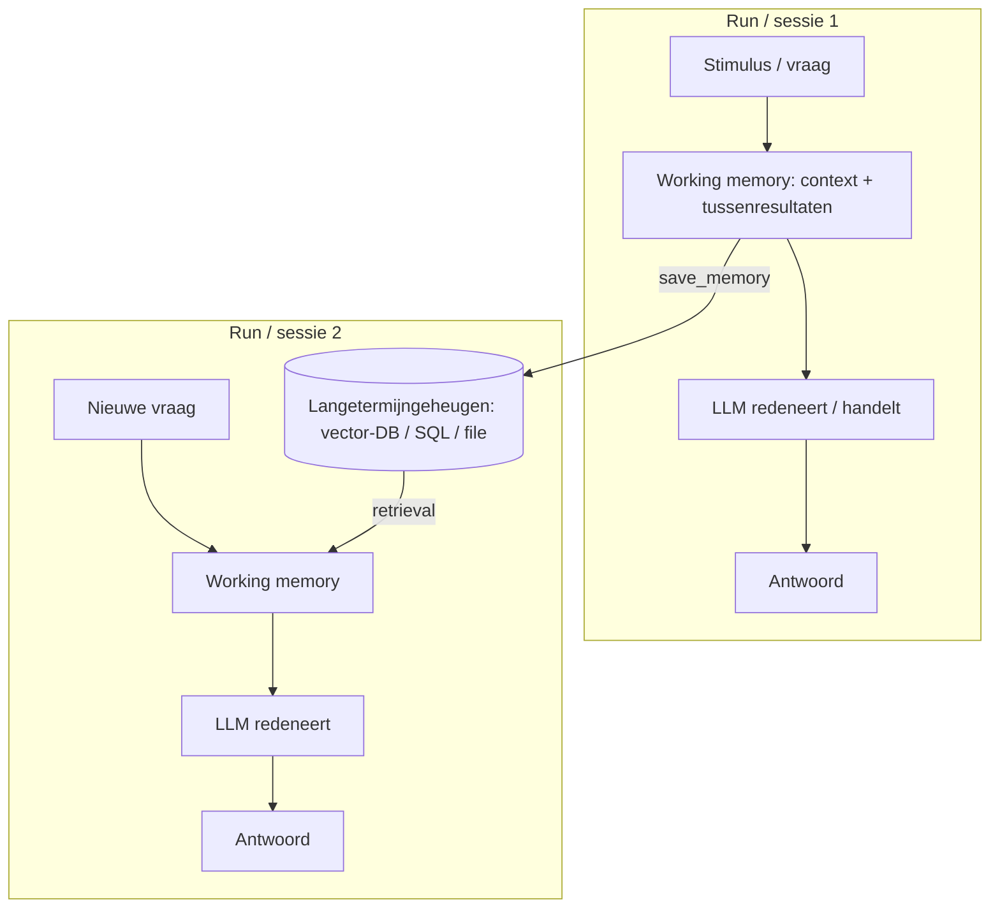

# 10. Memory: onthouden over sessies heen (verdieping)

> Dit document verdiept [§10 van `AGENTS.md`](../AGENTS.md). Het beschrijft wat
> **Memory** onderscheidt van een eenmalige run, *waar* herinneringen bewaard
> worden, en *hoe* een agent ze schrijft en terug ophaalt. Memory is nauw
> verwant aan de **agentic loop** (§5), aan **RAG** (§8) voor de retrieval-kant,
> en aan de **Resource Index** (§19) voor de structuur-kant — maar het gaat
> hier om *het onthouden van feiten*, niet om het ophalen van document-inhoud.

Het doel van dit hoofdstuk is **elk detail concreet aan te tonen** met
minimalistische, leesbare Python-voorbeelden (voornamelijk `numpy`). De code is
pedagogisch: ze toont het *principe* correct, maar is geen productie-implementatie
(en waar ze sterk vereenvoudigt, staat dat expliciet vermeld).

---

## Functioneel

Een **gewoon** LLM-gesprek is *stateless*: zodra de context sluit, is alles
weg. Memory maakt van een agent een **lerende, persisterende** agent — een
agent die tussen twee runs iets *onthoudt*.

Waarin verschilt dat concreet?

- **Eenmalige run** — de agent weet enkel wat binnen de huidige sessie in de
  context (het *working memory*) staat. Sluit je af, start je later opnieuw,
  dan is de agent "vergeten" wie de gebruiker is.
- **Lerende, persisterende agent** — naast het working memory heeft de agent een
  **langetermijngeheugen** dat *buiten* de run bestaat (een vector-DB, een SQL
  -store of een file). Daarin blijven feiten, voorkeuren en gebeurtenissen
  bewaard en kunnen ze in een volgende run terug opgehaald worden.

**Waarom** is dat waardevol?

- **Continuïteit over sessies** — de agent hoeft niet elke keer opnieuw
  uitgelegd te worden wie de gebruiker is of waar een project over gaat.
- **Voorkeuren onthouden** — "de gebruiker spreekt Nederlands" of "mail
  rapporten elke maandag" hoeft maar één keer geleerd te worden.
- **Opgebouwde kennis** — beslissingen en tussenresultaten uit eerdere runs
  voeden latere redeneringen, in plaats van telkens opnieuw ontdekt te worden.

**Wanneer** zet je memory in? Bij elke taak waarbij de agent langer dan één
interactie meegaat, of waarbij kennis van eerdere sessies de kwaliteit of
snelheid van het antwoord verhoogt. Voor een puur eenmalige, staatloze
vraag-beantwoord is het overbodig en voegt het latency en kosten toe.

Het onderscheid *binnen één run* versus *buiten de run* is het kerndiagram:



Het working memory leeft *binnen* de run (en verdwijnt tenzij gepersisteerd);
het langetermijngeheugen leeft *buiten* de run en overbrugt sessies.

---

## Technisch

### 10.1 Kortetermijngeheugen (working memory)

**Functioneel.** Het working memory is de **actieve context** van één run: de
geschiedenis van turns, de tussenresultaten van tool-calls en de instructies
(system prompt). Het bestaat enkel *binnen één run/sessie* en verdwijnt daarna,
tenzij het expliciet naar het langetermijngeheugen weggeschreven wordt. Het
wordt beheerd zoals beschreven in §9 (compressie): zodra het te groot wordt,
wordt het samengevat of afgekapt.

**Technisch (een `WorkingMemory`-buffer).** Dit toont hoe de context per run
wordt opgebouwd en — als knipoog naar §9 — met een budget wordt afgekapt.

```python
# pedagogical working memory — not production code
from dataclasses import dataclass, field

@dataclass
class WorkingMemory:
    """The active context of ONE agent run: history + intermediate results."""
    system: str = ""
    turns: list = field(default_factory=list)
    budget_tokens: int = 4096

    def add_turn(self, role, content):
        self.turns.append({"role": role, "content": content})

    def context(self):
        """Assemble the prompt sent to the model (mirrors the chat pipeline)."""
        return [{"role": "system", "content": self.system}, *self.turns]

    def truncate_to_budget(self, estimate_tokens=len):
        """Crude compression (see §9): drop oldest turns when over budget."""
        while estimate_tokens(str(self.context())) > self.budget_tokens and self.turns:
            self.turns.pop(0)

wm = WorkingMemory(system="Je bent een behulpzame agent.")
wm.add_turn("user", "Wat is de omzet in België?")
wm.add_turn("assistant", "Ik haal het Q2-rapport op...")
print("context turns:", len(wm.context()))
```

> **Vereenvoudiging:** `estimate_tokens=len` telt karakters, geen echte tokens.
> In productie gebruik je de echte tokenizer (zie `01-language-model.md` §3.1) en
> de compressietechnieken uit §9. Het working memory *zelf* is geen persistente
> store — het verdwijnt zodra de run eindigt.

---

### 10.2 Langetermijngeheugen (external memory)

**Functioneel.** Buiten de context, in een externe store, bewaren we wat de
agent moet onthouden. De drie hoofdvormen uit §10.2:

| Store | Geschikt voor | Voorbeeld |
|-------|---------------|-----------|
| **Vector-DB** | Semantisch ophalen van gerelateerde herinneringen (vaak via RAG, zie §8). | "Wat wisten we over klant X?" |
| **SQL / structured store** | Feiten, gebruikersvoorkeuren, gestructureerde records. | `user_profile`, `orders`. |
| **File / episodic log** | Volledige gesprekslogs, gebeurtenissen (audit trail). | `conversations/*.jsonl`. |

**Technisch (een `MemoryStore` met `add()` / `query()` via numpy cosine).** De
vector-DB-variantembedt elke herinnering en haalt bij een vraag de
cosine-meest-gelijke op.

```python
# pedagogical long-term memory (vector-DB style) — not production code
import numpy as np
from datetime import datetime, timezone

def _embed(text):
    """Placeholder embedder. In reality: sentence-transformers / OpenAI
    text-embedding-3-small. Here we use a deterministic hash-based vector so
    the cosine math is real and reproducible."""
    rng = np.random.default_rng(abs(hash(text)) % (2**32))
    v = rng.standard_normal(16)
    return v / np.linalg.norm(v)   # normalized -> cosine == dot product

class MemoryStore:
    """External, persistent long-term memory (vector-DB style)."""
    def __init__(self):
        self.records = []   # list of dicts: {text, vec, meta, ts}

    def add(self, text, meta=None):
        self.records.append({
            "text": text,
            "vec": _embed(text),
            "meta": meta or {},
            "ts": datetime.now(timezone.utc),
        })

    def query(self, text, k=3):
        q = _embed(text)
        scored = [(np.dot(r["vec"], q), r["text"]) for r in self.records]
        scored.sort(reverse=True)
        return [t for _, t in scored[:k]]

store = MemoryStore()
store.add("Klant X verhuisde naar Gent in 2023.")
store.add("De server draait op vLLM in de EU-regio.")
store.add("Facturatie gebeurt maandelijks via SEPA.")
print(store.query("Waar woont klant X?"))
```

> **Vereenvoudiging:** de `_embed`-functie is een deterministische placeholder.
> In productie levert een *echt* embedding-model de vector (zie §8.4); de
> cosine-wiskunde hierboven is daarmee identiek. SQL- en file-stores werken
> volgens hetzelfde `add`/`query`-idee maar met een andere back-end (een
> `SELECT` respectievelijk een JSONL-append).

---

### 10.3 Geheugentypen (psychologisch model)

**Functioneel.** Niet alles wat we onthouden is hetzelfde. §10.3 onderscheidt
drie typen, naar het psychologische model:

- **Episodisch** — specifieke gebeurtenissen ("gesprek van gisteren").
- **Semantisch** — algemene feiten ("gebruiker spreekt Nederlands").
- **Procedureseel** — *hoe* je iets doet ("routine voor facturatie").

Het onderscheid is praktisch: bij retrieval wil je soms enkel de feiten
(semantisch) of enkel de routines (procedureseel) ophalen.

**Technisch (typetags + gefilterde `query`).** We breiden `MemoryStore` uit met
een `mem_type` per record en laten `query` daarop filteren.

```python
# pedagogical typed memory — not production code
class TypedMemoryStore(MemoryStore):
    """Adds the episodic / semantic / procedural distinction (§10.3)."""
    def add(self, text, mem_type, meta=None):
        rec = {"text": text, "vec": _embed(text),
               "meta": {**(meta or {}), "type": mem_type},
               "ts": datetime.now(timezone.utc)}
        self.records.append(rec)

    def query(self, text, k=3, mem_type=None):
        q = _embed(text)
        cand = self.records
        if mem_type:
            cand = [r for r in cand if r["meta"].get("type") == mem_type]
        scored = [(np.dot(r["vec"], q), r["text"]) for r in cand]
        scored.sort(reverse=True)
        return [t for _, t in scored[:k]]

m = TypedMemoryStore()
m.add("Gesprek van gisteren: gebruiker vroeg om CSV-export.", "episodic")
m.add("Gebruiker spreekt Nederlands.", "semantic")
m.add("Routine: elke maandag de weekrapporten mailen.", "procedural")
print(m.query("Welke taal gebruikt de gebruiker?", mem_type="semantic"))
```

> **Inzicht:** het type is metadata op het record. Het maakt retrieval
> gerichter — je kunt de agent bij een "hoe"-vraag enkel procedurele entries
> laten ophalen, verwant aan hoe §19 de Resource Index structureel filtert.

---

### 10.4 Write- & read-patronen

**Functioneel.** Twee bewegingsrichtingen:

- **Wanneer schrijven?** Na belangrijke gebruikersfeiten, beslissingen of
  geleerde voorkeuren. Vaak expliciet aangestuurd door de agent via een tool
  `save_memory` (zie §6 function calling).
- **Hoe ophalen?** Bij een nieuwe vraag: embed de vraag en doorzoek de
  langetermijnstore (analoog aan RAG, §8), zodat enkel relevante herinneringen
  de context binnenkomen.

Privacy/compliance blijft van kracht: niet alles permanent bewaren; gevoelige
data vraagt om toestemming en verwijdering.

**Technisch (de `save_memory`-tool + een read-helper in de loop).** Het
schrijf-patroon is een tool-schema (§6.2); het lees-patroon embedt de vraag en
haalt relevante herinneringen op vóór de LLM-call.

```python
# pedagogical write/read patterns — not production code

# --- write pattern: a tool the agent can call (see §6, §10.4) ---
SAVE_MEMORY_TOOL = {
    "name": "save_memory",
    "description": "Sla een belangrijk feit, voorkeur of beslissing op in langetermijngeheugen.",
    "parameters": {
        "type": "object",
        "properties": {
            "content": {"type": "string",
                        "description": "De tekst die onthouden moet worden."},
            "mem_type": {"type": "string",
                         "enum": ["episodic", "semantic", "procedural"]}
        },
        "required": ["content", "mem_type"]
    }
}

# --- read pattern: pull relevant memories into working context (see §5, §8) ---
def agent_retrieve(store, user_query):
    """Embed the question and fetch relevant memories before the LLM call.
    Parallels RAG retrieval (§8) but over remembered facts, not documents."""
    relevant = store.query(user_query, k=3)
    context = "\n".join(f"- {r}" for r in relevant)
    return f"Relevante herinneringen:\n{context}\n\nVraag: {user_query}"
```

> **Vereenvoudiging:** in productie *beslist* het model zelf of `save_memory`
> aangeroepen wordt via native function calling (§6.3); hier tonen we enkel het
> schema en de read-helper. De read-stap is de memory-tegenhanger van de RAG
> retrieval-stap uit §8.2, maar dan over eerder geleerde feiten.

---

### 10.5 Consolidatie & vergeten

**Functioneel.** Een langetermijnstore groeit anders onbeperkt. Twee
onderhoudshandelingen:

- **Consolidatie** — vat verspreide episodes samen tot semantische feiten
  (gebruikmakend van §9 compressie). "Drie gesprekken over klant X" wordt één
  feit "klant X zit in Gent en heeft SEPA-betalingen".
- **Vergeten / TTL** — oude of irrelevante entries verwijderen of laten
  vervallen (Time-To-Live) om de store schoon en goedkoop te houden.

**Technisch (een `consolidate()` en een `forget_expired()` op TTL).**

```python
# pedagogical consolidation & forgetting — not production code
from collections import defaultdict

def consolidate(store, group_key="topic"):
    """Group episodic entries by a key and collapse them into one semantic
    fact (uses compression, §9). The summarization itself would be done by an
    LLM; here we concatenate as a stand-in."""
    groups = defaultdict(list)
    for r in store.records:
        if r["meta"].get("type") == "episodic":
            groups[r["meta"].get(group_key, "misc")].append(r["text"])
    summaries = []
    for topic, texts in groups.items():
        summary = f"[semantic] over '{topic}': " + " ; ".join(texts)
        summaries.append(summary)
    return summaries

def forget_expired(store, ttl_seconds=60 * 60 * 24 * 30):
    """Drop entries older than the TTL (§10.5)."""
    now = datetime.now(timezone.utc)
    kept, dropped = [], 0
    for r in store.records:
        age = (now - r["ts"]).total_seconds()
        if age <= ttl_seconds:
            kept.append(r)
        else:
            dropped += 1
    store.records = kept
    return dropped
```

> **Vereenvoudiging:** `consolidate` voegt hier enkel teksten samen; in
> productie neemt een LLM de episode-teksten en schrijft er één semantische
> samenvatting van (de "compressie" uit §9). De TTL is een vaste vervaltijd;
> fijnmaziger is vervallen op *irrelevantie* in plaats van enkel leeftijd.

---

## Samenvatting (key takeaways)

- Memory onderscheidt een eenmalige run van een **lerende, persisterende**
  agent: het gaat om *wat* onthouden wordt en *waar*.
- **Working memory** leeft binnen één run (context + tussenresultaten) en
  verdwijnt tenzij gepersisteerd; het volgt de compressieregels uit §9.
- **Langetermijngeheugen** ligt buiten de run: een **vector-DB** (semantisch),
  **SQL** (gestructureerd) of **file** (episodische logs).
- Drie geheugentypen — **episodic**, **semantic**, **procedural** — maken
  retrieval gerichter.
- Write-patroon = tool `save_memory` (§6); read-patroon = embed + zoek in de
  store, analoog aan **RAG** (§8) maar over feiten.
- **Consolidatie** (episodes → semantische feiten, via §9) en **TTL**-vergeten
  houden de store schoon en goedkoop.
- Verwant maar verschillend: de **Resource Index** (§19) ontsluit *structuur*
  (welk bestand/bestaat), memory onthoudt *inhoud* (wat wisten we). De agentic
  loop (§5) is de dirigent die beide aanspreekt.

Zie verder §5 (agentic loop), §8 (RAG) en §19 (Resource Index) voor de
omringende patronen.
