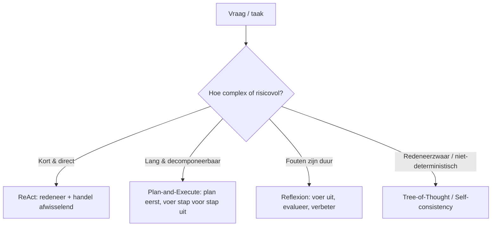
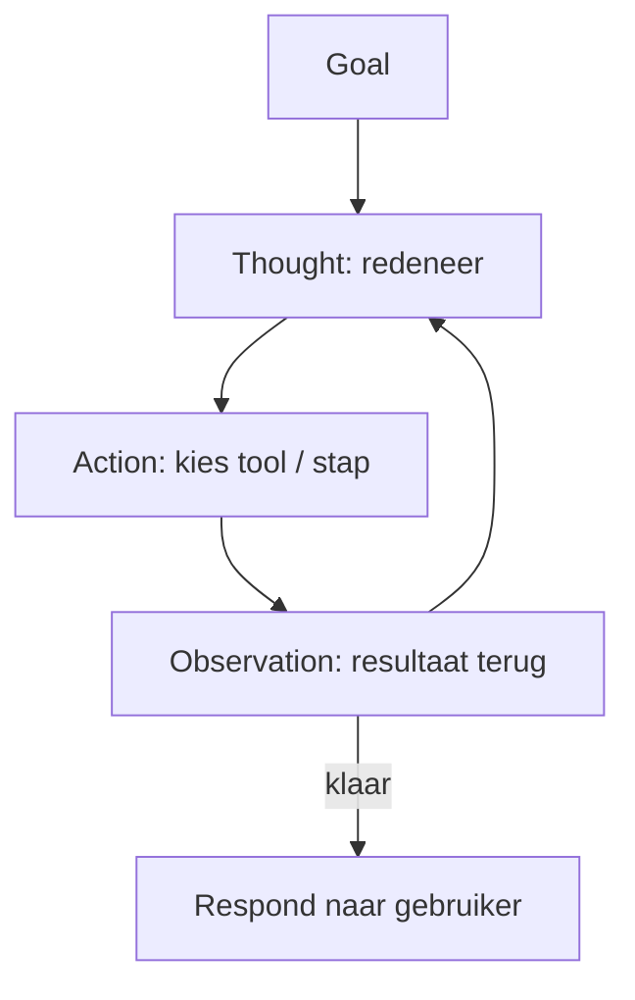

# 11. Planning (verdieping)

> Dit document verdiept [§11 van `AGENTS.md`](../AGENTS.md). Planning stuurt
> *wanneer* en *in welke volgorde* de andere componenten (tools, RAG, compressie,
> memory) worden ingezet, en maakt een agent geschikt voor complexe, multi-stap
> taken.

Planning bouwt voort op de **agentic loop** (§5): de loop is de motor die
per iteratie een component aanroept, planning is de **navigator** die bepaalt
*welk* component en *in welke volgorde*. Ze hangt nauw samen met tools (§6),
want de meeste planstappen eindigen in een tool-call, en met RAG (§8), want een
veelvoorkomende planstap is "haal relevante kennis op". Compression (§9) en
memory (§10) worden dan weer ingezet om de context beheersbaar te houden
terwijl een plan afloopt.

---

## Functioneel: wat planning doet, waarom en wanneer

**Wat planning doet.** Planning neemt een (vaak vage) einddoelstelling en
vertaalt die naar een *volgorde van acties*. Concreet stuurt het drie dingen:

1. **Wanneer** een component aan bod komt — bijvoorbeeld "pas na het ophalen
   van de data mag de rekentool los" (afhankelijkheden).
2. **In welke volgorde** de stappen lopen — sequentieel, of parallel waar het
   kan (zie sub-agenten in §11.3).
3. **Hoe de agent bijstuurt** — als een stap mislukt of het tussentijds resultaat
   afwijkt, bepaalt planning de volgende zet (zie §11.4).

**Waarom.** Een taak als *"onderzoek de concurrenten, schrijf een rapport en
mail het"* heeft meerdere stappen, onderlinge afhankelijkheden en
tussentijdse beslissingen. Zonder planning wordt de agent **reactief**: hij
doet wat de vorige output hem ingeeft en "vergeet" de laatste stap (hier: het
mailen). Planning dwingt een expliciet overzicht af vóórdat de uitvoering
start.

**Wanneer.** Kort samengevat:

- Korte, directe taken → planning is minimaal (ReAct volstaat).
- Lange, decomponeerbare taken → planning is essentieel (Plan-and-Execute).
- Taken waar een fout duur is → planning moet evaluatie en herstel inbouwen
  (Reflexion).

De keuze tussen strategieën volgt uit de aard van de vraag:



In het technische deel zien we per strategie werkende (mock-)code.

---

## Technisch

### 11.1 Waarom plannen?

**Functioneel.** Zonder plan ontdekt de agent afhankelijkheden pas *tijdens*
het werk. Omdat hij geen globaal overzicht heeft, slaat hij makkelijk een
eindstap over of doet hij stappen in de verkeerde volgorde (bijv. rekenen
vóórdat de data er is). Met een plan staat de volledige decompositie
zichtbaar vóórdat de uitvoering start, waardoor de agent en de ontwikkelaar
kunnen controleren of alle stappen aanwezig zijn.

**Technisch (contrast: met vs. zonder plan).** Het volgende voorbeeld
demonstreert het "vergeten" van de eindstap bij een reactieve aanpak:

```python
# Pedagogical mock -- no real LLM call. Shows why a plan prevents skipped steps.
class MockLLM:
    """A scripted 'model' that only reveals when planning helps."""
    def __init__(self, scripted_steps):
        self.steps = scripted_steps
        self.i = 0
    def complete(self, prompt: str) -> str:
        if self.i >= len(self.steps):
            return "FINISH"
        step = self.steps[self.i]
        self.i += 1
        return step

# WITHOUT planning: the agent discovers dependencies only while working,
# and drops the "mail the report" step because it was not in the immediate prompt.
def run_without_plan(llm):
    result = []
    while True:
        action = llm.complete("what next?")
        if action == "FINISH":
            break
        result.append(action)
    return result

llm_naive = MockLLM(["research competitors", "write report"])
print("without plan:", run_without_plan(llm_naive))
# -> ['research competitors', 'write report']   (mail step missing!)

# WITH planning: the planner decomposes the task into an explicit list first.
def run_with_plan(llm, goal):
    plan = llm.complete(f"plan for: {goal}").split("|")
    return [step.strip() for step in plan if step.strip()]

llm_planner = MockLLM(["research competitors | write report | mail report"])
print("with plan   :", run_with_plan(llm_planner,
                                     "research competitors, write report, mail it"))
# -> all three steps visible BEFORE execution starts
```

> **Vereenvoudiging:** `MockLLM` levert hier vastgelegde stappen; een echt
> model genereert de decompositie vrij. Het punt — een plan maakt de eindstap
> expliciet — blijft overeind.

---

### 11.2 Strategieën

**Functioneel.** Er bestaan meerdere planning-strategieën. De keuze hangt af
van taaklengte, decomponeerbaarheid en hoe duur een fout is.

- **ReAct** (Reason + Act) — redeneren en handelen *afwisselend*: per stap
  denkt het model na (`Thought`), kiest een actie (`Act`), observeert
  (`Observation`) en herhaalt. Simpel en transparant, maar mist globaal
  overzicht bij lange taken.
- **Plan-and-Execute** — het model maakt *eerst* een volledig plan (lijst van
  stappen), daarna wordt elke stap uitgevoerd (optioneel door sub-agenten,
  zie §11.3). Betere decompositie voor complexe taken.
- **Reflexion / Reflection** — na uitvoering *evalueert* de agent het resultaat
  (zelf of via een critic), leert van fouten en probeert verbeterd. Cruciaal
  als de eerste poging kan mislukken.
- **Tree-of-Thought / Self-consistency** — verken meerdere redeneerpaden en kies
  het beste; bij reasoning-zware, niet-deterministische taken.
- **Goal decomposition** — breek een hoofddoel recursief op in sub-doelen tot elk
  sub-doel uitvoerbaar is (vormt de basis van Plan-and-Execute en sub-agenten).

De ReAct-cyclus als diagram:



**Technisch (ReAct loop).** `react_step()` toont één Thought→Action→Observation
cyclus; `run_react()` herhaalt die tot een antwoord volgt.

```python
# ReAct: Reason + Act. Mock-LLM returns alternating Thought and Action lines.
class MockLLM:
    def __init__(self, script):
        self.script = script
        self.i = 0
    def complete(self, prompt: str) -> str:
        line = self.script[self.i]
        self.i += 1
        return line

def run_react(llm, goal, max_steps=5):
    """One ReAct episode: Thought -> Action -> Observation, repeated."""
    trajectory = []
    observation = f"Goal: {goal}"
    for _ in range(max_steps):
        # 1) Thought: the model reasons about the current state
        thought = llm.complete(f"{observation}\nThought:")
        if thought.startswith("ANSWER"):
            return thought.replace("ANSWER:", "").strip(), trajectory
        # 2) Action: the model picks a tool (see tool calling in §6)
        action = llm.complete("Action:")
        # 3) Observation: the runtime executes the tool and feeds the result back
        observation = execute_tool(action)   # delegated to the agentic loop (§5)
        trajectory.append((thought, action, observation))
    return "MAX_STEPS", trajectory

def execute_tool(action: str) -> str:
    # NO real tool call here; in production this is handled by the loop (§5/§6)
    return f"[observation of '{action}']"

script = [
    "I need to sum revenue per country",
    "sum_numbers([120, 90])",
    "the total is 210",
    "ANSWER: total revenue is 210",
]
llm = MockLLM(script)
answer, traj = run_react(llm, "what is the total revenue?")
print(answer, traj)
```

**Technisch (Plan-and-Execute).** De planner levert eerst een geordende lijst;
daarna loopt een executor de stappen af.

```python
# Plan-and-Execute: build a plan first, then run the steps (sub-agents in §11.3).
class MockLLM:
    def complete(self, prompt: str) -> str:
        if prompt.startswith("PLAN"):
            # planner decomposes the task into an ordered list
            return "1. gather competitors\n2. analyze pricing\n3. write report"
        return "OK"  # executor acknowledges each step

def plan_and_execute(llm, goal):
    plan = llm.complete(f"PLAN: {goal}").split("\n")
    steps = [s.split(". ", 1)[1] for s in plan if ". " in s]
    log = []
    for step in steps:                  # executor walks the steps in order
        result = llm.complete(f"DO: {step}")
        log.append((step, result))
    return steps, log

steps, log = plan_and_execute(MockLLM(), "research competitors and report")
print(steps)
```

> **Vereenvoudiging:** beide modellen zijn gemockt; in productie zijn planner en
> executor vaak *verschillende* model-calls (zie §11.3) en is `execute_tool`
> een echte tool-aanroep volgens §6.

---

### 11.3 Planner vs. Executor

**Functioneel.** Bij grotere taken scheid je de **planner** (kijkt naar het
grote geheel, bepaalt de volgende mijlpaal) van de **executor** (voert één
concrete stap uit, met tools). Voordelen:

- **Lagere cognitieve last per model-call** — de planner hoeft niet elke
  tool-detail te kennen, de executor niet het hele einddoel.
- **Parallelle uitvoering** — onafhankelijke stappen kunnen naar **sub-agenten**
  (elk met eigen tools, zie §6) die gelijktijdig draaien, wat latency verlaagt.

**Technisch (expliciete scheiding + parallelle sub-agenten).**

```python
# Separate Planner and Executor responsibilities (see §11.3).
class Planner:
    """Looks at the big picture, decides the next milestones."""
    def make_plan(self, goal: str) -> list[str]:
        # NO real LLM here; in production: a single (cheaper) model call for the plan
        return ["fetch docs", "embed & store (RAG §8)", "answer question"]

class Executor:
    """Runs one concrete step with tools (§6); knows nothing of the whole picture."""
    def run_step(self, step: str) -> str:
        return f"executed: {step}"

def plan_and_execute_pe(goal):
    plan = Planner().make_plan(goal)
    results = [Executor().run_step(s) for s in plan]   # sequential
    return results

print(plan_and_execute_pe("answer a question about our docs"))
```

```python
# Parallel execution via sub-agents lowers latency for independent steps.
import concurrent.futures

def run_parallel(goal):
    plan = Planner().make_plan(goal)
    with concurrent.futures.ThreadPoolExecutor() as ex:
        # each step is delegated to a (sub-)agent executor
        results = list(ex.map(Executor().run_step, plan))
    return results

print(run_parallel("answer a question about our docs"))
```

> **Vereenvoudiging:** de parallelle-versie gebruikt threads op een mock zónder
> echte I/O; in productie draaien sub-agenten als afzonderlijke loop-iteraties
> (§5) met eigen context en tools.

---

### 11.4 Evaluatie & error recovery

**Functioneel.** Planning stopt niet bij "stap uitgevoerd". Na elke stap moet
de agent controleren of het sub-doel bereikt is. Drie herstelmechanismen:

- **Opnieuw proberen** — dezelfde stap met aangepaste input.
- **Plan aanpassen** — de volgorde of het sub-doel bijstellen (zie Reflexion).
- **Escaleren naar de gebruiker** — als herstel niet lukt (bijv. een permissie
  ontbreekt, zie §6.5).

Daarnaast is **observability** (zie §16) essentieel: houd de geschiedenis van
beslissingen bij zodat de agent én de ontwikkelaar kunnen nagaan *waarom* een
pad gekozen werd.

**Technisch (Reflexion: evaluate + retry, and escalate on failure).**

```python
# Reflexion: execute, evaluate, improve. Mock-LLM yields a critic and a fix.
class MockLLM:
    def __init__(self):
        self.attempt = 0
    def complete(self, prompt: str) -> str:
        self.attempt += 1
        if "critic" in prompt:
            # critic judges: first attempt fails on a constraint
            return "FAIL: source not cited" if self.attempt == 1 else "OK"
        if "improve" in prompt:
            return "answer WITH citation"
        return ("answer without source" if self.attempt == 1
                else "answer WITH citation")

def reflexion(llm, goal, max_retries=2):
    for try_n in range(1, max_retries + 1):
        draft = llm.complete(f"solve: {goal}")
        verdict = llm.complete("critic: judge draft")      # evaluation step
        if verdict.startswith("OK"):
            return draft, try_n                           # succeeded
        # error recovery: adjust and retry (see §11.4)
        draft = llm.complete("improve: " + draft)
    return "ESCALATE_TO_USER", max_retries                 # not fixed -> escalate

llm = MockLLM()
out, tries = reflexion(llm, "write an answer with a source")
print(out, "after", tries, "attempt(s)")
```

> **Vereenvoudiging:** de critic en de "improve"-stap zitten hier in één mock;
> in productie zijn dat vaak aparte model-calls (een *critic*-model of een
> test/assert), en de escalatie kan een echte gebruikersvraag zijn.

---

### 11.5 Wanneer welke strategie

**Functioneel.** De vuistregels uit §11 sluiten de strategiekeuze af:

- Korte, directe taken → **ReAct** volstaat.
- Lange, decomponeerbare taken → **Plan-and-Execute** (+ sub-agenten, §11.3).
- Taken waar fouten duur zijn → **Reflexion** (evalueer en verbeter).

**Technisch (beslissingsfunctie).** Een kleine, deterministische helper die de
vuistregels codeert:

```python
# Decide which strategy fits the task (mirrors §11.5).
def choose_strategy(task: dict) -> str:
    if task["errors_are_costly"]:
        return "Reflexion"            # evaluate and improve
    if task["steps"] >= 3 and task["decomposable"]:
        return "Plan-and-Execute"     # + sub-agents (§11.3)
    return "ReAct"                    # short, direct tasks

print(choose_strategy({"steps": 1, "decomposable": False, "errors_are_costly": False}))
# -> ReAct
print(choose_strategy({"steps": 4, "decomposable": True, "errors_are_costly": True}))
# -> Reflexion
```

> **Opmerking:** `Tree-of-Thought` / `Self-consistency` (§11.2) ontbreken hier
> bewust in de eenvoudige beslisser; ze worden gekozen bij redeneerzware,
> niet-deterministische taken waar je meerdere paden wilt verkennen.

---

## Samenvatting (key takeaways)

- Planning is de **navigator** van de agentic loop (§5): het bepaalt *wanneer*
  en *in welke volgorde* tools (§6), RAG (§8), compression (§9) en memory (§10)
  worden ingezet.
- **Zonder plan** wordt een agent reactief en slaat hij afhankelijkheden of
  eindstappen over; een plan maakt de decompositie expliciet vóórdat er iets
  uitgevoerd wordt (§11.1).
- Vijf strategieën, elk met een gebruikssituatie (§11.2): **ReAct** (kort),
  **Plan-and-Execute** (lang/decomponeerbaar), **Reflexion** (fouten duur),
  **Tree-of-Thought / Self-consistency** (redeneerzwaar), **Goal decomposition**
  (recursieve opbouw).
- Scheid **planner** en **executor** (§11.3): lagere cognitieve last per
  model-call en de mogelijkheid van parallelle sub-agenten.
- Bouw **evaluatie & error recovery** in (§11.4): probeer opnieuw, pas het plan
  aan, of escaleer — en log elke beslissing voor observability (§16).
- De strategiekeuze volgt uit taaklengte, decomponeerbaarheid en
  foutgevoeligheid (§11.5).

De volgende stap in dit project is de verdieping van **Skills** (§12), die
planning en executie kunnen aansturen met herbruikbare domeinkennis.
