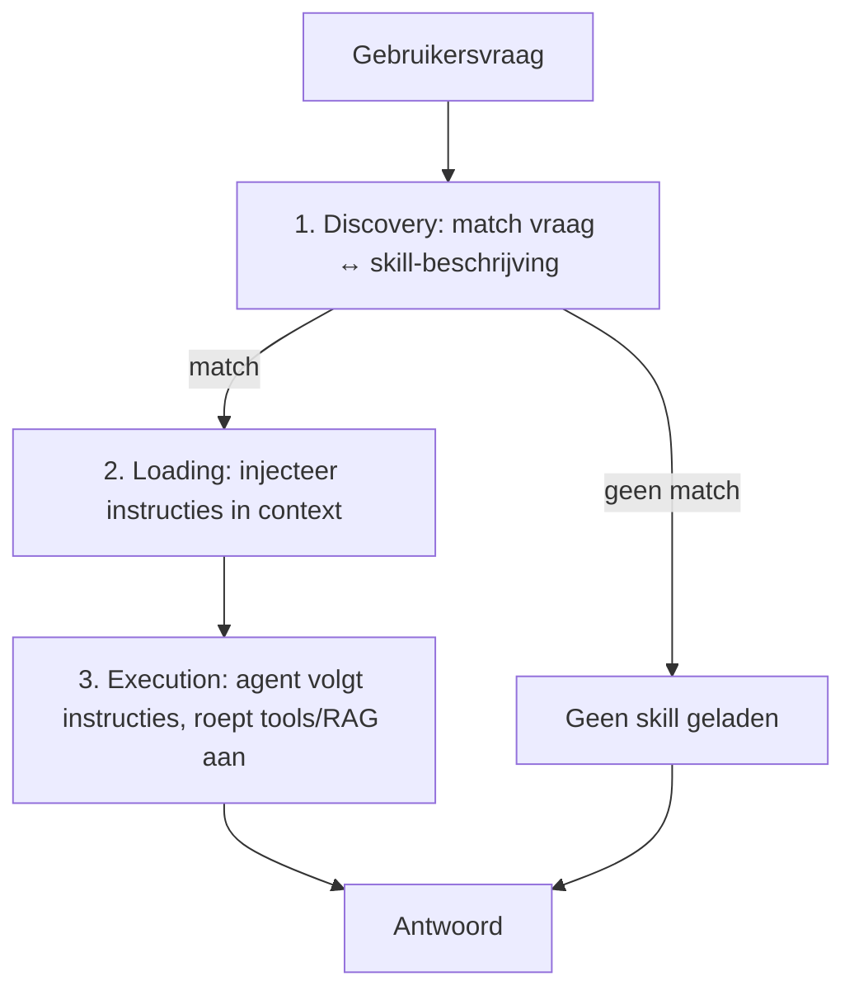

# 12. Skills (verdieping)

> Dit document verdiept [§12 van `AGENTS.md`](../AGENTS.md). Naast **tools** (§6)
> en **MCP-servers** (§7) is er een lichtere manier om een agent **blijvend
> slimmer** te maken: **skills**. Een skill is een *verpakte, herbruikbare
> capaciteit* — instructies plus eventueel randmateriaal — die de agent inlaadt
> wanneer een taak erom vraagt. Waar een tool een *functie* is, is een skill
> vooral **kennis + werkwijze**.

Het doel van dit hoofdstuk is **elk detail concreet aan te tonen** met
minimalistische, leesbare Python-voorbeelden. De code is pedagogisch: ze toont
het *principe* (een skill-library met discovery/loading/execution) correct, maar
is geen productie-framework.

---

## Functioneel: wat is een skill en waarom bestaat het?

Een LLM "weet" algemene taal- en redeneerkunst (§3), maar niet jouw
bedrijfsprocessen, huisstijl of compliance-regels. Je *kunt* die elke keer in de
prompt stoppen, maar dat kost tokens en is fragiel. Een **skill** verpakt die
know-how één keer in een `SKILL.md` (beschrijving + instructies) die de agent
**op verzoek inlaadt**. Het is dus "kennis die je activeert met weinig tokens".

Het onderscheid met de andere bouwstenen:

| | Bevat | Wie "roept aan" | Voorbeeld |
|---|-------|-----------------|-----------|
| **Tool** | Uitvoerbare functie | Model (function calling) | `send_email()` |
| **MCP-server** | Tools + resources + prompts | Host via protocol | Postgres-MCP |
| **Skill** | Instructies + kennis (meta) | Agent laadt bij matching | "GDPR-conforme closings paragraph" |

De **lifecycle** van een skill heeft drie stappen:



Skills zijn ideaal voor **terugkerende, goed omschreven taken** (SOPs),
domeinexpertise, en als "bibliotheek" van werkwijzen.

---

## Technisch

### 12.1 Wat is een skill?

**Functioneel.** Een skill bevat typisch een `SKILL.md` met een **beschrijving**
(waarop de agent matcht) en **instructies** (hoe de taag aangepakt wordt).
Optioneel: scripts, sjablonen, of verwijzingen naar tools/RAG. Een skill *vormt*
hoe de agent redeneert en kan op zijn beurt tools (§6), RAG (§8), planning (§11)
of memory (§10) aansturen.

**Technisch (een skill als dat-structuur + een voorbeeld-`SKILL.md`).**

```python
# 12.1 — Een skill als gestructureerd object
from dataclasses import dataclass, field

@dataclass
class Skill:
    name: str
    description: str          # gebruikt voor matching (zie 12.3/12.4)
    instructions: str         # de "werkwijze" die in de context wordt geladen
    scripts: list[str] = field(default_factory=list)   # optioneel randmateriaal

# Inhoud van een (gesimuleerd) SKILL.md-bestand:
SKILL_GDPR_MD = """
# Skill: gdpr_closing

## Description
Schrijf een GDPR-conforme afsluitende paragraaf voor klantcommunicatie.

## Instructions
1. Vermeld dat de klant het recht heeft om gegevens te laten wissen.
2. Noem een concreet contactpunt voor privacyvragen.
3. Gebruik geen juridisch jargon dat de lezer afschrikt.
"""

gdpr_skill = Skill(
    name="gdpr_closing",
    description=SKILL_GDPR_MD.split("## Description")[1].split("##")[0].strip(),
    instructions=SKILL_GDPR_MD.split("## Instructions")[1].strip(),
)
print("skill:", gdpr_skill.name)
print("beschrijving:", gdpr_skill.description[:60], "...")
```

> **Verschil met tool.** De `instructions` zijn *tekst* die de agent volgt; er
> staat geen uitvoerbare functie in. Een skill mag wél tools aanroepen, maar is
> op zichzelf geen functie.

---

### 12.2 Skills vs. Tools vs. MCP

**Functioneel.** De drie bouwstenen zijn complementair. Tools *doen* iets,
MCP *standaardiseert* de ontsluiting, skills *vormen* het redeneren. In één
agent kunnen ze tegelijk voorkomen.

**Technisch (één registry die de drie typen onderscheidt).**

```python
# 12.2 — Unified registry: skills, tools en MCP-servers naast elkaar
class Registry:
    def __init__(self):
        self.skills = {}      # name -> Skill
        self.tools = {}       # name -> callable (zie §6)
        self.mcp_servers = {} # name -> client (zie §7)

    def register_skill(self, skill: Skill):
        self.skills[skill.name] = skill

    def describe(self) -> dict:
        return {
            "skills": list(self.skills),
            "tools": list(self.tools),
            "mcp_servers": list(self.mcp_servers),
        }

reg = Registry()
reg.register_skill(gdpr_skill)
print(reg.describe())
# -> {'skills': ['gdpr_closing'], 'tools': [], 'mcp_servers': []}
```

> **Keuze.** Gebruik een **tool** voor een actie met vaste input/output, een
> **MCP-server** om die tools (én data/prompts) gestandaardiseerd aan te bieden,
> en een **skill** voor know-how/werkwijze die de agent *volgt* maar niet per se
> *aanroept*.

---

### 12.3 Lifecycle

**Functioneel.** Drie stappen: (1) **Discovery** — vergelijk de vraag met de
beschrijvingen van beschikbare skills; (2) **Loading** — bij een match wordt de
skill-inhoud in de context geïnjecteerd (als system-context); (3) **Execution**
— de agent volgt de instructies en mag tools/RAG aanroepen.

**Technisch (discovery + loading in Python).**

```python
# 12.3 — Discovery (match) en Loading (injectie in context)
def discover(query: str, skills: dict[str, Skill]) -> Skill | None:
    """Zoek de skill waarvan de beschrijving het best bij de vraag past.
    (Pedagogisch: simpele keyword-overlap; productie gebruikt embeddings, zie §8.)"""
    query_words = set(query.lower().split())
    best, best_score = None, 0.0
    for skill in skills.values():
        desc_words = set(skill.description.lower().split())
        score = len(query_words & desc_words) / max(1, len(query_words))
        if score > best_score:
            best, best_score = skill, score
    return best if best_score > 0 else None

def load_into_context(skill: Skill, system_prompt: str) -> str:
    """Loading: voeg de skill-instructies toe aan de system-context."""
    return f"{system_prompt}\n\n[ACTIVE SKILL: {skill.name}]\n{skill.instructions}"

# voorbeeld
reg.register_skill(gdpr_skill)
vraag = "Schrijf een privacyvriendelijke afsluiting voor mijn klantmail"
match = discover(vraag, reg.skills)
if match:
    context = load_into_context(match, "Je bent een behulpzame assistent.")
    print("context bevat skill:", "[ACTIVE SKILL: gdpr_closing]" in context)
```

> **Execution.** Na `load_into_context` volgt de agent de instructies in de
> prompt. De skill kan daarbij via de agentic loop (§5) tools (§6) of RAG (§8)
> activeren — de skill *stuurt*, het model *voert uit*.

---

### 12.4 Wanneer skills gebruiken

**Functioneel.** Skills zijn nuttig voor:
- Terugkerende, goed omschreven taken en **standaardprocedures (SOPs)**.
- Domeinexpertise die niet in de gewichten zit (bedrijfsprocessen, huisstijl,
  compliance).
- Een "bibliotheek" van werkwijzen die de agent met weinig tokens activeert.

**Best practices:** één skill per smal onderwerp, een scherpe `description`
(gebruikt voor matching), self-contained, en met concrete voorbeelden.

**Technisch (selectie-metriek + best-practice check).**

```python
# 12.4 — Wanneer laden we een skill? Een eenvoudige beslisser.
def should_load_skill(query: str, skills: dict[str, Skill],
                      threshold: float = 0.05) -> Skill | None:
    match = discover(query, skills)
    # enkel laden bij voldoende confidence (voorkomt ruis-matches)
    if match is None:
        return None
    q = set(query.lower().split())
    score = len(q & set(match.description.lower().split())) / max(1, len(q))
    return match if score >= threshold else None

# Best-practice check bij aanmaak van een skill
def is_well_formed(skill: Skill) -> list[str]:
    problems = []
    if " " in skill.name:            # smal, helder topic -> geen spaties
        problems.append("naam bevat spatie; kies een smal onderwerp")
    if not skill.description:
        problems.append("ontbrekende description (nodig voor matching)")
    if len(skill.instructions) < 20:
        problems.append("instructies te kort / niet self-contained")
    return problems

print("problemen:", is_well_formed(gdpr_skill))   # -> []  (goed gevormd)
```

> **Token-efficiëntie.** Omdat enkel de *matchende* skill in de context komt,
> blijft de context klein — een voordeel ten opzichte van alles altijd inladen
> (zie ook §9 compression en §15 token economics).

---

## Samenvatting (key takeaways)

- Een **skill** is verpakte **kennis + werkwijze** (geen functie): het *vormt*
  het redeneren van de agent, en mag tools/RAG/planning aansturen.
- Drie **complementaire** bouwstenen: **Tool** = doet iets, **MCP** =
  standaardiseert ontsluiting, **Skill** = vormt het denken.
- **Lifecycle:** Discovery (match vraag ↔ beschrijving) → Loading (injectie in
  context) → Execution (agent volgt instructies).
- Skills zijn ideaal voor **SOPs, domeinexpertise en compliance**; activeer ze
  enkel bij een (confidence-)match om tokens te sparen.
- **Best practices:** één smal onderwerp per skill, een scherpe `description`
  (voor matching), self-contained en met concrete voorbeelden.

Het volgende document (`12-data-privacy.md`) behandelt de **anonymizing proxy**
(PII-maskering) — relevant wanneer je een cloud-API (§4/§13) gebruikt maar
privacy-eisen hebt. Skills kunnen daarbij helpen om compliant teksten te
(genereren, zie §12.1).
