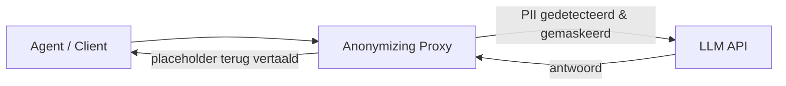

# 14. Anonymizing proxy (data-privacy / PII) (verdieping)

> Dit document verdiept [§14 van `AGENTS.md`](../AGENTS.md). Wanneer je een
> **externe (cloud-)LLM** gebruikt (zie §4 chatmodus en §13 self-hosting),
> verlaat gevoelige data je organisatie. Een **anonymizing proxy** is een laag
> die persoonsgegevens (PII) en geheimen maskeert *vóór* het verzoek de
> aanbieder bereikt. Het is het natuurlijke **alternatief voor self-hosting (§13)**
> wanneer je geen eigen model kunt draaien maar wél privacy-eisen hebt.

Het doel van dit hoofdstuk is **elk detail concreet aan te tonen** met
minimalistische, leesbare Python-voorbeelden. De code is pedagogisch: ze toont
het *principe* (detectie → maskering → un-mask) correct, maar is geen
productie-grade DLP. Voor productie gebruik je *Microsoft Presidio* (NER) in
plaats van de regex-stub hier.

---

## Functioneel: wat is het probleem en hoe lost de proxy het op?

Een prompt kan ongewild **PII** bevatten: namen, e-mails, ID-nummers, adressen,
broncode, API-keys, medische/financiële data. Alles wat je naar de API stuurt,
kan (tot in logs) bij de aanbieder belanden — een **GDPR- en bedrijfsrisico**.

De **anonymizing proxy** zit *tussen* de agent (§5) en de API (§4). Drie stappen:



1. **Detectie** — analyseer de tekst op PII (NER, regex, of Presidio).
2. **Maskering** — vervang PII door een **consistente placeholder**, bv.
   `<<PERSOON_1>>`. Het model ziet een leesbare, stabiele vervanger.
3. **Un-mask** — in het antwoord wordt de placeholder terugvertaald naar de
   echte waarde voor de eindgebruiker.

---

## Technisch

### 14.1 Het probleem

**Functioneel.** Prompts lekken vaak onbewust PII. Zodra de tekst de API
bereikt, ligt ze (incl. logs) bij een derde partij. Dat is het kernrisico dat de
proxy adresseert.

**Technisch (toon wat er lekt zónder proxy).**

```python
# 14.1 — De risico-situatie: gevoelige data zit in de prompt
raw_prompt = (
    "Stuur een herinnering naar jan.jansen@bedrijf.eu over zijn "
    "IBAN BE12 3456 7890 1234 en het dossier van klant 8912."
)

# Enkele veelvoorkomende PII-patronen (vereenvoudigde regex)
import re
PATTERNS = {
    "email": r"[\\w.+-]+@[\\w-]+\\.[\\w.-]+",
    "iban": r"\\b[A-Z]{2}\\d{2}( ?\\d{4}){3,4}\\b",
    "klant_id": r"klant ?\\d{3,6}",
}
leaks = {kind: re.findall(p, raw_prompt) for kind, p in PATTERNS.items()}
print("PII in prompt (zonder proxy):", leaks)
# -> {'email': ['jan.jansen@bedrijf.eu'], 'iban': ['BE12 3456 7890 1234'], ...}
```

> **GDPR-risico.** Al deze velden vertrekken richting aanbieder. Eén
> `raw_prompt` is voldoende voor een datalek-melding.

---

### 14.2 Werkwijze van de proxy

**Functioneel.** De proxy **detecteert** PII, **maskeert** het met een
consistente placeholder (zodat het model dezelfde entiteit telkens gelijk ziet),
en **vertaalt** in het antwoord de placeholders terug naar de echte waarden.

**Technisch (een minimale `AnonymizingProxy`).**

```python
# 14.2 — Detectie + maskering + un-mask
from collections import defaultdict

class AnonymizingProxy:
    def __init__(self):
        self.map = {}                 # placeholder -> origineel (reversibel)
        self._counters = defaultdict(int)

    def _mask_match(self, kind, value):
        self._counters[kind] += 1
        ph = f"<<{kind.upper()}_{self._counters[kind]}>>"
        self.map[ph] = value          # mapping moet beveiligd bewaard worden (14.3)
        return ph

    def anonymize(self, text: str) -> str:
        out = text
        for kind, pat in PATTERNS.items():
            out = re.sub(pat, lambda m: self._mask_match(kind, m.group(0)), out)
        return out

    def deanonymize(self, text: str) -> str:
        out = text
        for ph, original in self.map.items():
            out = out.replace(ph, original)   # un-mask voor de eindgebruiker
        return out

proxy = AnonymizingProxy()
masked = proxy.anonymize(raw_prompt)
print("gemaskeerd:", masked)
# -> ... <<EMAIL_1>> ... <<IBAN_1>> ... <<KLANT_ID_1>> ...
print("terugvertaald:", proxy.deanonymize(masked) == raw_prompt)   # True
```

> **Consistente placeholder.** `<<PERSOON_1>>` blijft bij elke nieuwe match
> stabiel (counter per `kind`), zodat het model bv. weet dat dezelfde klant
> tweemaal genoemd wordt — belangrijk voor coherente output.

---

### 14.3 Afwegingen

**Functioneel.** Drie aandachtspunten:
- **Reversibel vs. definitief** — bij reversibele tokens moet de mapping
  beveiligd bewaard worden (net zo gevoelig als de brondata zelf).
- **Kwaliteitsverlies** — anonimiseren kan context weghalen die het model nodig
  heeft; afweging privacy vs. bruikbaarheid.
- **Logging** — ook je eigen logs mogen geen ruwe PII bevatten (zie §16).
- **Compliance** — data-minimalisatie (GDPR): verstuur enkel wat nodig is.

**Technisch (logging-filter + "definitief" maskeren i.p.v. reversibel).**

```python
# 14.3 — Afwegingen concreet gemaakt
def log_safe(text: str) -> str:
    """Log NOOIT ruwe PII: maskeer ook in je eigen logs."""
    return proxy.anonymize(text)

# Keuze: reversibel (mapping bewaren) vs. definitief (geen terugvertaling)
def anonymize_definitive(text: str) -> str:
    """Definitief maskeren: geen mapping opgeslagen -> geen un-mask mogelijk."""
    out = text
    for kind, pat in PATTERNS.items():
        out = re.sub(pat, lambda m: f"<<{kind.upper()}_REDACTED>>", out)
    return out

print("log-safe     :", log_safe(raw_prompt))
print("definitief   :", anonymize_definitive(raw_prompt))

# Kwaliteitsverlies: het model mist nu de echte naam -> minder gepersonaliseerd.
# Afweging: soms is een <<PERSOON_1>>-tag voldoende voor het model om gepast te antwoorden.
```

> **Reversibele mapping = gevoelig.** De `self.map` in 14.2 is op zich PII. Bewaar
> ze versleuteld, kortlevend en nooit in platte logs (zie §16 observability).

---

### 14.4 Plaats in de architectuur

**Functioneel.** De proxy zit idealiter *tussen* de agent (§5) en de API (§4).
Het is het natuurlijke **alternatief voor self-hosting (§13)** wanneer je geen
eigen model kunt draaien maar wél privacy-eisen hebt.

**Technisch (de proxy als wrapper rond de API-aanroep).**

```python
# 14.4 — Proxy ingebed tussen agent en LLM-API
def call_llm(messages: list[dict]) -> str:
    """Conceptuele API-aanroep (hier gestubd)."""
    # in productie: client.chat.completions.create(..., messages=messages)
    return "Bevestiging verzonden naar de opgegeven contactpersoon."

def agent_call_with_proxy(user_text: str) -> str:
    proxy = AnonymizingProxy()
    # 1. masker vóór vertrek naar de (cloud-)API
    safe_text = proxy.anonymize(user_text)
    # 2. model krijgt enkel de gemaskeerde tekst
    reply = call_llm([{"role": "user", "content": safe_text}])
    # 3. un-mask het antwoord vóór het de gebruiker bereikt
    return proxy.deanonymize(reply)

# De agent (§5) merkt niets: de proxy is transparant in de transportlaag.
print(agent_call_with_proxy(raw_prompt))
```

> **Alternatief voor §13.** Self-hosting houdt data volledig binnen; de proxy
> maskeert enkel wat nodig is. De keuze hangt af van volume, compliance en of je
> GPU-infra hebt (zie §13 en §15).

---

## Samenvatting (key takeaways)

- Een **anonymizing proxy** maskeert PII *tussen* agent (§5) en API (§4): het
  natuurlijke alternatief voor self-hosting (§13) bij privacy-eisen.
- Drie stappen: **detectie** (NER/regex/Presidio) → **maskering** (consistente
  placeholder, bv. `<<PERSOON_1>>`) → **un-mask** in het antwoord.
- **Consistente placeholders** houden het model coherent (zelfde entiteit = zelfde
  tag).
- **Reversibele mapping is zelf PII**: versleuteld en kortlevend bewaren; nooit in
  platte logs (§16).
- **Afweging:** privacy vs. bruikbaarheid — soms is definitief maskeren eenvoudiger
  dan een beveiligde mapping.

Het volgende document (`13-token-economics.md`) behandelt de **kosten** van
tokens — en waarom een proxy, compressie (§9) en self-hosting (§13) elk de
token-rekening beïnvloeden.
