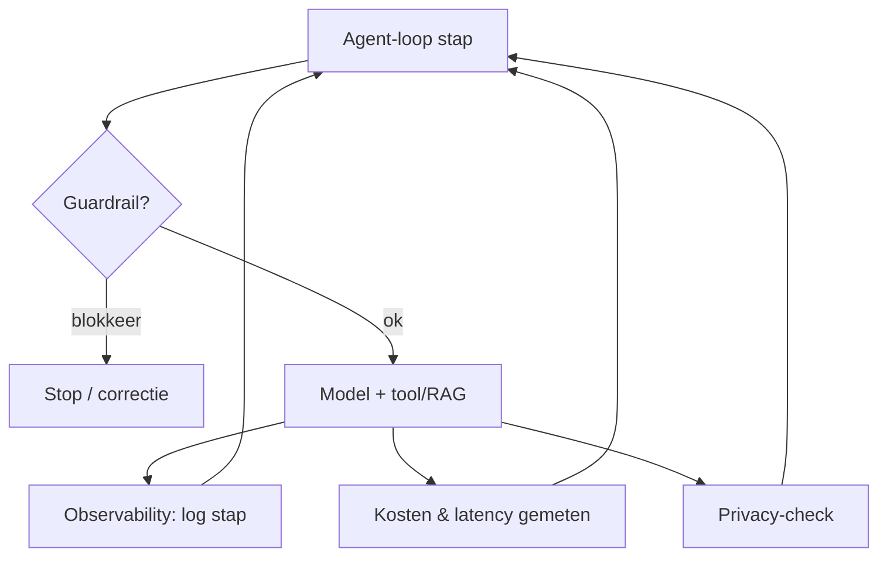

# 16. Wat nog belangrijk is — evaluatie, guardrails & observability (verdieping)

> Dit document verdiept [§16 van `AGENTS.md`](../AGENTS.md). Het bundelt de
> **aanvullingen** die een agent pas *betrouwbaar* maken: evaluatie & guardrails,
> kosten & latency, observability, determinisme vs. creativiteit, en privacy &
> compliance. Deze thema's zijn geen aparte architectuurlaag maar lopen *dwars*
> door alles heen — ze combineren wat we in §3–§15 zagen.

Het doel van dit hoofdstuk is **elk detail concreet aan te tonen** met
minimalistische, leesbare Python-voorbeelden. De code is pedagogisch: ze toont
het *principe* (testen, meten, loggen, seeden, auth) correct, maar is geen
productie-framework.

---

## Functioneel: waarom "het model antwoordt" niet genoeg is

Een LLM kan vloeiend **onzin** produceren, een tool verkeerd aanroepen (§6.5),
gevoelige data lekken (§14) of onverwacht veel tokens kosten (§15). Voor een
agent die *acties* onderneemt, is dat niet alleen onhandig maar **risicovol**.
Daarom heb je een dwarse laag van:

- **Evaluatie & guardrails** — testen en afremmen vóórdat iets misgaat.
- **Kosten & latency** — meten wat elke stap kost in geld en tijd.
- **Observability** — loggen wat de agent *deed*, om te kunnen debuggen.
- **Determinisme vs. creativiteit** — de sampling-keuze (§4.3) bepaalt of output
  reproduceerbaar is.
- **Privacy & compliance** — self-hosting (§13) en/of proxy (§14); token economics
  (§15) bepaalt haalbaarheid op schaal.



---

## Technisch

### 16.1 Evaluatie & guardrails

**Functioneel.** Guardrails houden de agent binnen veilige grenzen: controleer
tool-permissies (§6.5), blokkeer ongeldige output, en evalueer de agent tegen
testgevallen (hallucinatie-controle, verwachte structuur).

**Technisch (een guardrail + een minimale evaluator).**

```python
# 16.1 — Guardrail (input-validatie) + evaluator (testgevallen)
DANGEROUS = {"delete_record", "send_email"}

def guardrail(tool_name: str, user_consent: bool = False) -> None:
    if tool_name in DANGEROUS and not user_consent:
        raise PermissionError(f"geblokkeerd: {tool_name} vereist Go")

def evaluate(cases: list[tuple[str, str]]) -> float:
    """returneert fractie correcte antwoorden (score 0..1)."""
    ok = 0
    for vraag, verwacht in cases:
        # gesimuleerd antwoord; in productie: echte agent-aanroep
        antwoord = f"antwoord op: {vraag}"
        if verwacht.lower() in antwoord.lower():
            ok += 1
    return ok / len(cases)

guardrail("get_weather")                       # ok
try:
    guardrail("send_email")
except PermissionError as e:
    print("guardrail:", e)
print("eval-score:", evaluate([("wat is 2+2?", "2+2"), ("kleur?", "kleur")]))
```

---

### 16.2 Kosten & latency

**Functioneel.** Tokens kosten geld én tijd. Compressie (§9) en MoE (§3.4)
helpen, maar tool-calls (§6) en RAG (§8) voegen round-trips toe. Meet beide per
stap.

**Technisch (meet latency + tokens per loop-stap; bouwt voort op §15).**

```python
# 16.2 — Latency + kosten per stap meten
import time

def run_step(stub_ms: float, tokens: int):
    t0 = time.perf_counter()
    time.sleep(stub_ms / 1000.0)              # simuleer model + tool round-trip
    dt = time.perf_counter() - t0
    return dt, tokens

steps = [("tool-call", 120, 300), ("rag", 80, 900), ("answer", 200, 250)]
total_ms, total_tok = 0.0, 0
for name, ms, tok in steps:
    dt, t = run_step(ms, tok)
    total_ms += dt * 1000; total_tok += t
    print(f"{name:9s} latency≈{ms}ms  tokens={tok}")
print(f"totaal: ~{total_ms:.0f}ms, {total_tok} tokens "
      f"(zie §15 voor $)")
```

> **Koppeling.** Stop `total_tok` in de `TokenBill` van §15.1 om de échte
> kosten per taak te krijgen — observability (16.3) sluit dit aan elkaar.

---

### 16.3 Observability

**Functioneel.** Log elke loop-iteratie: welke **tool** (§6), welke
**retrieval** (§8), welke **planning** (§11). Zonder die trace is een agent
ondebugbaar.

**Technisch (een `AgentTrace` die elke stap vastlegt).**

```python
# 16.3 — Observability: elke stap gelogd als structured record
from dataclasses import dataclass, field

@dataclass
class Step:
    n: int
    action: str          # "tool" | "retrieval" | "plan" | "answer"
    detail: str
    tokens: int

class AgentTrace:
    def __init__(self):
        self.steps: list[Step] = []
    def log(self, action, detail, tokens=0):
        self.steps.append(Step(len(self.steps) + 1, action, detail, tokens))
    def report(self):
        for s in self.steps:
            print(f"#{s.n} [{s.action}] {s.detail} ({s.tokens} tok)")

trace = AgentTrace()
trace.log("plan", "decompose: zoek weer + bereken", 40)
trace.log("retrieval", "RAG: haal Q2-rapport", 600)
trace.log("tool", "get_weather(Brussel)", 80)
trace.log("answer", "formuleer eindantwoord", 250)
trace.report()
```

---

### 16.4 Determinisme vs. creativiteit

**Functioneel.** De sampling-strategie (§4.3) bepaalt of een agent
**reproduceerbaar** is. `temperature=0` (greedy) is deterministic; hogere
temperatuur is creatiever maar minder voorspelbaar — relevant bij tests en bij
riskante acties.

**Technisch (toon het effect van temperature op reproduceerbaarheid).**

```python
# 16.4 — Temperature beïnvloedt reproduceerbaarheid (gesimuleerd)
import random

def sample_word(temperature: float, seed: int) -> str:
    r = random.Random(seed + int(temperature * 100))
    return r.choice(["stabiel", "variabel", "creatief", "onvoorspelbaar"])

# greedy-achtig (temp~0): zelfde seed -> zelfde uitkomst
a = sample_word(0.0, 42); b = sample_word(0.0, 42)
print("temp=0 reproduceerbaar:", a == b)     # True
# hoog (temp~1): gedrag varieert per run
print("temp=1 voorbeeld      :", sample_word(1.0, 7))
```

> **Regel van thumb.** Voor evaluatie (16.1) en riskante tool-calls (§6.5) zet je
> `temperature` laag; voor brainstorm/tekstgeneratie mag hij hoger.

---

### 16.5 Privacy & compliance

**Functioneel.** Weeg self-hosting (§13) en/of een anonymizing proxy (§14) af.
Token economics (§15) bepaalt de haalbaarheid op schaal. Compliance = data-
minimalisatie (GDPR): verstuur enkel wat nodig is.

**Technisch (compliance-gate: geen ruwe PII naar een cloud-API).**

```python
# 16.5 — Privacy-gate vóór een cloud-aanroep (bouwt voort op §14)
import re
PII = r"[\\w.+-]+@[\\w-]+\\.[\\w.-]+|\\b[A-Z]{2}\\d{2}( ?\\d{4}){3,4}\\b"

def compliance_gate(text: str, allow_cloud: bool) -> str:
    has_pii = bool(re.search(PII, text))
    if has_pii and allow_cloud:
        # optie 1: maskeer eerst via de proxy uit §14
        return "BLOKKEER: masker PII met anonymizing proxy (§14) vóór cloud"
    if has_pii and not allow_cloud:
        return "OK: self-hosted (§13) — data blijft binnen"
    return "OK: geen PII, cloud toegestaan"

print(compliance_gate("mail jan@x.eu", allow_cloud=True))   # blokkeer -> proxy
print(compliance_gate("mail jan@x.eu", allow_cloud=False))  # ok -> self-host
```

---

## Samenvatting (key takeaways)

- **Evaluatie & guardrails** (16.1) houden de agent veilig: testgevallen + het
  afremmen van gevaarlijke tool-calls (§6.5).
- **Kosten & latency** (16.2) meet je per stap en koppel je aan de `TokenBill`
  (§15) — tool-calls en RAG voegen round-trips toe.
- **Observability** (16.3): log elke stap (tool/retrieval/plan) — anders is de
  agent ondebugbaar.
- **Determinisme vs. creativiteit** (16.4): `temperature` (§4.3) bepaalt of output
  reproduceerbaar is; laag bij evaluatie en riskante acties.
- **Privacy & compliance** (16.5): weeg proxy (§14) vs. self-host (§13); token
  economics (§15) bepaalt de haalbaarheid op schaal.

Het volgende (en laatste) document (`15-project-file-index.md`) behandelt de
**Projectbestandsindex / Resource Index** (§19): wanneer gebruik je RAG (§8) en
wanneer een gestructureerde index van bestanden — met tree-sitter extractie.
