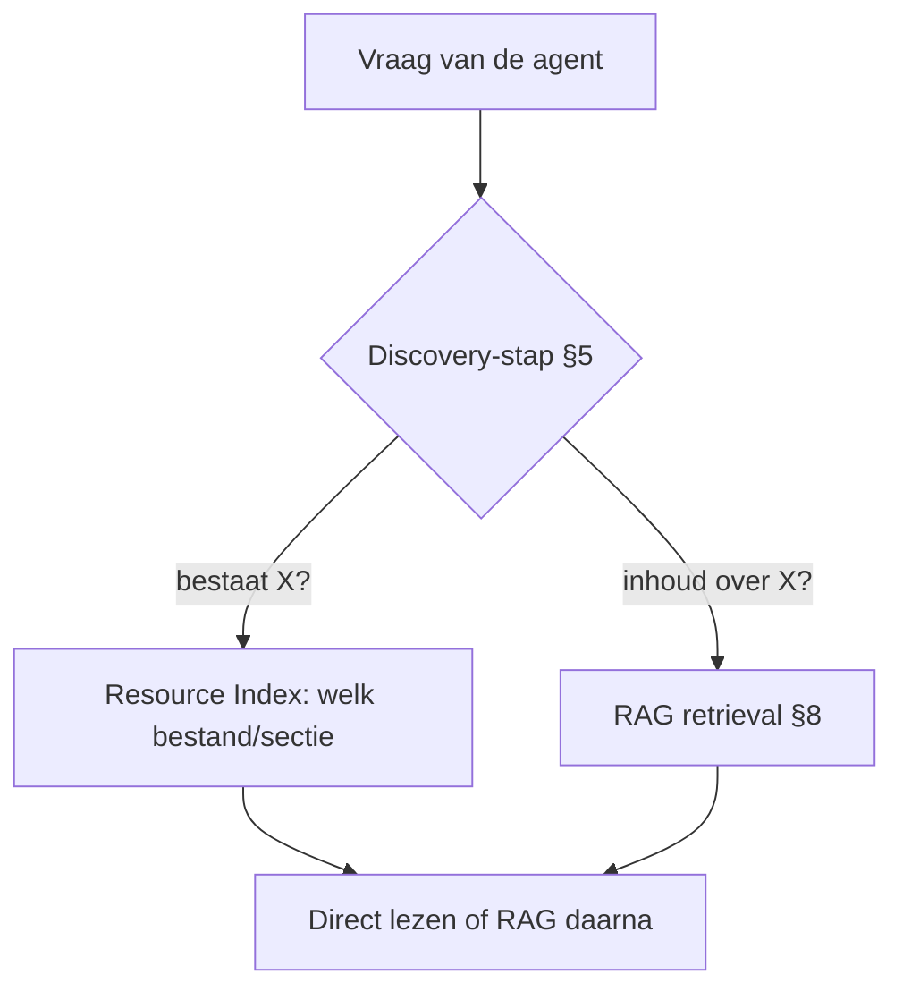

# 19. Projectbestandsindex (Resource Index) (verdieping)

> Dit document verdiept [§19 van `AGENTS.md`](../AGENTS.md). Naast de
> *semantische* ontsluiting via **RAG** (§8) is er een lichtere, *gestructureerde*
> manier om een project navigeerbaar te maken: een **Resource Index** (ook
> *projectbestandsindex* of *codebase index*). Waar RAG de **inhoud** van
> documenten vectoriseert, houdt een Resource Index enkel **metagegevens** per
> bestand bij: wat bestaat er, van welk type, en hoe heet de oppervlakkige
> structuur (symbolen, hoofdstukken)?

Het doel van dit hoofdstuk is **elk detail concreet aan te tonen** met
minimalistische, leesbare Python-voorbeelden. De code is pedagogisch: ze toont
het *principe* (extractie → manifest → routing) correct, maar is geen
productie-indexer. Voor meertalige code gebruik je **tree-sitter** (zie 19.1).

---

## Functioneel: wat is een Resource Index en waarom bestaat hij?

Een Resource Index is de **catalogus** van beschikbare bestanden. Hij beantwoordt
structurele vragen: *"welk bestand / welke functie / welke sectie bestaat?"* —
snel, deterministisch en zonder embeddings. Daarmee is hij het natuurlijke
tegenwicht van RAG:

- **RAG (§8)** ontsluit *inhoud* semantisch (wat staat erin over X?).
- **Resource Index (§19)** ontsluit *structuur* lexicaal (waar ligt wat?).



In een agent-loop (§5) raadpleeg je de Resource Index vaak *eerst* om te
bepalen *welk* bestand/deel relevant is, en pas *daarna* RAG of direct lezen om
de inhoud te halen. De index is verwant aan de **Resources**-primitief van MCP
(§7.2): de index maakt resources *ontdekbaar*, MCP leest ze uit.

---

## Technisch

### 19.1 Metagegevens-schema per bestand

**Functioneel.** Elke entry bevat minstens `path`, `type` en `inhoud`-metadata.
De metadata hangen af van het type: code → symbolen (functies, klassen, globals,
imports) via **tree-sitter** (AST); text → koppen (H1–H3) via een Markdown-parser;
data/config → top-level sleutels.

**Technisch (Python-symbolen via `ast` + een tree-sitter-snippet voor meertalig).**

```python
# 19.1 — Symbolen extracteren uit Python met de stdlib `ast` (deterministisch)
import ast

def extract_python_symbols(source: str) -> dict:
    tree = ast.parse(source)
    functions = [n.name for n in ast.walk(tree)
                 if isinstance(n, ast.FunctionDef)]
    classes   = [n.name for n in ast.walk(tree)
                 if isinstance(n, ast.ClassDef)]
    # globale constanten: velden zoals MAX_TOKENS, DEFAULT_MODEL
    globals_  = [n.targets[0].id for n in ast.walk(tree)
                 if isinstance(n, ast.Assign)
                 and isinstance(n.targets[0], ast.Name)
                 and n.targets[0].id.isupper()]
    return {"functions": functions, "classes": classes, "globals": globals_}

# Tree-sitter is de meertalige equivalent (C#, Go, Rust, ...):
#   pip install tree-sitter tree-sitter-python
#   import tree_sitter_python as tsp
#   parser = Parser(); parser.set_language(tsp.language())
#   tree = parser.parse(bytes(source, "utf8"))   # -> AST, dan symbolen walken
```

> **Waarom tree-sitter?** `ast` werkt enkel voor Python. Tree-sitter levert uit
> *vrijwel elke* taal een AST, zodat de index zónder embeddings en zónder het
> hele bestand in de context te laden, symbolen kan opnoemen.

---

### 19.2 Voorbeeld van een index-manifest

**Functioneel.** De index wordt bewaard als één JSON-/JSONL-manifest met één
entry per bestand. Voor tekst komen de koppen erin; voor een document dat deel
uitmaakt van de **RAG-knowledge base** zet je `rag_indexed: true` en laat je de
koppen *weg*.

**Technisch (bouw het manifest uit 19.1 + koppen-extractie).**

```python
# 19.2 — Een entry en het manifest samenstellen
import json, re

def extract_headings(source: str, max_level: int = 3) -> list[str]:
    heads = []
    for line in source.splitlines():
        s = line.lstrip()
        if s.startswith("#"):
            level = len(s) - len(s.lstrip("#"))
            if 1 <= level <= max_level:
                heads.append(s[level:].strip())
    return heads

manifest = {
    "files": [
        {
            "path": "src/agent.py", "type": "code", "language": "python",
            "symbols": extract_python_symbols("def run_agent(): pass\nclass AgentLoop: pass\nMAX_TOKENS = 4096"),
        },
        {
            "path": "docs/01-language-model.md", "type": "text",
            "headings": extract_headings("# 3. Language Model\n## 3.1 Tokenisatie\n## 3.2 Embeddings"),
            "rag_indexed": False,
        },
        {
            "path": "knowledge/handbook.md", "type": "text",
            "rag_indexed": True,
            "note": "RAG-knowledge base; hoofdstukken NIET in resource index",
        },
    ]
}
print(json.dumps(manifest, indent=2, ensure_ascii=False)[:200], "...")
```

---

### 19.3 Hoe de index wordt opgebouwd

**Functioneel.** Drie stappen: (1) **indexeren** — doorloop de repo, extraheer
per type; (2) **opslaan** — één manifest; (3) **onderhouden** — herbouw bij
wijziging (file-watcher of bij elke task-start).

**Technisch (een minimale repo-indexer).**

```python
# 19.3 — Loop de repo door en bouw het manifest
import os

CODE_EXT = {".py": "python", ".ts": "typescript", ".rs": "rust"}
TEXT_EXT = {".md", ".txt", ".rst"}

def index_repo(root: str) -> dict:
    files = []
    for dirpath, _, names in os.walk(root):
        for name in names:
            path = os.path.join(dirpath, name)
            ext = os.path.splitext(name)[1]
            if ext in CODE_EXT:
                src = open(path, encoding="utf-8").read()
                files.append({"path": path, "type": "code",
                              "language": CODE_EXT[ext],
                              "symbols": extract_python_symbols(src)})
            elif ext in TEXT_EXT:
                src = open(path, encoding="utf-8").read()
                files.append({"path": path, "type": "text",
                              "headings": extract_headings(src)})
    return {"files": files}

# manifest = index_repo(".")   # herbouw bij elke task-start of via file-watcher
```

> **Onderhoud.** Omdat de index *structuur* weerspiegelt, raakt hij verouderd
> zodra bestanden wijzigen — herbouw daarom automatisch (§19.6).

---

### 19.4 Wanneer RAG, wanneer een Resource Index?

**Functioneel.** De kernkeuze:
- *"Welk bestand / welke functie / welke sectie **bestaat**?"* → **Resource Index**
  (lexicaal, exact, goedkoop, deterministisch).
- *"Wat **staat erin** over onderwerp X?"* → **RAG** (§8, semantisch, ook als de
  term niet letterlijk voorkomt).
- Eén klein bestand → **direct lezen**.
- Groot corpus / privé-kennis → **RAG**.

**Technisch (een router die de juiste aanpak kiest).**

```python
# 19.4 — Routeer een vraag naar Resource Index, RAG of direct lezen
def route_query(query: str, file_small: bool = False) -> str:
    q = query.lower()
    if any(k in q for k in ["bestaat", "welke functie", "welke sectie", "waar ligt"]):
        return "resource_index"          # structurele vraag
    if "inhoud" in q or "over onderwerp" in q or "relevante tekst" in q:
        return "rag"                      # semantische vraag
    if file_small:
        return "direct_read"             # past in context
    return "rag"

print(route_query("Welke functie run_agent bestaat?"))   # resource_index
print(route_query("Wat staat erin over tokenisatie?"))   # rag
```

> **Regel.** Een document krijgt zijn koppen in de Resource Index, *tenzij*
> `rag_indexed: true` — dan vertrouw je voor inhoud op RAG en laat je de koppen
> weg (geen dubbele ontsluiting).

---

### 19.5 Relatie met MCP Resources (§7) en Memory (§10)

**Functioneel.** Twee relaties:
- **MCP Resources (§7.2)** — de Resource Index is de *catalogus* van die
  resources; MCP is het transport om ze uit te lezen.
- **Memory (§10)** — een vectorstore lijkt op RAG; de Resource Index is daarentegen
  een *file manifest* (gestructureerd, niet geëmbed) en dient navigatie, niet het
  onthouden van feiten.

**Technisch (koppeling index → MCP-resource-uri).**

```python
# 19.5 — Elke index-entry kan een MCP-resource-uri worden
def to_mcp_resources(manifest: dict) -> list[dict]:
    resources = []
    for f in manifest["files"]:
        uri = "file:///" + f["path"].replace("\\", "/")
        resources.append({"uri": uri, "name": f["path"], "kind": f["type"]})
    return resources

# de host (§7) kan deze uri's via MCP resources/read uitlezen
print(to_mcp_resources(manifest)[0])
```

---

### 19.6 Trade-offs

**Functioneel.** Twee kanten:
- **Resource Index** — goedkoop, snel, deterministisch, accuraat over *structuur*;
  weet niets over *inhoud* en kan verouderd raken (herbouw nodig).
- **RAG (§8)** — rijk aan inhoud en semantisch; kost embeddings + vector-DB +
  retrieval-latency, en is minder geschikt voor "bestaat dit?"-vragen.

**Technisch (gesimuleerde latency/cost-vergelijking).**

```python
# 19.6 — Vergelijking: index-lookup vs. RAG-retrieval (orders of magnitude)
def cost_model(n_files: int, use_rag: bool) -> tuple[float, float]:
    # Resource Index: O(1) lookup in geladen manifest; geen embeddings
    idx_latency = 0.5                        # ms, in-memory manifest
    idx_cost = 0.0                           # geen tokens/node-kosten
    # RAG: embed query + vector search + top-k lezen
    rag_latency = 20.0 + 5.0 * (n_files / 1000.0)   # ms, schaalt met corpus
    rag_cost = 0.00001 * 8                   # embed + retrieval tokens (§15)
    return (idx_latency, idx_cost) if not use_rag else (rag_latency, rag_cost)

print("index :", cost_model(5000, use_rag=False))
print("rag   :", cost_model(5000, use_rag=True))   # duurder + trager, maar semantisch
```

> **Complementair.** Gebruik de Resource Index voor *structuur* en RAG voor
> *inhoud* — niet als rivalen maar als lagen in dezelfde discovery-stap (§5).

---

## Samenvatting (key takeaways)

- Een **Resource Index** is de *catalogus* van bestanden: enkel **metagegevens**
  (pad, type, symbolen/koppen), geen inhoud — het lexicaal/structurele tegenwicht
  van **RAG** (§8).
- **Extractie:** code-symbolen via **tree-sitter** (meertalig) of `ast`
  (Python); tekst-koppen via een Markdown-parser; config via JSON/YAML-parser.
- Één **manifest** (JSON/JSONL), automatisch **herbouwd** bij wijziging.
- **Routering:** "bestaat X?" → index; "inhoud over X?" → RAG; klein bestand →
  direct lezen. Documenten in de RAG-knowledge base krijgen `rag_indexed: true`
  (koppen dan *niet* in de index).
- **Relaties:** catalogus voor MCP **Resources** (§7.2); *geen* feiten-store (dat
  is Memory, §10).
- **Trade-off:** index = goedkoop/snel/deterministisch over *structuur*, maar weet
  niets van *inhoud* en kan verouderen; RAG = semantisch rijk, maar duurder.

---

*Hiermee is de verdieping van alle 15 `docs/`-hoofdstukken (§3–§16 en §19)
voltooid. Zie `project_state.md` voor de status en de volgende stap: `examples/`-demo's
en de cheat sheet (§17 stap 6–7).*
