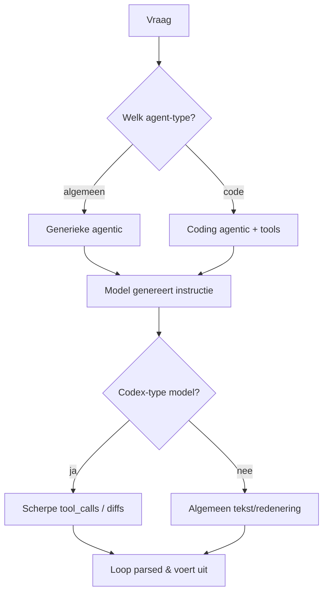
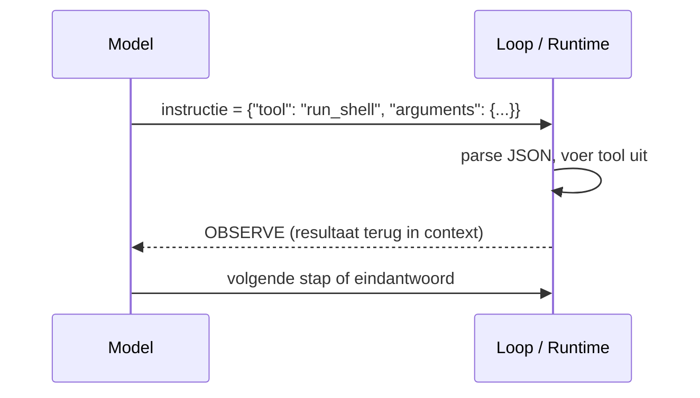

# 20. Agentic & model types (generiek vs coding) — verdieping

> Dit document verdiept [§20 van `AGENTS.md`](../AGENTS.md). Waar §5 de
> *agentic loop* beschrijft, gaat dit hoofdstuk over *welk soort agent* en
> *welk soort model* eronder zit — en vooral hoe een model zijn bedoeling
> ("instruction") naar de loop seint.

Het doel is **elk detail concreet aan te tonen** met minimale Python-voorbeelden.
De code is pedagogisch: ze toont het *principe*, geen productie-implementatie.

---

## Functioneel

Een agent is meer dan alleen een LLM in een lus: de *soort* agent en de *soort*
model bepalen wat er mogelijk is en hoe de loop faalt of herstelt. Dit hoofdstuk
maakt drie onderscheiden concreet:

1. **Generieke agentic vs. coding agentic** — verschil in doel, omgeving en
   failure-mode.
2. **Model types** — wat je mag verwachten van een "codex-type" model t.o.v.
   een algemeen model.
3. **Signaling** — hoe het model een instructie naar de loop "seint" (geen
   magie, gewoon gestructureerde tekst die de loop parsed).

### De drie onderscheiden op hoog niveau



---

## Technisch

### 20.1 Generieke Agentic vs. Coding Agentic

**Functioneel.** Beide lopen dezelfde agentic loop (§5), maar een *coding
agentic* voegt een **code-omgeving + code-specifieke tools** toe en een lus die
fouten (build/test) terugvoedt. De failure-mode verschuift van "verkeerd
antwoord" naar "compileer-/runtime-fout die iteratief hersteld moet worden".

| Aspect | Generieke agentic | Coding agentic |
|--------|-------------------|----------------|
| Doel | Algemene assistentie, vragen beantwoorden, taken orchestreren | Code lezen/schrijven/uitvoeren, repo's begrijpen, tests draaien |
| Omgeving | Tools: search, API's, RAG, rekenmachine | + filesystem, shell, interpreter, linter, git, test-runner |
| Context | Chat-geschiedenis + documenten | Hele codebase (bestanden, symbolen, build, foutlogs) |
| Failure-mode | Verkeerd antwoord | Compileer-/runtime-fout → agent moet iteratief herstellen |
| Evaluatie | Faithfulness, antwoordkwaliteit | Tests groen, diff klein, geen regressie |

**Technisch (router tussen beide types).**

```python
def agent_type_for(task: str) -> str:
    code_signals = ("schrijf", "refactor", "test", "bug", "repo", "fix", "code")
    if any(s in task.lower() for s in code_signals):
        return "coding"      # + filesystem/shell/git/test-runner
    return "generic"         # + search/rag/calculator

print(agent_type_for("schrijf een test voor parser.py"))   # -> coding
print(agent_type_for("wat is de omzet in Q2?"))             # -> generic
```

> Een coding agent is dus een **generieke agent + code-omgeving**: de loop
> blijft gelijk, de *tools* en de *evaluatie* verschillen.

### 20.2 Model types: wat verwachten van een "codex-type" model?

**Functioneel.** Een codex-type model (bv. Codex, code-afgestemde varianten van
GPT/LLaMA) verschilt van een algemeen model door:

- **Meer code in de trainingsdata** → betere syntaxis, idiomatische code, kennis
  van libraries/frameworks.
- **Tooling-affiniteit** — beter in het produceren van *gestructureerde* acties
  (tool_calls, diffs, commando's).
- **Langdurende context** — vaak grotere contextvensters om bestanden te
  behappen.
- **Self-correction bias** — getraind om tests/fouten te verwerken.

**Technisch (affiniteit: gestructureerde actie vs. vrij tekst).** Een
codex-type model neigt naar een parseerbare actie; een algemeen model naar
uitgebreide uitleg.

```python
def model_output_style(is_codex_model: bool, task: str) -> str:
    if is_codex_model:
        # neiging: gestructureerde, uitvoerbare actie
        return f'{{"tool": "run_shell", "arguments": {{"command": "pytest {task}"}}}}'
    # algemeen model: vrij tekst-antwoord
    return f"Je zou de test kunnen draaien met: pytest {task}"

print(model_output_style(True, "tests/test_parser.py"))
# -> {"tool": "run_shell", "arguments": {"command": "pytest tests/test_parser.py"}}
```

> Verwacht van een codex-type model: scherpere code, maar het blijft een
> *taalmodel* — het "begrijpt" geen code semantisch, het *genereert* waarschijnlijke
> vervolgen. De omgeving (compiler, tests) levert de echte waarheid.

### 20.3 Hoe seint het model instructies naar de loop?

**Functioneel.** Het model genereert **geen magie**: het schrijft een
*gestructureerde boodschap* die de loop parsed. Bij native function calling is
dat een `tool_calls`-blok (naam + JSON-argumenten); de runtime voert het uit en
stopt het resultaat terug in de context (zie §6.1). Zo wordt een *taal* model
een *actie* model.

**Technisch (loop parsed de instructie van het model).**

```python
import json

def run_loop_step(model_instruction: str):
    # de loop ontvangt de "instructie" als gestructureerde tekst van het model
    try:
        call = json.loads(model_instruction)        # bv. {"tool": "...", "arguments": {...}}
    except json.JSONDecodeError:
        return "ANSWER", model_instruction           # geen actie → eindantwoord

    tool, args = call["tool"], call["arguments"]
    # Runtime (niet het model!) voert de actie uit
    if tool == "run_shell":
        result = f"(uitvoer van: {args['command']})"   # vereenvoudiging
    else:
        result = f"(resultaat van {tool})"
    return "OBSERVE", result                          # terug in context voor volgende stap

kind, payload = run_loop_step(
    '{"tool": "run_shell", "arguments": {"command": "pytest tests/test_agent.py"}}'
)
print(kind, "->", payload)   # OBSERVE -> (uitvoer van: pytest tests/test_agent.py)
```



> De "instructie" is gewoon tekst die de loop interpreteert — bij native
> function calling als `tool_calls`, bij tekst-gebaseerde agents als een
> geparste actie. De runtime (§5) is de schakel tussen *taal* en *actie*.

---

## Samenvatting (key takeaways)

- Een **coding agentic** = generieke agentic + code-omgeving (filesystem, shell,
  git, test-runner) + een lus die build/test-fouten terugvoedt.
- Een **codex-type model** geeft scherpere, gestructureerdere output (tool_calls,
  diffs) maar is géén denkende compiler — de omgeving levert de waarheid.
- Het model "seint" zijn instructie naar de loop als **gestructureerde tekst**
  (JSON / tool_calls); de *loop* parsed en voert uit, en stopt het resultaat
  terug als `OBSERVE`.
- Het onderscheid model-type vs. agent-type is orthogonaal: elke agent-type kan
  op elk model draaien, maar een codex-type model maakt een coding agent veel
  effectiever (zie ook §16 model-self-hosting en §3.4 architectuur-typen).
- **Runnable demo:** `examples/agentic-model-types-demo.py` toont de
  type-router, de codex-output-stijl en de signaling-loop (pure stdlib).
