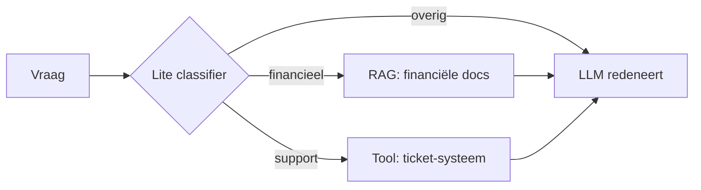

# 21. Optimalisaties: lite-classificatie & routing — verdieping

> Dit document verdiept [§21 van `AGENTS.md`](../AGENTS.md). Sommige beslissingen
> (naar welke tool sturen? RAG ja/nee? welke agent?) vereisen geen zwaar
> *geheugenmodel* (LLM). Er bestaan lightweight shortcuts om de *categorie* van
> een vraag of tekst te bepalen — lokaal, in milliseconden, zonder GPU.

Het doel is **elk detail concreet aan te tonen** met minimale Python-voorbeelden.
De code is pedagogisch: ze toont het *principe*, geen productie-implementatie.

---

## Functioneel

Een LLM aanroepen om "wat voor soort vraag is dit?" te classifyen is traag en
duur, zeker in een agentic loop die vaak routeert. Je wil goedkoop en direct
categoriseren zodat de *echte* LLM enkel de zware redenering doet.

### Wanneer deze optimalisatie?

- **Routering** — stuur een vraag naar de juiste tool / agent / kennisbron.
- **Gate-keeping** — blokkeer of markeer gevoelige/ongewenste categorieën vóór
  de LLM ze ziet.
- **Categorie-labeling** — tag inkomende tekst voor later ophalen (memory, §10).

### Shortcuts & lokale "modellen"

| Techniek | Hoe | Wanneer |
|----------|-----|---------|
| **Keyword / regex** | match op domein-termen ("factuur", "ERROR") | simpele, voorspelbare routing |
| **TF-IDF + kleine classifier** | `TfidfVectorizer` + `LogisticRegression` (lokaal, geen GPU) | veel gelabelde voorbeelden, stabiel schema |
| **Lokale embedder + cosine** | kleine embedder (sentence-transformers mini) vergelijkt vraag met voorbeeldzinnen per categorie | semantische routing zonder LLM |
| **Zero-shot (lokale transformer)** | bv. een kleine NLI/zeroshot-classifier op CPU | nieuwe categorieën zonder retraining |
| **fastText / bag-of-words** | supersnelle tekstclassificatie, getraind in seconden | hoge doorvoer, weinig resources |

Deze "modellen" zijn geen LLM's: ze classificeren op statistiek/embeddings en
lopen lokaal in milliseconden.

### Plaats in de architectuur



---

## Technisch

### 21.1 Keyword / regex routering

**Functioneel.** De goedkoopste vorm: match domein-termen. Snel en deterministisch,
maar blind voor synoniemen en taalvariatie.

```python
import re

RULES = {
    "financieel": r"\b(factuur|omzet|btw|betaling|q[1-4])\b",
    "support":    r"\b(crash|error|wachtwoord|login|bug)\b",
}

def route_keyword(text: str) -> str:
    for cat, pat in RULES.items():
        if re.search(pat, text, re.IGNORECASE):
            return cat
    return "overig"

print(route_keyword("de factuur voor Q2 ontbreekt"))   # -> financieel
print(route_keyword("de app crasht bij login"))        # -> support
```

### 21.2 TF-IDF + kleine classifier (lokaal, geen LLM)

**Functioneel.** Train een kleine classifier op gelabelde voorbeelden; loopt
volledig lokaal op CPU.

```python
# pip install scikit-learn
from sklearn.feature_extraction.text import TfidfVectorizer
from sklearn.linear_model import LogisticRegression

train = [
    ("Wat is de omzet in Q2?", "financieel"),
    ("Toon het factuur van klant X", "financieel"),
    ("Hoe reset ik mijn wachtwoord?", "support"),
    ("De app crasht bij login", "support"),
]
X = [t for t, _ in train]; y = [c for _, c in train]
vec = TfidfVectorizer().fit(X)
clf = LogisticRegression().fit(vec.transform(X), y)

def route_tfidf(question: str) -> str:
    return clf.predict(vec.transform([question]))[0]

print(route_tfidf("factuur voor Belgie ontbreekt"))   # -> financieel
```

### 21.3 Lokale embedder + cosine (semantische routing zonder LLM)

**Functioneel.** Vergelijk de vraag-embedding met één voorbeeldzin per categorie;
de dichtste categorie wint. Vangt synoniemen die keyword/routing missen.

```python
import numpy as np, hashlib

def embed(text, dim=64):   # pedagogische embedder (zie 06-rag.md §8.4)
    seed = int(hashlib.md5(text.encode()).hexdigest(), 16) % (2**32)
    v = np.random.default_rng(seed).standard_normal(dim)
    return v / np.linalg.norm(v)

EXAMPLES = {
    "financieel": embed("omzet en facturen van het kwartaal"),
    "support":    embed("problemen met inloggen en crashes"),
}
def route_embed(query: str) -> str:
    q = embed(query)
    return max(EXAMPLES, key=lambda c: float(np.dot(q, EXAMPLES[c])))
# Productie: vervang embed() door een lokale sentence-transformer (CPU).
```

> **Zero-shot / fastText.** Voor nieuwe categorieën zonder labels gebruik je een
> kleine zero-shot classifier (bv. `transformers` `zero-shot-classification` op
> CPU) of train je fastText in seconden op bag-of-words — beide lokaal, geen LLM.

### 21.4 Trade-offs

**Functioneel.** Lite-classificatie is **snel, goedkoop, deterministisch**, maar
heeft minder taalbegrip dan een LLM en is gevoelig voor onbekende formuleringen.
Gebruik het voor *routering* en *gate-keeping*; laat de LLM de echte redenering
doen. Combineer gerust: keyword als eerste filter, embedder als fallback.

**Technisch (gecombineerde router).**

```python
def route(text: str) -> str:
    kw = route_keyword(text)
    if kw != "overig":
        return kw                 # snelle, zekere match
    # fallback naar een zwaardere lite-methode (embedder / tf-idf)
    return route_embed(text)

print(route("factuur voor Q2 ontbreekt"))   # -> financieel (via keyword)
```

---

## Samenvatting (key takeaways)

- Een **LLM is overkill** om enkel de *categorie* van een vraag te bepalen;
  lokale, lichte methoden doen het in milliseconden en tegen minimale kost.
- **Keyword/regex** is het snelst maar blind voor synoniemen; **TF-IDF +
  classifier** en **lokale embedders** vangen betekenis; **zero-shot/fastText**
  dekken nieuwe categorieën zonder retraining.
- Zet lite-classificatie in als **routering** en **gate-keeping** vóór de LLM,
  zodat het zware model enkel de echte redenering doet (zie ook §15 token
  economics en §5.1 component-keuze).
- Het is een *optimalisatie-laag*, geen vervanging: de LLM blijft de beslisser
  voor complexe redenering.
- **Runnable demo:** `examples/lite-classification-demo.py` toont de keyword-,
  embedder- en gecombineerde router (pure stdlib; TF-IDF-branch optioneel).
